# 公关和如何免费进入目标媒体
我开始教你“在线公关”，我称之为“在线公关”，也被称为公共关系、新闻营销、公关营销，或者只是公关。我们从这里开始的原因是我想立即以尽可能多的价值领先。因此，与其让你等到最大的“价值炸弹”结束，我想从一开始就直接进入。公关对于任何处于早期阶段的初创公司都非常重要，因为一篇好文章可以让你站在最好的投资者面前，可以让你走在行业的最前沿，或者为你提供额外六个月的资金支持所需的增长。这也是最强大的营销策略之一，因为没有上限，你可以根据自己的意愿获得尽可能多的公关，而且不一定要花费任何费用；这就是为什么它在很多营销圈中被称为“赢得的媒体”。
想想这个名字：“赢得媒体。”即使你是全新的，你仍然可以从有针对性的赢媒体投放中获得大量免费增长，并且它广泛适用于几乎所有业务、垂直行业、行业等，因此，如果你正在阅读本文，并且作为只要你从事具有目标人群的业务，那么你就需要进行公关以领先于他们！
公关的基本思想是让你的公司和你的项目成为你的目标人群通过有针对性的媒体展示位置消费的关键内容。现在，我如此喜欢它的原因是我们将要详细了解如何破解它，它只需要你的时间和不懈地专注于为他人创造价值。而已。但是，为什么这么多初创公司每月要为优质的公关服务支付 5,000 到 20,000 美元之间的费用呢？原因很简单：因为它始终如一地支付良好的投资回报率，而且自己做非常耗时。仅仅因为你将要准确地学习如何自己做，并不意味着它会很容易。我将在本书中教给你的一切都需要数周甚至数月的时间才能看到任何价值，你需要继续这样做才能看到好处，相信我它确实会得到回报，就像几十年一样我的客户，如 Tinder、Different、Zedge、HitList、Matt's Flights、RoadTrippers、Fly.com、Hushly 等等！
话虽如此，公关不仅对品牌塑造、思想领导力、合作伙伴关系和招聘很有帮助，更重要的是，它还是一种可靠的用户获取策略，确实可以很快带来收入的增加。除了绝对增加你的销售额，公关还增加了社会证明。因此，即使你的播客采访和杂志功能不会立即在你的分析中推动大量直接销售，你也应该看到其他指标得到了实质性的提升，例如网站转化率（假设你将最近的新闻文章放在你的网站上）在显眼的位置）、自然搜索流量等。试想一下，如果你的企业在目标人群阅读的某个地方获得有关你的解决方案/产品的全国性或全球性文章，那将是多么有价值。我估计，根据 ACLTV（平均客户生命周期价值 -新用户在与你的企业互动的整个生命周期中的价值），这是基于我在 Forbes、TechCrunch、INC、USAToday、GQ、Bustle 等公司创业的几次经验。
所以你知道你需要公关，并且你知道与像 GrowthExpertz 这样的机构或其他初创公关公司合作是昂贵的，因为它可以将公关活动的学习曲线缩短大约 5 到 12 个月。代理机构的工作是为你节省时间 六个月内你可能会做的事情，一家好的公关公司可以在 30-60 天内完成，但这并不意味着你不能自己完成。毕竟，这一切都是我自学的，所以我知道如果我能成功，那么你也可以。成为早期创业公司的美妙之处在于你有时间。我知道你可能会在脑海中读到你很忙，根本没有时间，但我的意思是不像一家大公司，你有时间继续测试新战略，不受外界影响你，并通过扩大你的公关，这就是全部。无论你的世界看起来多么竞争激烈，与大公司的营销人员相比，你对自己的关注要少得多，因此你有时间站在自己这边。如果你发布一篇糟糕的新闻稿，没有人会在社交媒体上惊慌失措；你可以一直安静地迭代，直到你得到它恰到好处。
首先，成为初创公关大师需要三个主要部分，我们将深入研究这三个部分：建立你的新闻列表、制作你的故事以及有效地分发你的公关。

## 第 1 步：建立你的新闻列表
成功的公关活动的第一个关键部分是学习建立自己的目标媒体列表，列出你想就你的业务联系的人。什么是新闻列表？从本质上讲，它将成为你向目标人群讲述故事的所有不同人的运行标签。在此列表中，你将包括他们的姓名、电子邮件地址，如果你是像我这样的超级成功人士，他们撰写的出版物，甚至他们撰写的一些关于你所在行业的示例文章。这一切都将帮助你在未来与他们建立联系。你记的越多越好，但姓名和电子邮件是必不可少的。使用此列表，你最终将可以直接、不受限制地接触到所有可以大规模免费向潜在客户推广你的业务的人员。
我将教你如何随着时间的推移被动地构建此列表，并且时间投入非常少，这样当你准备好在屋顶上就你的业务大喊大叫时，你就已经拥有了最重要的联系信息你需要讲述你的故事的杰出创作者、作家、记者和 YouTube 用户。这样，当你拥有对他们具有潜在价值的东西时，你可以毫不费力地进行大规模推广，并激发大量的兴趣来推广你的新产品/服务！
想一想大多数处于早期阶段的公司在推出一款大而闪亮的新产品 30 天后可能是什么样子。我可以告诉你，他们经常争先恐后地做一百万件事情而没有正确完成任何一件事情。接下来，想想如果在发布前的 6 到 8 个月内，他们每周随意地将 5 到 50 个电子邮件地址添加到人员列表中以宣传他们的发布，情况会有多不同。那样的话，他们可以有几十个宝贵的机会来推广他们的产品，并且在营销方面已经好了很多。
下一步是弄清楚如何建立你的新闻列表。请花一点时间在这里暂停一下，做一个小练习，它将为你指明正确的方向。我希望你考虑你的项目、你、你的公司、你的行业和你的市场可能与之相关的所有行业、地点或关键字。接下来，你将记下一些潜在的关键字重点，用于你在寻找可以参与的目标媒体人物时在线关注的搜索。如果你在计算机上或附近，你可以直接访问 Google 快讯或 Google 新闻，或者随时使用下面的记号点用笔书写。或者拿出一张单独的纸，或者如果你想保存一些树木，甚至在手机上写下你的清单（我只用我的手机，因为我的笔迹很糟糕）。

这里的想法是考虑与你的公司相关的所有潜在“故事弧线”或盒子，以便你可以测试向记者、作家和主持人从所有这些不同的角度推销你公司的故事，看看什么是有效的。所以你会想出这个要遵循的术语列表，我将分享一个很好的潜在术语列表的例子，从我做过的一个成功的项目中进行头脑风暴。这个公关活动是为一家女性创立的初创公司在旅游领域推出 Android 应用程序。我之所以说这些细节，是因为当我开始为此活动建立新闻列表时，我使用了这个确切的策略。我想到了这次发布的所有潜在新闻角度，然后搜索了围绕“旅行应用程序”和“旅行初创公司”以及“女性创始人”、“Android 应用程序”、“Android 初创公司”和“Android 旅行应用程序”撰写文章的人，”因为我想告诉任何可能关心我的项目和我们正在推出的内容的人。然后我将所有这些术语输入到 Google 快讯中，这样我就会收到有关作者使用这些关键术语发表新文章的通知。
现在，如果你还不了解 Google Alerts，请立即停止阅读本书，打开你的笔记本电脑，然后访问 alerts.google.com。在那里，我希望你输入你的姓名 + 与你合作的公司名称，然后至少你会在任何时候有人在互联网上（社交帖子之外）写下你的文章时收到通知。这就是你将如何发现重要人物何时报道与你公司相关的事情，然后你将想要找到他们的联系信息并将其添加到你的列表中，因为接下来，我将教你如何与他们讨论你的项目，并有可能让他们报道/宣传你。
因此，对于我提到的这个 Android 应用程序项目，只要有人使用我上面提到的关键字在互联网上创建了新内容，我就会立即开始从 Google Alerts 接收电子邮件。这给我带来了很多潜在记者的电子邮件地址，最终，这家初创公司在发布后的前 30 天内获得了 30,000 多次安装，而且没有花一分钱。这是一个公关列表构建活动 Google Alert 的示例，适用于我的一个专注于健康的引导式初创公司教练客户。

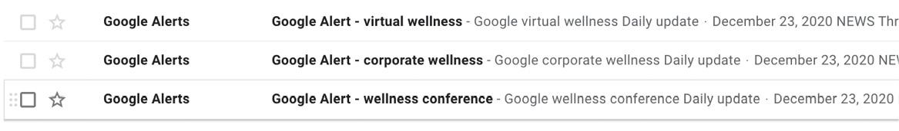

在设置了从上一个练习中绘制的关键字搜索词后，你将开始看到像上面一样的电子邮件。警报电子邮件的内容通常是你需要仔细阅读的几篇相关文章，如下图所示。我知道这看起来非常简单，因此你可能认为它没有那么有价值，但我向你保证，这些电子邮件不仅会改变你的公关活动的游戏规则，而且你很快就会找到所有相关的即将举行的会议、活动和你所在行业也发生了大事件。最重要的是，你不必不断地研究以了解谁在谈论你的目标用户关心的事情，你每天都会通过电子邮件将其发送给你，你需要做的就是花时间收集电子邮件中最好的文章。

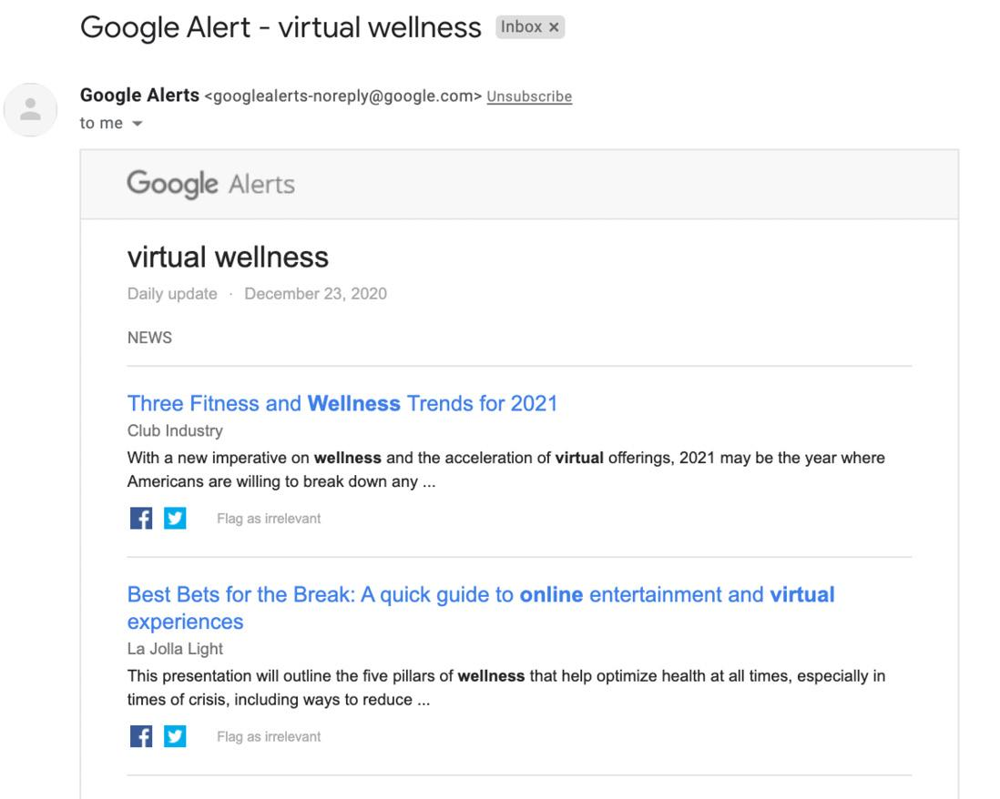

一旦你开始查找相关文章，你会立即注意到一些不可思议的事情：大多数内容创作者、记者、作家和主持人都可以在互联网上轻松找到！他们业务的纯粹性质迫使他们易于发现和平易近人，因此他们可以获得入站机会，例如合作、故事提示、来源介绍等。有了这些，如果你转到 Google 快讯发送给你的有关关键字的任何文章我们想出了上面的内容，然后你通常会看到作者的名字就在出版物上，并且通常也带有超链接，所以你单击它，会出现什么？通常是他们的电子邮件地址。如果你单击电子邮件地址，它会立即打开一个带有新电子邮件的选项卡，你可以随时与他们联系。现在，我不希望你马上给他们发电子邮件。我希望你做的是获取他们的姓名和电子邮件，并将其放入我们刚刚讨论过的新闻列表中。通读每封 Google Alerts 电子邮件时（我通常建议你在工作日的前 10 分钟或在你最终检查电子邮件时这样做），你将能够找到目标潜在公关合作伙伴的电子邮件地址.在上图中，我点击了列表中的第三篇文章，很快注意到记者的电子邮件就在那里，时机成熟。见下图。

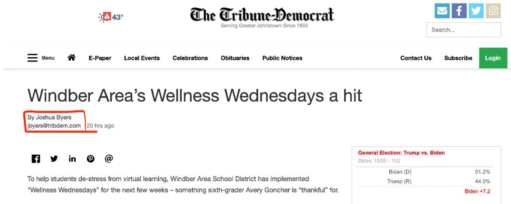

太好了，那么我们将把约书亚的名字和电子邮件添加到我们的公关列表中，继续我们的一天。如果你找到了一篇与你的业务非常相关的精彩文章，但找不到记者的电子邮件，则无需担心，因为几乎总会有一些社交链接。在这种情况下，我建议你浏览记者的社交媒体并在那里查看他们的电子邮件。请参阅下面的一些示例，了解记者和作家如何公开发布他们的联系信息，因为他们迫切希望就潜在故事被联系。

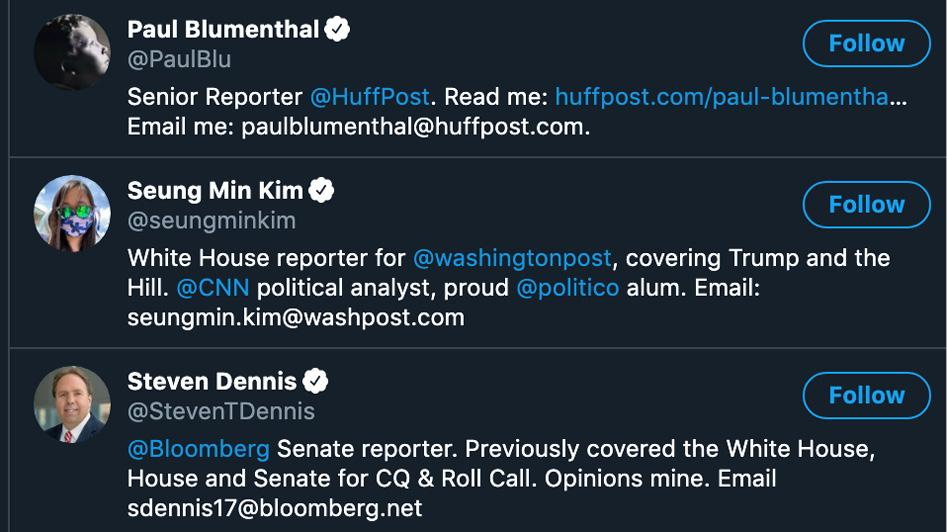

如果他们的社交媒体资料中没有他们的电子邮件，那么，为了追求成功，你可以轻松地在任何社交媒体平台上发推文或向他们发送消息，并按照我在下图中所说的话对于最近的客户：

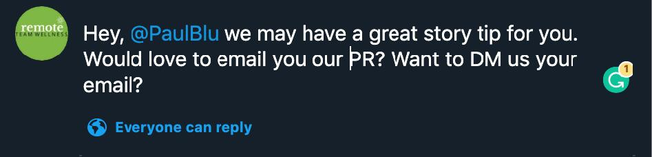

如果你正在阅读本文并认为你没有时间这样做，请不要担心；如果你在准备发布前几个月开始这个过程，你每周只需 30 分钟就可以获取这样的新公关电子邮件，我向你保证，几个月后，你会有 100 到 300 - 加上有针对性的 PR 列表，你可以将其重复用于众多营销活动、合作伙伴关系和发布。坚持我。我希望你将其视为一种被动的时间投资，因为这是一场马拉松式的营销活动，而不是短跑。你只是随便地继续建立你的新闻列表，同时还致力于产品开发，完成你的投资，建立你的团队，并准备扩展你的其余营销。

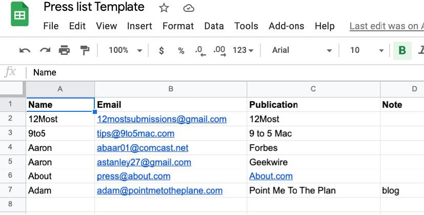

获取我的超级简单新闻列表模板并从此处开始你的列表：https://bit.ly/3rjKssN
每天，当你阅读与你的行业相关的新闻时，你会开始高度关注公关列表机会，下意识地寻找记者的电子邮件地址，甚至在社交媒体上也是如此。最终，你会沉迷于每天将它们添加到你的新闻列表中。老实说，我全年都在固定的 Chrome 标签中打开我自己的公关列表。如果你不确定何时发布，那也没关系；你无需准备好发布，甚至无需考虑确定的产品即可开始执行此操作。我希望你为 PR 列表设定的目标是在你准备好发布之前获得大约 500 到 1,000 个电子邮件地址，以便你可以准备好将其推向大众并获得大量免费促销。另外，请记住，此列表将在未来几年为你带来红利。你可以使用这个庞大的公关列表来交换、推广活动、推出新功能、宣布你何时达到未来的里程碑、推广大型赠品比赛，甚至宣布你的退出（总有一天！），所以不要怀疑它的价值建立你自己的公关名单。我的公关名单大约有 3,000 多名记者（因为流失、裁员和退订），我在 2012 年开始使用这个确切的策略，每周只有 10 到 30 分钟。我使用这份个人名单一遍又一遍地让客户获得大量曝光，寻找新合作伙伴，吸引新员工和实习生，获得赠品奖品等等。现在，几年后，我什至开始收到现在认识我的记者的入站请求，所以，请将此任务添加到你的待办事项列表中，并记住它可以轻松地融入你的其余部分工作日通过计算的 30 分钟突发。
我希望每天早上，当你开始新的一天时，你会自然而然地先查看 Google 快讯电子邮件，或者自己访问 Google 新闻，然后手动搜索以发现撰写有关你的业务和行业故事的新人，然后每天将新电子邮件添加到你不断增长的媒体联系人列表中。如果你每天都做这个简单的练习，在我看来，毫无疑问你将处理 30% 的公共关系机器，最好的部分是，你将能够在未来几年内使用和重复使用该列表.

## 第 2 步：创建完美的新闻稿
成为你自己的公关机构的下一个主要部分就是在你准备好开始吸引眼球后如何处理你一直在建立的清单。在公关中，你必须能够将你正在做的事情变成强大而有价值的故事，让媒体反刍给他们的观众。这里有大量的秘密技巧，这就是创造力的来源。我们现在将更多地展示我们的营销力量，因为我将教你如何为每个单独的类别制作完美的新闻稿或你收集的电子邮件地址的主题。我们这样做的原因是因为作为你自己企业的“公关顾问”，你的工作将是想出各种方式让你的故事对记者、作家和博主有价值，并测试什么引起了他们的注意，什么没有吨。
就像在营销甚至生活的其他几个领域一样，测试多种策略将有更大的成功机会。事实是，在进行测试之前，你永远不会真正知道对任何观众来说什么是有价值的，因此你必须创建一些故事“轨道”，然后与它们一起运行，看看哪些是有效的。因此，我们现在就为你的企业这样做，你可能正在阅读本文并认为 PR 不可能适用于你的早期业务，因为“我们还没有帮助过一百万人”或“我们还没有赚到 100 万美元，安德鲁，所以我们还没有故事要讲。”它在这里引用是因为我在与新客户合作时听到过几十次。我认为大多数人认为“有新闻价值”是“著名”的同义词，而对于媒体来说，这根本不是真的。你绝对可以在不出名或赚了数百万美元的情况下进入媒体。让我在这里明确说明这一点。然而，我一遍又一遍地听到刚起步的公司说他们不能做公关，因为他们没有达到任何重要的里程碑，比如筹集大量资金或帮助一百万人消除贫困。事实是，每家公司都有话要说，即使只是简单地推出也可能具有新闻价值。如果你真的在解决一个问题，你就是围绕这个大问题的故事的一部分，即使你还没有解决它。我在媒体上看到了数十家全新的初创公司，你只需要意识到，无论你处于哪个阶段，你都是报道你所在行业的作家的相关来源。
此外，如果你从事的业务不属于解决更大问题的一部分，那么你可能完全在从事错误的业务。也许你是一家大数据公司，正在绘制有关酒店的 10 亿个数据点；有一些利基媒体会吃掉它。也许你是一家全新的 SaaS 公司，正在帮助简化远程工作；嗯，这是 2021 年的热门话题。也许你是 DTC 护肤系列，它是有史以来第一个使用某种成分的护肤系列。每家公司都有一个故事，他们正在做一些事情来改变我们世界的一小部分。也许你在产品的起源背后有一些可以利用的惊人历史，或者你只是目前媒体大趋势的解决方案，并且你与此相关。
毫无疑问，在我看来，就像许多早期创业营销策略一样，你需要伪造它直到你成功，但这是一个很好的“肌肉”，可以尽可能多地锻炼创始人，无论如何。作为早期创业营销人员或品牌代表，你必须始终谈论你的业务，提前 6 到 12 个月思考你今天所处的位置，以便其他人追随你的愿景并相信公司。在与媒体打交道时，同样的规则也适用。所以，我希望你把自己放在记者的角度，想想你作为一个企业所做的事情有哪些有趣、令人兴奋或有新闻价值的地方。这就是我们要为你的新闻稿关注的内容，我们将首先制作完美的新闻稿标题/副标题。

你将打开一个新的 Google Doc（与你刚刚创建的 PR 列表在同一文件夹中，以保持组织有序），并且你将首先为你的故事集思广益几个潜在的新闻稿标题。我过去注意到，当我帮助新公司时，最好的起点是围绕公关头衔进行扎实的头脑风暴会议，然后其余的似乎都从那里开始。为了让你更轻松，我从我们过去三到五年中使用这些确切方法在 GrowthExpertz 上成功完成的公关发布中放置了一些屏幕截图。这些都是 100% 的早期初创公司，所以不要因为这感觉有多困难而气馁，因为这些文章确实最终让我的客户登上了福布斯、TechCrunch、INC 杂志、华尔街日报和数百较小的出版物，它们都是从这样的头脑风暴开始的。看看这些，然后在下面记下你自己的一些想法。
示例 1.（注意标题和副标题是如何一起流动的。）

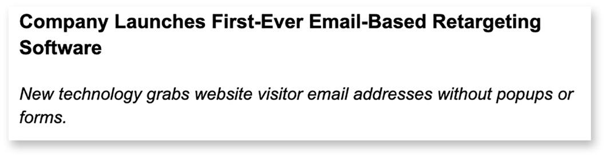

示例 2.（这是关于我的个人品牌。）

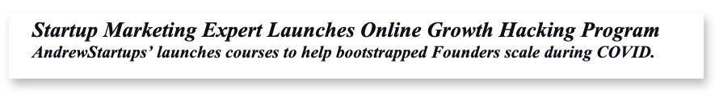

例 3

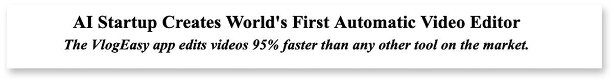

例 4

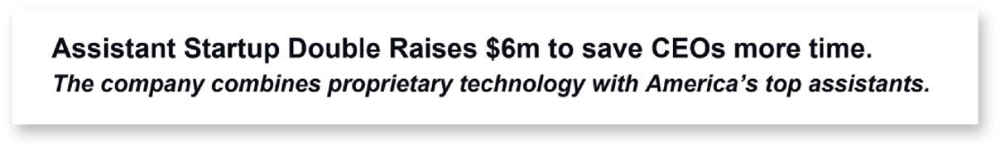

撰写新闻稿好标题的一些技巧：

1. 保持简短，标题一行，副标题一行（并且没有小字）！
2. 让它有趣但很模糊，所以他们继续阅读。
3. 在标题/副标题之间至少提及一次公司名称。
4. 使用你认为对读者有价值的流行词。
5. 问问自己：“这对他们的听众有价值吗？”如果没有，请重新开始。
6. 如果你有的话，货币数字和数字在标题中表现良好。

这里有一些空间供你集思广益，为你未来的新闻稿提供一些公关标题的示例想法！
. . . . . . . . . . . . . . . . . . . . . . . . . . . . . . . . . .
. . . . . . . . . . . . . . . . . . . . . . . . . . . . . . . . . .
. . . . . . . . . . . . . . . . . . . . . . . . . . . . . . . . . .
. . . . . . . . . . . . . . . . . . . . . . . . . . . . . . . . . .
. . . . . . . . . . . . . . . . . . . . . . . . . . . . . . . . . .
这里最重要的一点是，你要让接收者有足够的兴趣继续阅读，并且你想要尝试公然明显，这样你的信息就与这个人相关，所以他们知道你没有浪费他们的时间。尽管我经常说“假装成真”，但重要的是要区分我所鼓励的未来真正存在的东西与你对业务的愿景和撒谎之间的区别。请不要在你的新闻稿中撒谎（或根本就没有营销）！这样做弊大于利。相信我。你最不想做的事情就是在你真正拥有一家年轻企业之前就毁掉你的声誉。相反，只需创建一堆诚实但令人兴奋的潜在标题，并让你的顾问和/或朋友圈子投票选出他们最喜欢的。通常，你应该始终事先获得有关你计划公开的所有创意和营销活动的尽可能多的反馈。你的新闻稿也不例外。
有了这个，我实际上已经以私人讨论组的形式为你排列了一些免费的反馈和建议。在那里，你将能够暂停并从我那里获得更深入的说明（有时，以现场办公时间的形式），并从本书的其他坏蛋读者那里获得有关本课和接下来所有内容的帮助。因此，这是放下本书并通过本书背面的链接加入在线讨论的好时机。我们都想看看你的公关头条是什么，并在小组中给你我们的反馈，即使我不在，也会有其他成员愿意帮助并在公关方面得到帮助。
当你稍后联系目标媒体列表时，你最终确定的标题也可能成为你电子邮件的主题，因此请花点时间把它弄好。在你觉得你已经得到了你认为会吸引最多注意力的标题后，你会更深入地解决你正在解决的问题——写下你的新闻稿的其余部分。在下一页，你将看到成功发布新闻稿的核心要素的细分，我还在本节末尾附上了完整的新闻稿示例，你可以将其用作长度和长度的参考流动。

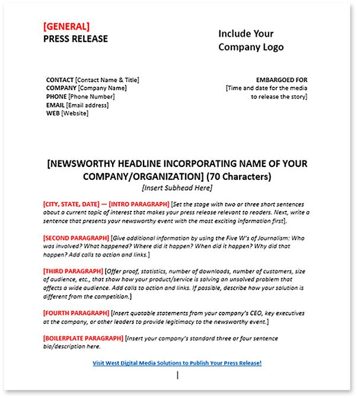

当人们撰写前几篇新闻稿时，我看到的最常见错误之一是他们倾向于下意识地将它们写成博客文章或文章。新闻稿是不同的；你不是在为最终读者制作最终产品。它不需要讲述一个完整的故事；它需要向记者传达引人入胜的细节，然后记者将调查、修饰并最终讨论该主题，以使你发送的事实成为一个很好的阅读。注意我说的是事实。在你的发布中坚持事实；没有意见。
看上面的例子。在你的标题下方，你会看到你从约会和出发城市开始，还有一段介绍性的段落，更多地解释了你在做什么。在介绍性段落之后，是时候开始赋予它们真正的价值了。我不担心把它印出来：记者很懒惰！
我在十多个国家做过关于公关黑客的公开演讲，当我问听众是否有人有公关背景参加时，通常会有几个人举手。然后，如果我说任何关于公关或记者的明显错误，我会要求相应的人阻止我，而且每一次，当我说媒体懒惰时，我都会看到他们同意并点头表示赞同。不要误会我的意思；这是一项艰巨的工作，有固定的最后期限，经常是大规模裁员，还有大量的噪音需要筛选，所以我不责怪他们。正因为如此，记者们确实只是在寻找你在新闻稿中为他们提供他们讲述你的故事和吸引读者/听众/观众所需的一切。因此，你希望让他们尽可能轻松地在你的业务中拥有他们所需的一切，尽可能少的接触点和尽可能少的时间投入。
在尝试为他们提供一切的同时，我仍然建议你尝试将新闻稿保持在两页以内，因为就像任何其他营销信息一样，存在 TLDR 因素。请注意这一点。如上图所示，一定要包括一些关于你的故事的好引语。一个理想引述的例子可能是创始人或 CEO 在讨论里程碑、公司愿景、她或他（或你）解决这个更大的问题时有多兴奋、公司的成功或推出对公司意味着什么。你可以使用的另一个重要引语是你从早期客户或用户那里获得的推荐信，它解释了产品或服务在改变他们生活中这个更大的问题方面有多么出色。如果你的投资者或顾问背后有大名或声名狼藉，我建议你也从他们那里获得一份报价以供发布。如果他们非常忙且难以联系到，请主动为他们写报价单并让他们签字，而不是要求他们为你创建报价单。这将为他们节省一些时间，并使你更有可能从他们那里得到一份。
在你得到你的报价之后，是时候更深入地添加关于你正在解决的问题的另一段了，如果可以的话，使用一些引用的大/著名的来源或统计数据，就这样了。没有理由添加没有价值的东西只是为了把它弄得一团糟。如果你的新闻稿只有一页，但包含上述所有信息（来自图片），那很好。
新闻稿的最后几部分包括详细的公司简介、你公司的媒体代表联系信息以及数字媒体工具包，以便记者获得他们可能需要的所有图像而不会打扰你。
对于媒体工具包，你只需创建一个名为 Your Company Name Media Kit 的 Google Drive 文件夹即可。在这里，你可能想要删除所有各种徽标、团队图片、产品屏幕截图、可能是你的办公室或你可能想要包含在其中的客户生成的内容。再一次，考虑任何对试图讲述你的故事的记者有价值的东西，比如你创始人的头像、你的产品或你的团队工作的图片等。关于你的媒体联系人，如果你“对于单人秀或单人秀，不要把你自己，CEO，贬低为媒体联系人。我注意到这使得公司看起来很小，因此作为媒体来源的吸引力可能会降低。相反，请使用别名电子邮件或假冒团队成员（例如 Andrew@yourcompany.com），并将该电子邮件用作你的联系人，并在以后与媒体联系时使用。这会让你看起来像是有人为你处理你的公关。
还记得不久前我说过我们将为每个故事线制作不同的新闻稿吗？好吧，现在是你对几个不同版本进行 A/B 测试的时候了。为不同的受众制作不同的新闻稿；越适用越好。你将专注于更改标题和副标题以及每个版本之间大约 20% 的文本。在下一节中，我们将讨论外展，但你会很快看到哪个版本具有“最多的腿”并停止使用其他变体。如果你只想从一个新闻稿和故事开始，那也完全没问题。这完全取决于你希望公关活动的规模有多大。如果你就你的 AI 初创公司联系体育作家，你必须在发布时谈论你的 AI 如何帮助体育行业的人们，所以只要让它尽可能相关和有价值，你就会做得很好。

## 第 3 步：免费向媒体正确传播你的故事！

现在是时候了。在过去的几个月里，你刚刚在你的产品上工作，加强你的信息，并照顾你的早期客户，你终于准备好在媒体上制造一些噪音。史诗！到现在为止，我希望你已经为你的企业制作了一个有影响力的故事（或故事），并且你已经安排了至少几百个你想与之分享这个故事的人，所以你的公关难题的最后一部分是有效且高效地发送你的故事，并开始获得一些牵引力和对话。此时你可能会想，你可以发送一封大型群组电子邮件并收工，而且你可以。我将在本节末尾包含一个类似的策略和最佳实践，作为你公关活动的最终任务，但首先，我将向你提供一些开始外展的最佳方法，这确实会导致更好的开放率，更好的回应，反过来，更多的公关机会不仅仅是用一个巨大的 BCC 列表来爆破它，所以坚持我在这里。
首先，我想回顾一下你开始公关外展时可能会发生的一些情况，以帮助你管理你的期望，然后为你提供如何处理每个人的最佳实践，以使你在以下方面取得最大成功公关。你接触的每个记者/作家/媒体人物只有三个潜在的积极结果：他们要么回信说他们有兴趣在他们已经存在的故事中引用或介绍你的公司正在努力；他们会复制粘贴你写的东西，写一个关于你的故事，甚至不告诉你（最常见）；或者第三个，也是最理想的情况是他们想要一个独家采访来创造一个关于你和你的企业的故事（最不常见，但保持积极！）。当然，另一个潜在的结果是他们完全什么都不做，你也听不到回复，这是一个很容易解决的问题——我们只是自动与他们联系（稍后会详细介绍），直到他们做出回应。请记住，成为出色的早期营销人员的一部分就是加倍努力并且永不放弃。持续专注的努力 = 在这场比赛中取得成功。
你的公关推广成功的关键是引领价值。如果你只从这本书中摘取一件事，我希望它是这样的：提供的更多价值=更多的成功。因此，我需要你了解你的企业故事对你接触的每个人有何价值，并确保你在外展信息中关注这一点。当你这样做时，至少在每条消息之间进行一些定制，你比那些只是复制粘贴和向记者发送垃圾邮件的女孩或男孩多 10 倍。他们得到了很多，所以要与众不同，具有相关性，并且有价值。请记住这一点——当你向他们发送消息时，你是在提供价值；你不是在寻求价值。如果你写信给记者询问甚至乞求他们报道你的故事，你可能永远不会得到回应，但如果你重新定义你的信息，而是为他们提供“一生难得的机会”来采访这个惊人的消息来源，他是这方面的专家XYZ 故事，你会惊讶于有多少人真的会回应，要求了解更多信息。
接下来，我希望你将刚刚建立的新闻列表分成两个主要部分：高价值的人，或者我喜欢称之为“登月机会”，然后是列表的其余部分——较小的，不太强大的机会，这些机会更有可能做出回应。我们这样做是因为我们将首先接触最大的出版物，在我们向其他人发送消息之前，我将向你详细介绍如何为它们创造额外的价值。我通常建议人们根据潜在机会简单地突出他们公关名单上的前 10% 的人。这些是最大的潜在机会、游戏规则改变者、梦想场景媒体投放以及拥有大量目标人群并首先与这些人接触的人。我们从那里开始，因为如果我们有几个人来报道我们，我们已经准备好进行一次非常大的发布，另外关于我们将提供给他们的额外价值，我们将向他们承诺独家发售，这意味着我们必须从那里开始，但我很快会更详细地解释这一点。
因此，我们将通过两种主要方式联系你的名单，一种是针对那些高价值人士，我将向你介绍如何直接向他们发送电子邮件，然后是批量 -电子邮件爆炸方式适用于所有数百个较小的机会，使用一些很酷的自动化来确保他们看到我们的邮件，而无需我们在它们上花费大量时间。
从你刚刚突出显示的前 10% 开始，你将开始逐个向他们发送电子邮件，一次一个，并尽可能定制一条消息。请参阅下面非常简短的个性化消息。

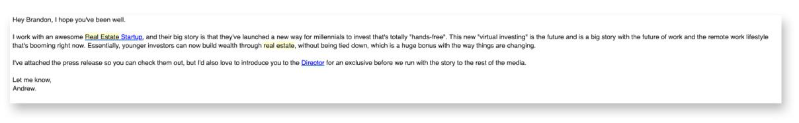

现在我们将在电子邮件营销一章中深入讨论冷外展，但我至少想提一下，当为你的公关工作发送冷电子邮件时，你需要将电子邮件大小保持在你认为可以接受的一半左右。这意味着我希望你在发送之前将电子邮件减少 50%。一般来说，电子邮件越短，阅读量就越大。我经常查看新团队的冷外展模板，并对他们在第一个电子邮件接触点尝试向接收者提供的信息感到震惊。这是一个失败，因为绝大多数接收者将在他们的手机上阅读电子邮件，当我们在手机上看到一封巨大的电子邮件时会发生什么？我们完全跳过了它，因为它的要求太多了，甚至无法阅读它。话虽如此，我对 PR 的冷电子邮件外展的第一条建议是在实际发送之前始终删除 50% 的消息。即使这感觉太短，它也可能是正确的长度，因为模糊也能获得更好的响应率。根据 Entrepreneur Magazine 的说法，冷发送电子邮件的第一个技巧是使用“模糊、简短的标题获得最多的打开次数”，你的电子邮件正文也是如此。
在电子邮件营销方面，头条新闻有一个关键目标：让收件人打开电子邮件。但是，他们打开电子邮件后会发生什么，取决于邮件的大小和内容本身。 TLDR 也适用于冷外展，所以一开始让你的信息非常简短，只专注于说三件事：

1. 你是谁。
2. 你为他们准备了什么。
3. 你的行动号召。

而已。请记住，一旦他们做出回应，你就可以详细说明更多信息，甚至可以让他们接听电话。所以如果你再去看看我上面分享的模板，你会发现我懒得自我介绍。那是浪费文字，因为他们不在乎我的名字；他们想知道我在说什么。公式是，电子邮件越短，回复率越高。电子邮件主题也是如此。 “电子邮件营销软件巨头 MailChimp 发现，在所有主要行业中，打开率从平均 17% 到 28% 不等。这意味着只有大约四分之一的人会打开你的电子邮件（更不用说阅读或单击其中的任何链接了）。如你所见，优化标题是确保订阅者阅读你的电子邮件的关键。这样做并不难。在制作标题时，请记住两个重要因素——保持简短并保持模糊。”
我建议你先测试几个不同的电子邮件主题和正文，然后再找出最适合你的项目的内容；然而，总的来说，我最好的外展主题一直是三个字或更少。对于公关，最好在电子邮件主题中加入一些可能被认为有价值的内容，例如“公关故事”或“XYZ 故事优惠”等。企业家说：“可以说，电子邮件营销历史上最好的标题是在奥巴马的第一次总统竞选期间发送，在线筹集了 6.9 亿美元（主要通过电子邮件营销）。那是，“嘿”。不，这不是打字错误。电子邮件的标题很简单，“嘿”。为什么效果这么好？这一切都归结为心理学。你更有可能打开通常在收件箱中来自朋友、家人或同事的标题为标题的电子邮件。”
我在这里触及适当的心态也很重要，所以请记住，仅仅因为你对这些人发电子邮件不感冒并不意味着你在向他们发送垃圾邮件。请记住：没有针对性的垃圾邮件。如果你在毫无根据的信息中为正确的目标创造了足够的价值，谁将从该价值中受益，那么他们真的不会在乎你是否被邀请给他们发送电子邮件！不过也有例外，所以请记住，当你收到一两个不满的回应时，可能会阻止你继续。不要停止。我现在是你的营销教练，我说继续前进！最终，你会收到令人难以置信的回复，这会让你想给我发电子邮件并告诉我你的成功（这样做：me@andrewstartups.com）。请记住，你并不是要出售或向他们索要任何东西。你试图为他们提供采访这个惊人消息来源的机会。这个想法是你正在为他们创造价值，这才是真正获得高打开率、高响应率并最终让你获得这三个理想结果之一的原因。
我真的希望你能至少获得一篇关于你的业务的文章，然后你可以将其放在社交媒体、时事通讯、网站的新闻版块等中。那么我们如何最大限度地提高发生这种情况的机会呢？我们需要为他们提供一些额外的东西，但在这种情况下，我们能为一家大型出版物的著名记者创造什么价值？你只是一家小型初创公司，因此没有钱摆在桌面上，但你知道自己可以提供什么吗？新闻稿的排他性。这仅仅意味着你将让他们在他们可以决定的特定天数内独家访问故事。因此，你实际上是在让他们有能力在其他人之前讲述你的故事。
这在他们的工作范围内是巨大的，并且真的可以让他们在他们的团队或他们的老板眼中看起来很棒，所以不要低估你给他们的机会的价值。那么我们可以为这些记者提供的另一部分价值是什么？与首席执行官的独家专访。回顾上面的模板，你会发现我也提到了这些方面的内容。现在你自己可能是 CEO，你现在正在一个人的节目中工作，在一家小公司里自己做这一切，所以你认为这没什么大不了的，但他们不知道.回顾之前，当我建议你使用虚假的团队成员电子邮件地址（如 andrew@company.com）向记者发送电子邮件时。如果你以营销或公关协调员 Andrew 的身份与你的 CEO 进行独家专访，这不仅会让你的公司看得更远、比你更合法，而且还会让他们了解你消息更有价值。
因此，你已经为前 50 到 100 个可能最重要的人提供了快速价值，这是开始公关推广的好地方，如果可以的话，通常在发布前 30 天左右。我说要在发布前很久就开始外展，因为很多时候需要几周的时间才能与这些大记者建立融洽的关系并将他们锁定，因为他们通常在其他截止日期前工作。因此，请了解该时间间隔并提前做好准备。现在，根据你细分的列表的第二部分，这是我们在这里进行一些很酷的增长黑客攻击的地方。因此，你一直在构建的大部分电子邮件列表，我们将采用该电子邮件列表，并将其放入你现有的电子邮件服务提供商或全新的自动化工具中，然后将它们发送到关于你的公关故事的电子邮件旅程，它将在未来几周内继续为你带来媒体机会。通过我在本书中教给你的所有策略，你会注意到我在开始时手动测试事物，尽可能多地进行变化，获取有关有效方法的数据，然后围绕该策略构建自动化以扩大规模，这也不例外。因此，在你手动向列表中最优先的记者发送了 100 封左右的电子邮件后，我希望你与记者进行了一些良好的对话，但也有很多关于哪些主题最有效以及哪些主题最有效的数据某种消息传递效果最好，这就是我们现在将使用一些很酷的工具扩展的内容。
现在，如果你使用除 MailChimp 之外的几乎任何其他电子邮件服务提供商（MailChimp 在这里不起作用，因为它们不允许上传手工构建的列表），你可以使用现有的工具逃脱对于这种自动化的公关外展策略，但我想推荐一些惊人且非常实惠的电子邮件外展工具，你可以轻松地使用它们来消除公关外展（以及我们将在电子邮件营销一章中讨论的其他渠道）中的时间投资。他们是：

如果你使用 Close.com 或 HubSpot 或任何其他强大的电子邮件自动化工具，那很好，但接下来的几段是基于上述工具。我不会在此详细介绍每个工具的具体细节，但我的想法是，你将为你所在社区中较小机会的记者、作家、博主、播客和 YouTube 用户创建一个五到七封电子邮件系列。列表，然后每隔几天左右自动向他们发送一封新电子邮件，持续大约一个月。这将每周为你的企业带来几个新的媒体展示位置，并且实际上需要几个小时来设置，然后你就忘记了它。我们在这一点上依赖自动化的原因是你是企业主或早期营销人员，你还有很多其他事情要做。仅本书就至少涵盖了 10 个其他营销渠道，所以我的目标是让你手动启动和测试 PR，然后一旦证明它对你的业务有价值，你就可以通过自动化或其他团队成员处理它来扩展它并完全消除你的时间投资。使用上述任何一种工具，你都可以简单地上传你的整个 PR 列表和你编写的电子邮件系列（我在本节末尾放置了一个最近客户的整个电子邮件系列模板供你复制），然后规定何时发送电子邮件，然后繁荣，你只需坐下来等待回复。在撰写本书时，Reply.io 有 14 天的免费试用期，因此如果你完全手头拮据，我建议你先去尝试该工具，但它们都很棒，而且交付率非常好.
现在，正如我所说，记者和媒体人往往有点懒惰，所以他们可能不会回应，即使他们确实感兴趣。所以你会怎么做？你进入该电子邮件工具，查看公关活动的报告，单击“打开”，你将看到谁打开该电子邮件的次数最多。有时你会看到一位记者打开了 5 到 20 个邮件，但他们还没有给你发回电子邮件。你做什么工作？现在你要去找那个人，再次从 Andrew@yourcompany.com 给他们发送一封自定义电子邮件，比如，“嘿，我的 CEO 说她真的很喜欢你写的东西，我们有兴趣聊聊和你。单击下面的链接以预订电话。”他们不知道你已经看到他们打开电子邮件的次数，但该数据通常意味着他们一直在办公室内转发你的公关，并且可能正在撰写有关你的故事，因此请在此处联系一个很大的增值。这就是公关外展的全部内容。你可以在有时间的情况下继续进行手动外展，但自动化会真正提高你的能力，所以不要害怕。
我们将在本书后面更深入地讨论电子邮件营销，但就目前而言，这里有一些关于自动公关推广的最后提示：

1. 每天发送的电子邮件不要超过 100 封。 你希望能够跟上回复，这可能会导致你的邮件成为垃圾邮件。
2. 在开始之前，确认你的电子邮件地址处于良好的垃圾邮件评级状态。 我建议你使用 www.mail-tester.com 并在开始自动化之前处于 8 或 9 状态。
3. 避免使用“免费”、“折扣”、“交易”、“储蓄”、“优惠券”等词。
4. 不要在工作时间以外或周末发送电子邮件。
5. 随着你的前进，让你的电子邮件变得越来越严肃和真诚，并为每封邮件增加新的价值。 不要每次都发送相同的消息。 参考我的模板。

公关外展模板：https://bit.ly/3rYMqir
加入本书背面列出的论坛，与其他读者分享你自己的电子邮件模板和活动数据/结果。 我们很想听听你的成功和经验教训。
资料来源：
https://www.entrepreneur.com/article/276543

## 第 4 步：获得更多免费新闻
到目前为止，在这个 PR 章节中已经有很多信息，所以我希望你花点时间把书放下并执行几次课程，而不是试图一次完成。至少现在你应该能够明白为什么获得资助的初创公司和大公司每年要为公关机构支付数十万美元。就像我在本书中教的其他所有内容一样，这都是关于时间投资的，所以不要在公关营销上懈怠。如果你兼职做这个，你会没事的，但如果你只尝试一两天，它可能不会有太大的意义。公关是值得的，因为一个非常好的媒体投放，特别是如果你的产品/服务可在全国或全球范围内使用，可以一举为你的公司带来成千上万的新用户/客户。
有了这个，我想通过介绍一些更多的方法来结束第一章，让你最大限度地利用媒体的所有时间投资，并为你的公司获得更多免费的公关机会。我希望你做的第一件事是查找所有可以免费发布新闻稿的网站，然后将你的新闻稿放在所有网站上。很多人没有想到这一点，但根据我的经验，每个网站的每个新闻稿大约有 500 到 1500 次查看，所以为什么不花几个小时一次把你的故事放在记者去的每个地方对于故事。为了让你开始，我已经提前列出了一小部分免费公关网站（截至 2021 年年中），你可以在这些网站上发布你的新闻稿以获得更多曝光：

1. https://mashable.com/submit
2. www.prnewswire.com
3. http://businesswire.com
4. http://us.cision.com
5. www.prlog.org
6. https://www.prfire.co.uk

这些网站之所以有效，是因为，就像我说的，记者很懒惰，（再次抱歉，没有冒犯记者的意思），但他们通常会去这些网站寻找报道机会。所以周一早上，他们的老板告诉他们，“嘿，我想让你写一些关于创业的文章。”他们做的第一件事就是去这些网站寻找关于正在扼杀它的初创公司的新闻报道，我希望你能在那里。像上面这样的网站将帮助你从你创建的版本中获得更多的收益，并且可能会在未来几个月内推动一些入站记者的请求。我建议你也去谷歌搜索“免费公关网站”，找到所有最新的免费网站，请去我们的免费论坛，与其他人分享你找到的最好的网站。我们的小组论坛将是最新免费网站的重要资源，所以不要犹豫，在那里发帖询问小组！
现在我想让你做的第二件事是访问 www.helpareporter.com。如果你以前从未听说过这项令人难以置信的免费服务，Help A Reporter 是一份免费的每日电子邮件通讯，其中包含来自美国各地（有时是国际）的记者的请求，其中包括他们目前正在撰写的内容以及他们的来源寻找。注册后，你会收到非常有针对性的电子邮件，其中包含记者请求，你可以实时回复这些请求，并且你的消息会直接发送给记者。注册时，你只需突出显示你可能成为有价值来源的类别，例如技术、商业、初创公司、健康、娱乐、媒体、旅行、旅游业或你所在的行业。然后，每天，HARO（也称为）向你发送记者的问题，寻找专家在其出版物中谈论这些主题。 HARO 最好的事情是，除了有机会为大量大型出版物创造价值并在媒体上宣传你的业务之外，如果你花时间为记者写一篇非常详细的回复，也许他们从未回复，你通常仍然可以通过将你所写的内容转换为博客或社交媒体帖子来重新利用该内容！因此，每周花一两个小时回复这些媒体询问是没有风险的。也许他们最终不会让你参与其中，但没什么大不了的，因为现在你有了一个可以重新用于其他营销活动的帖子。所以每天检查 HARO，在所有这些免费网站上发布你的 PR，你会从你写的每一篇新闻稿中得到大量的支持。我真的迫不及待地想在我们的私人在线论坛上听到你所有的成功故事，所以请在那里发帖。额外的信用，如果你想得到我的直接反馈，请在社交媒体上发布成功公关活动的截图或链接，并标记我@andrewstartups，我会回复！