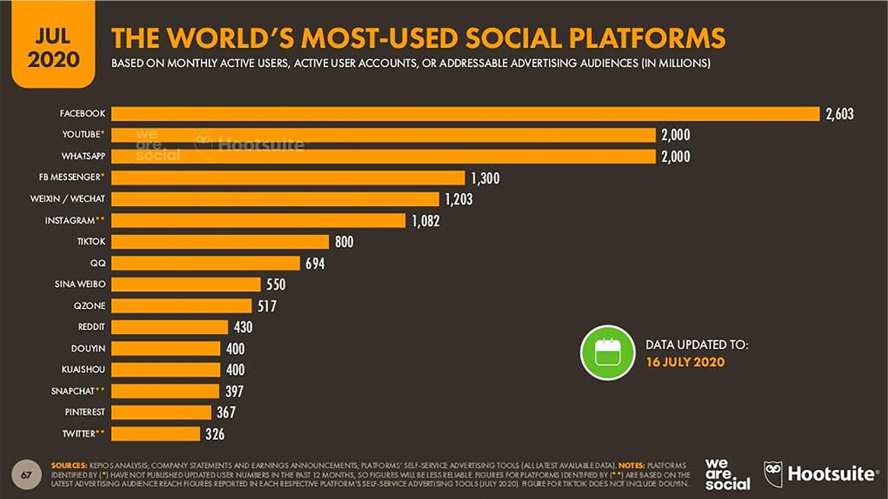
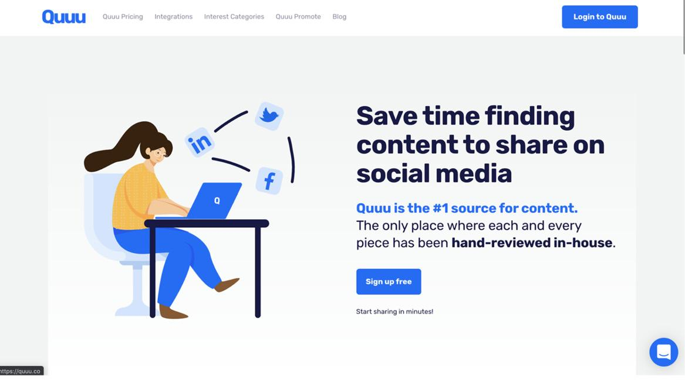
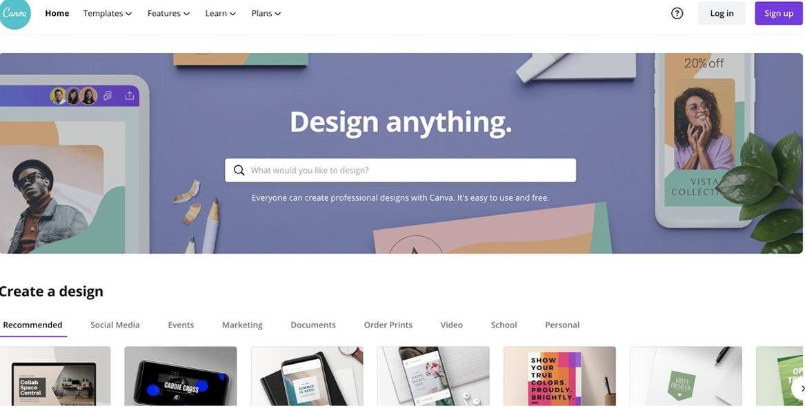
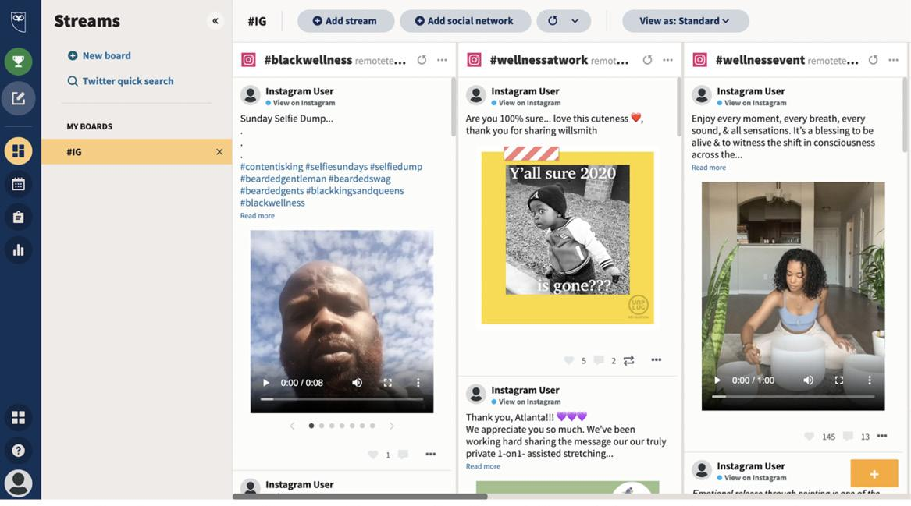

# 破解社交媒体营销以推动早期业务增长
## 第 1 步：了解社交并制定策略

对于一家处于早期阶段的公司，几乎没有什么比向早期客户学习更重要的了，因为早期客户通过他们为你提供的有关早期产品的强大定性数据帮助你加速成功。想想你公司的第一批客户的反馈有多重要。花时间与早期潜在客户进行互动和交流同样重要，你的社交媒体渠道是促进有意义的互动的有机渠道，这些互动可以尽早改变你公司的发展轨迹。你的社交媒体也是我所说的“营销基础”的核心部分，就像你的网站、徽标、标语、分析和品牌的其他基础部分一样。在这个时代，任何企业的“第一步”的一部分就是建立这个基础，所以我总是教团队至少在你制作第一个网站的同时建立所有相关的社交媒体页面.在时间上，公司应该从一开始就开始他们的社交媒体，从字面上看，当他们有创办公司的想法时，而不是像许多人认为的那样，一旦他们推出，因为你越早开始这些页面，你就越早甚至在你与他们进行交易之前，你就可以开始获得市场份额，并可能在每个新追随者面前获得先发优势。如果你处于预发布阶段，甚至处于隐身模式，你可以设置一个带有电子邮件捕获的简单登录页面，并且你最终仍会使用一定数量的电子邮件地址来启动你的产品，这就是明显比没有好。
通常，我从创始人那里听到他们推迟创建社交媒体页面，因为他们认为这不是一个强大的获取渠道，而且他们并不是 100% 错的。老实说，你不应该期望自己的社交媒体渠道能尽早为你带来大量新业务。事实是，社交媒体平台每个月都在稳步减少你可以从内容中获得的自然曝光量，以促使你在广告上花费更多。
正如 HootSuite 最近的一篇文章所述：“在 Facebook 上，自然页面帖子的平均覆盖率徘徊在 5.20% 左右。这意味着大约每 19 个粉丝中就有一个看到页面的非推广内容。”每个平台都有效地效仿，通过减少你的自然印象并提示你“提升”或“赞助”内容向更多人展示他们正在赚取现金，但这并不意味着你没有很多其他原因至少需要创建你的社交媒体页面，并对你发布的内容坚持有意义的策略。你的社交关注对你的业务有很多无形的好处，即使你很可能无法通过自己的页面推动大量的早期销售（不过，我们将在本章后面讨论如何通过社交推动销售）。首先，一家公司的社交媒体关注者很像他们的电子邮件列表，从某种意义上说，它是一种资产，充满了忠诚的品牌拥护者，其终生价值远高于普通的一次性客户。根据著名的转化率优化博客 Invesp 的说法，获得新客户的成本比留住老客户的成本高出五倍，因此社交媒体本质上是一种非常便宜的留住客户并一遍又一遍地转化的方式再次（但电子邮件更好！）。
通过在你的企业宣传中添加所谓的“社交证明”，社交媒体对于提高几乎所有企业的转化率优化也至关重要。想一想；当你看到你正在考虑购买的企业拥有大量粉丝时，你就会更加确信该产品的价值。这只是人类的心理。承认吧；我们是追随者。社交媒体通常是我在网站上看到的点击次数最多的项目之一，多年来，我已经查看了所有行业的数百个网站访问者的屏幕录像，我无法告诉你我有多少次看到网站访问者一直向下滚动，传递大量有趣的内容，只是先点击了小小的 Instagram 按钮。人们会检查企业在社交媒体上的活跃程度，以及你拥有的粉丝数量将决定用户是否信任你的品牌。谷歌也同样做同样的事情。尽管社交媒体不是 SEO 的直接排名因素，但它也与搜索引擎优化排名有关。
根据全球搜索营销中最大的声音之一 SemRush 的说法，“CognitiveSEO 的研究取得了一些令人兴奋的发现。在分析了选定平台上的 2300 万社交媒体分享后，他们发现社交分享和 SEO 之间存在模棱两可的联系。你的帖子收到的分享、喜欢和评论是 Google 和其他搜索引擎用来对你的网站进行排名的重要信号。这些信号加强了谷歌在对网站进行排名时考虑的因素。你可以在不同的社交媒体网站上大量分享这些信号。你在社交媒体上分享的有用内容越多，你的观众就越有可能与他们的朋友和关注者分享这些帖子。”
但是，如果如今社交媒体如此重要，那么为什么大多数年轻的公司在起步时都会推迟呢？答案是，即使开始也感觉像是一项艰巨的任务，更不用说保持一致了；因此，许多创始人在早期完全忽略它，而是专注于其他渠道。如果你不确定你应该拥有什么样的声音，或者你可以发布什么样的内容对潜在客户和用户有价值，我可以理解你为什么会跳过它，但我在这里帮助你破解所有这些。作为一家年轻的企业，定期发帖很重要，添加我们讨论过的社会证明，并表明你很活跃，但你不需要花费大量时间在每天早上进入办公室时创建内容和发帖.相反，现在，我将向你展示如何创建一个有效的社交媒体策略，你可以将其用作 SMM 的指南，然后在下一节中，我们将详细介绍如何一致地安排帖子以最少的时间投入。我们这样做是因为，正如我在本节前面提到的，你不应该期望自己的页面带来大量新业务，因此你应该最大限度地减少在自己的社交媒体页面上的时间投入，以便将时间从你的页面与用户互动并通过社交推动实际业务增长（稍后将在第 3 步中详细介绍）。现在，我想让你做的第一件事是冲回 Google Docs 并创建一个名为 [Your Company Name] Social Media Strategy 的新共享文档。现在，即使你的公司只有你自己，这份文件也可以作为你在社交媒体上遇到困难时的参考点。我在本节末尾附上了一个示例社交媒体策略文档，但在本文档中，我希望你写下五件事：

- 理想的内容重点：
- 创建渠道：
- 要关注/监控的竞争对手：
- 每月内容机会：
- 我们喜欢的示例帖子：

你将使用此文档作为上述五个类别中每一个类别的头脑风暴部分，为你的社交媒体提供适当的内容、重点和消息传递，以及将来每次遇到哪种类型的问题时为社交媒体创建的内容，你可以回到这里再次在你的策略中找到重点。我已经在本节的末尾放置了一个演示社交媒体策略文档来激励你，但如果你是团队的一员，这是一个很好的点，把这本书放下，就每个人进行小组讨论策略文档的部分。
对于内容重点类别，你需要决定要传达的三到五个不同类别或消息，然后根据你认为内容对你的业务的重要性为每个内容重点分配一个百分比，以及为读者。这将是你讨论某事或作为品牌销售某事的经验法则。例如，对于以前的一个客户，我们推出了一种新的电子邮件营销技术，它是“世界上第一个基于电子邮件的重定向软件”，因此在我们的内容重点中，我们强调至少包含 40% 的教育内容新技术是什么。这将帮助你确保你专注于最重要的事情，不要忽视任何事情。所以想想你想谈论的所有不同的事情，把它缩小到几个主要主题，分配这些百分比，并尽可能地坚持下去。一致性是内容和社交的关键，因此这些规则将帮助你保持一致。如果你在这里或本节的任何地方遇到困惑，我鼓励你加入私人小组的聊天，并从其他制定社交媒体战略文件的人那里获得反馈。
对于你将作为企业关注的社交媒体渠道，我希望你走得更远，而不仅仅是 Facebook、Instagram 和 LinkedIn，因为社交媒体实际上是你的目标人群进行互动和创建内容的任何在线场所社交上。因此，这可能包括与你的行业相关的利基论坛、国际网站（如果你计划成为全球品牌）、Quora 和 Reddit 等问答网站等等。我希望你列出你知道至少需要在其上创建和发布内容的每个频道，即使你不希望在每个频道上都非常活跃。我经常指导品牌为他们的突破平台创建内容，至少重新调整用途并在其他页面上重新发布这些内容。例如，许多公司正在为 TikTok 或 Instagram 创建内容，但他们也会在 LinkedIn、YouTube 和其他渠道上转发他们的内容，这很好。

你在所有这些网站上吗？我不这么认为。它们可能并不都是相关的，所以开始简单，但测试一切。
对于竞争对手部分，我希望你列出你所在行业或利基市场中的一些品牌，这些品牌比你走得更远，你可以通过社交媒体寻找灵感。我绝不鼓励你抄袭他们的社交内容；恰恰相反。我希望你知道他们在做什么，并从中得到启发，而不必做同样的事情。我鼓励你关注你的所有竞争对手，并了解什么是有效的，你的目标人群对什么最有反应，但请远离任何复制粘贴。
你将在内容机会部分花费最多的时间。在这里，你将从上面扩展内容重点部分，并集思广益，你可以在这些类别中提出每个潜在的内容创意。一个例子是，如果你是我在下面的例子中的艺术酒店，并且你希望你所有帖子的 30% 是关于艺术的，内容机会之一可能是关于“艺术教育”，教追随者关于艺术术语和行业。这份清单对你来说将是最重要的，因为每个月当我们计划和安排我们的社交媒体帖子时，你都会在创建内容时一遍又一遍地使用这份清单来获得灵感。
在示例帖子部分，我希望你剪切和粘贴你从其他品牌看到的鼓舞人心的内容，即使它们与你发布的内容无关。当你在创建自己的内容时遇到困难时，这将是你的参考。这可以是你在其他地方看到的、你想用你的品牌进行测试的事物的运行和不断发展的列表，也可以是一个倾销任何你想尝试的很酷的内容创意或机会的地方。
在你的社交媒体策略文档中填写这五个部分，即使你是一个人工作，这不仅可以作为你最终成长并将 SMM 的统治权移交给其他人时的指南，而且还可以作为你随时使用的绝佳工具在你创建和安排新内容的日子里，“作家的障碍”。你可以简单地查看你的内容机会，看看你在那个特定月份是否还没有使用过某些东西，并立即获得灵感。当你对要发布的内容有新想法时也是如此；你可以简单地回到这个文档，看看所说的想法是否符合你提出的内容重点。如果没有，最好放弃它并坚持到底（除非你想测试它）。这里的想法是，当你创建社交媒体内容时，此文档每个月都会为你节省时间，这样你就不必花费数天时间来创建帖子。在下一部分中，我们将深入研究如何安排你以最少的时间投入创建的精彩内容，以便你可以将所有时间都花在与页面外的用户互动上（第 3 步）。

这是你可以用作模板的社交媒体策略示例：https://bit.ly/36KtX0b
资料来源：
https://blog.hoosuite.com/organic-reach-declining/
https://www.invespcro.com/blog/customer-acquisition-retention/

## 第 2 步：每月在 On-Page SMM 上度过一天

现在你已经制定了你的社交媒体策略，并制定了你想要关注的渠道、你想要发布的内容类型以及你想要为哪些社区创造价值的指南。有了这些信息，我现在将教你如何每个月只花一天时间来创建所有社交媒体内容，这样你就可以不用再花时间担心每天发帖了，而是使用免费工具来最大限度地减少时间通过提前安排职位进行投资。在我进一步讨论之前，我想详细说明我将开始大量使用的社交媒体营销术语。大多数营销专业人士没有意识到，在社交媒体营销中实际上有两种主要策略：一种是指你在自己的页面上所做的事情，我将其命名为“页面 SMM”，另一种是指你所做的离开你自己的页面，然后我将其称为“页面外 SMM”。虽然我确实创造了这些术语，但我确实看到其他人在教类似的想法，重点是 SEO 很像 SEO，它也有页面内和页面外策略，两者都有重要的方面，但许多公司不要同时进行页内和页外 SMM（很像 SEO），因此会留下相当多的“金钱”。
将这两者区分开来很重要的原因是，就像我说的，大多数公司的页内 SMM 在早期没有太多业务，但是当你有时间时，可以从页外 SMM 获得大量早期业务专注于它，所以我们使用工具和自动化来最大限度地减少在我们自己的页面上发布的时间投资，而是花更多的时间在页外参与，将人们从他们已经在线的地方带到我们的内容（我们在第 3 步中讨论） ）。你会从我在本书中推荐的所有工具中看到一个主题：它们是便宜的（并且尽可能免费）工具，这是设计使然。我的目标是为你节省我在营销上的每一美元以及你的时间，我们将从自动社交媒体发布调度程序开始。
社交媒体最困难的事情之一是发布需要多长时间，因此通过使用自动发布工具，我们可以消除我们每天的时间投资，并减少跳过发布天数和不一致性的可能性，这会损害 SMM 的整体成功。

去 planoly.com 免费试用他们的社交媒体调度工具。
我们将讨论的第一个工具是 Planoly。 Planoly 是一款免费工具，可让你每月最多安排 30 个帖子而无需支付一分钱，我已经列出了所有顶级安排工具的列表，供你比较并在下面找到你最喜欢的工具，以防免费计划可能用 Planoly 改变。还有其他几个竞争对手没有太大区别。我个人最喜欢的是 Later.com，因为它具有可视化的调度程序，并且你可以轻松地使用他们的“拖放”UI 进行创建。我已将排名前 10 的社交媒体日程安排工具放在下方，以便你可以自行调查其中的一些并找到最适合你需求的工具。
用于调查的顶级社交媒体调度工具：

- Later
- Hootsuite
- Publer
- Crowdfire
- ContentStudio
- PromoRepublic
- Sociamonials
- MeetEdgar
- Amplifr
- SocialPilot

无论你决定使用哪种日程安排工具，你基本上都会在每个月的某一天，通常在月初或上个月的月底，向你的 Google 日历添加几个被封锁的小时数，其中你将花费一些时间来创建下个月的内容。然后，你将所有这些帖子安排到你选择的工具的队列中，然后繁荣，你基本上完成了本月所有的页面 SMM。这可确保你每天都在最重要的页面上发帖，并且即使你的内容并不完美，也能吸引观众而不是让他们悬而未决。现在我并不是说这是最好的页面 SMM 策略，但它肯定比我所看到的规范更好：什么都不做。我的目标是让你花费很少的时间并获得最大的按时投资回报，在这 30 天结束时，你应该不仅会看到你的追随者在增长，而且还会看到有关哪些内容类型的数据产生共鸣并为你的网站或应用带来合格的流量。随着时间的推移，你会变得越来越聪明，而且月复一月，你会越来越擅长创建内容，直到最终，你将能够雇佣或扩大时间投资，但在短期内，这样做.我已经提前在下方放置了一些非常重要的早期社交发布指南，但我很乐意在私人论坛中看到你的提示和建议。
社交媒体发布指南：

- 每天在所有页面上设置一个自动帖子。 （但你仍然可以手动参与）
- 在发布之前，总是问，“这对我们的观众有价值吗？”
- 总是尝试去教导、启发或留下深刻印象。
- 每月至少尝试几次新想法。
- 每个月都要浏览每月的内容机会。
- 最多使用 5 – 10 个主题标签。更多会淡化你的信息。
- 这不是强制性的，但建议尽可能保留通用的配色方案。
- 尝试用语言和幽默保持品牌形象。选择一种方式并继续。

也许你对社交媒体日程安排工具了如指掌，这很好，但是我为你准备的下一个令人难以置信的省时免费工具，我几乎肯定你从未听说过。它被称为 Quuu (quuu.co)。 Quuu 是另一个令人难以置信的页面社交媒体工具，因为它确实为你的观众发现了有价值的内容，并自动将其添加到你的社交媒体调度程序中。 Quuu 有一个团队，负责管理数十个类别的有价值的内容，并为你提供有关发布内容的想法，因此你所要做的就是对其进行一点自定义（如果需要），将其拖放到你的日程安排工具中，瞧！社交媒体被黑。

Quuu 将为你的社交页面排列强大的内容，而你无需动动手指。
这个令人难以置信的工具实际上可以每周为你节省数小时来查找要发布的有价值的内容，而且它的美妙之处在于你仍然定期发布，获得思想领导力，并被目标人群发现，但这并不占用你的时间，并且这让你有时间专注于每周创建一两个有机内容，我们将在内容营销章节中详细讨论。
下一个“必备”页面社交媒体工具称为 Canva。大多数人都知道 Canva，但如果我至少不提及它，我就会失职。 Canva (Canva.com) 是一款免费的社交媒体图像创建工具，你可以使用它为 Instagram、Pinterest 和其他平台创建精美的帖子。这个令人难以置信的工具消除了在早期启动阶段对图形设计师的需求，以及在创建的每个图像上投入数小时的需要。例如，你可以创建强大的图片引用来激励和提升你的观众，或者你可能想要测试制作有趣的模因并分享它们。

Canva 是一款出色的工具，可满足你公司的任何内部图形要求。
如果你想爆出 2 到 30 张好的图片，你可以拖拽上传到你的日程安排工具的日历中，快速为每张图片写下帖子文本，然后，boom，你的社交媒体被安排在这个月.现在，我并不是说要在你的企业生活中这样做，随着你公司的成长，我希望你在社交方面得到越来越多的投资，尤其是当你有资金和资源来聘请队友时。此时，你将不再需要这些工具，但一开始，当你是“首席一切官”时，这些工具将为你节省大量时间。这些工具有意义的全部原因是基准测试什么都不做，所以使用这些工具，至少你可以确保你每天都在做一些事情并快速了解什么是有效的。
因此，尽可能多地安排时间，让它运行，返回，查看分析，看看什么是有效的，以数据为驱动，然后根据该数据进行优化。

## 第 3 步：通过 Off-Page SMM 在社交上免费获取早期客户
到目前为止，我所讨论的与你的社交媒体相关的所有内容都是关于你可以如何以最少的时间投资来发展自己的页面，但我希望这仅占你在社交媒体上花费的总时间的 20% 左右.我希望看到你节省 80% 的时间用于 SMM，用于通过我所谓的“页外 SMM”推动早期转化的活动。社交媒体上真正的乐趣在于离开你自己的页面，以推动你的业务参与度和流量。
我想让你花更多时间离开你的页面的原因是，就像我之前提到的，你根本无法从社交媒体页面获得大量的自然覆盖，至少在开始阶段是这样。然而，我一次又一次地看到这些页外策略为公司带来了真正的、可量化的增长，而无需花一分钱。在我看来，一小时一小时，没有什么比监控社交媒体和大规模参与对了解你的行业、你的目标和你的未来客户有更大的影响，这就是页外 SMM 的全部意义所在。现在，你每天都在自己的页面上自动发布帖子，你可以腾出时间去发现、吸引和推销潜在客户，当他们真正需要你时，没有什么比这更能免费为你带来更多数据和更多业务了.我将教你一些工具，这些工具将使你能够轻松地持续监控其他社交页面、热门关键字、主题标签、目标群体和论坛，以及你的目标人群在网上花费时间的任何地方，以便你在合适的时候可以通过有针对性的、超值的消息向他们发送消息，从而推动一些早期业务。在我看来，这对于年轻的企业来说比在自己的页面上创建和安排帖子强大得多，这就是为什么我花了这么多时间教你如何自动化社交媒体营销的这一方面。
我希望你做的第一件事是考虑与你的业务相关的所有不同的关键字和主题标签。这也需要一些研究，如果需要的话，你应该与你的团队、朋友甚至家人进行头脑风暴会议。此外，你可以去 Instagram，你可以去 Twitter，你可以去 Facebook，你可以搜索那些主题标签和那些关键词，看看他们有什么样的活动。你正在尝试找出对你希望作为用户或客户获取的人最活跃的字词。我要你把它们写下来。记住它们。你最终会变得有点痴迷于成为围绕这些术语的对话的一部分。
理想情况下，你会发现至少 5 到 10 个关键短语或主题标签，你可以对其进行监控并使其变得活跃。将这些视为你可以加入的长期对话，它们将持续为你带来业务，并使你能够发现潜在的合作伙伴、媒体机会，甚至是未来的客户或用户。
我将在这里以我的业务 GrowthExpertz 为例。如果我的业务是向创始人销售创业营销解决方案，那么我将想要监控关键字和主题标签，这些关键词和标签不仅可以让我在围绕“创业营销”的对话中获得“市场份额”，而且在潜在客户在线讨论他们需要帮助时找到他们。因此，我可能想要遵循和监控的一些术语可能是：

- “My startup needs”
- “#Startupmarketing”
- “Bootstrapped marketing”
- “Startup raises millions”
- “#startupfounder”
- “Startup founder marketing”

你开始看到一些模式了吗？现在将其应用于你自己的业务，一旦你想出一些术语，下一步就是使用这些术语设置一些社交媒体监控工具，以便你可以在人们需要你时做出回应。再次，这里的目标是通过与通过谈论需要你的产品/服务甚至是自我认证的人接触来尝试推动一些潜在客户，安装，对话或其他任何可以为你的年轻公司带来动力的东西只是你试图解决的问题。
请记住，营销就是创造价值，这个策略也不例外。我们希望能够找到需要我们价值的人，然后尽可能多地为他们提供服务，让他们做我们想做的事情。我们将介绍的第一个工具（你可能听说过）是 Hootsuite (hootsuite.com)。 Hootsuite 是一种调度工具，但也具有强大的监控功能，它本质上是一个社交媒体帖子的搜索引擎，可让你监控几乎所有主要社交网络上发布的内容。

Hootsuite 正在为我的一个客户提供服务。使用此工具来监控你的潜在客户在网上说什么。
使用 Hootsuite 中的一个简单的免费帐户，你可以轻松地设置对你之前想出的主题标签和关键短语的搜索，并且只要世界上的任何人发布内容，你就会迅速开始获得这些搜索的实时桌面通知条款。另一个惊人的免费工具，仅适用于 Twitter，是 TweetDeck。如果你是一个强大的 Twitter 用户，你需要放下这本书，去 tweetdeck.com，然后用你的帐户登录。你的生活可能再也不会一样了。使用这两种工具中的任何一种（如果你想在 Hootsuite 上使用除 Twitter 之外的其他社交媒体帐户，然后在 Twitter 上使用 TweetDeck），只要有人发布包含你输入的那些术语的任何内容，你都会收到实时通知，并且能够以价值回应。
让我再举一个例子来说明这对你有什么作用。假设你是我以前的客户 RoyalRobbins.com，你卖攀岩和徒步旅行的衣服。如果你在 TweetDeck 上将“攀岩服”作为一个关键术语进行监控，并且有人在推特上写道：“今天攀岩时撕裂了我的衬衫。猜猜，我需要新的攀岩衣服，”你会看到它并能够立即向他们发送类似这样的回复：“嘿，看起来你可以使用一些新装备。我们愿意帮忙。这是我们的新产品线和 10% 的优惠券，因为太棒了！”
而已。你坚持下去，你会看到真正的结果，我向你保证。除了销售，我经常看到这种策略帮助公司更好地了解他们的行业，经常发现新的竞争对手、行业事件、大规模的潜在合作机会，甚至投资者。它是完全免费的，只需要很少的时间投入，如果做得好，可以带来真正的结果。
所以我希望你每周尝试几次，别担心，你不需要实时回复，当你看到一个新帖子时。只要你不等几天才回复某人，该消息应该仍然很有价值。我希望你做的是在你第一次打开笔记本电脑时把它变成一个简短的早晨仪式。然后，每天早上，当你开始新的一天时，你会留出一些时间来回复最近 10 到 20 位在不同社交网络上发帖的人，将他们确定为你的潜在高质量目标。随着时间的推移，你将了解哪些术语最适合遵循和最活跃，并加强你的注意力。如果你怀疑此策略对你所在行业的有效性，请不要在不尝试之前就将其注销，因为即使你没有推动实际销售，你仍然会从监控中的对话中获得大量额外价值你的行业。
此外，值得一提的是，这并不类似于向人们发送垃圾邮件，因为我总是说些什么？没有针对性的垃圾邮件之类的东西。如果你想成为一名成功的增长营销人员，你必须让自己摆脱这些人不希望你给他们发信息的思维过程。仅仅因为它是主动提供的，不会使它成为垃圾邮件。你专注于给他们价值，所以这是一个有价值的信息。这就是良好的主动营销和垃圾邮件之间的区别。你正在努力帮助他们。
我想让你做的是用包含他们实际需要的价值的消息来打击目标人群。作为参考，我在 10 多年的时间里做这件事的长期定性数据是你得到大约 40% 的响应率，其中大约 75% 的响应通常是积极的。考虑一下。如果你发送 100 条消息，大约 40% 的人会回复，通常情况下，他们会点击而不回复。因此，假设 60% 的人可能会点击该链接。如果你关闭了其中 5% 的人，那么在发送 100 条消息所需的时间内，这仍然是两到三个潜在的销售/安装/潜在客户。这就是我所说的，如果应用得当，这对某人来说可能是一种有价值的策略。
页外社交媒体营销还扩展到活跃在所有其他社交媒体网站上，例如与你的目标相关的论坛和群组，因此我还希望你加入与你的业务或目标人群相关的所有 Facebook 和 LinkedIn 群组。我建议你也加入 Reddit 上相关的潜在“subreddit”。 Quora 是让你成为你所在领域思想领袖的绝佳机会，因此请花一些时间回答甚至可能不相关但将有助于你在该网站上的地位的问题。最后，对“你的行业+论坛”进行彻底的谷歌搜索，这样你就可以发现是否有任何与你的目标人群相关的利基网站，并在那里建立存在感。这个想法是，你希望在目标人群花费时间上网的任何地方，而且你不需要大量预算来做到这一点。你只需要花时间做正确的事情。