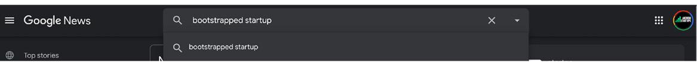

# 自己开始和扩展内容营销活动
## 第 1 步：始终如一地创建有用的内容

内容营销就是创建对潜在有价值的目标有用的内容。这个想法是为你以后想要与之开展业务的目标创造价值，以便他们可以自己发现你的公司，而不是通过你直接向他们出售。有价值的目标的一些例子可能是潜在的推荐人、未来的用户、客户、客户，以及你想在以后购买或转换的任何其他人。
入站流量（自己来找你的人）与你尝试向其销售的客户之间的主要区别在于，当他们进入你的网站时，他们基本上已经“出售”了。他们在访问你的网站、商店或应用程序之前就已经出售了自己，因为他们消费了一些关于你的业务的内容，这让他们意识到他们做出了有意识的决定来了解更多。这就是内容营销如此强大的原因；你创建的每一条内容都可以在未来几年免费为你的企业带来高质量和高意向的流量。
现在，我在本书中教授的大部分内容都是外向营销策略，因为像内容营销这样的策略需要大量时间才能开始工作（数月，而不是数周），而我完全是为了即时满足营销和业务发展。话虽如此，请不要误会，入站营销可以在你花费时间后创造免费的流量来源多年。入站流量是自然而然地向你发送的流量。我经常使用这样的类比，内容营销就像钓鱼时将一堆浮标扔进水里（如果你不喜欢钓鱼参考，就像向太空发射几颗卫星）。他们只是永远漂浮在那里，人们偶然发现他们并从他们那里了解你的业务。
要启动可靠的内容营销策略，你首先需要了解你可以创建和测试的所有不同类型的内容。你创建的内容类型越多，你就会越快看到哪些类型的内容与你的受众产生共鸣，因此你应该扩大战略的哪一部分。许多人错误地认为内容营销是博客的同义词，但事实并非如此。博客在 1990 年代后期风靡一时，因为它是最简单的内容营销类型，因为你可以快速写一些东西并将其放在那里。 Twitter 后来因为微内容的出现而火爆，而 Instagram 则因为美丽的视觉内容的流行而火爆。还有播客和有声读物形式的音频内容以及你制作的关于品牌的课程、课程和视频形式的视频内容。在撰写本书时，YouTube 现在是世界第二大搜索引擎。在 YouTube 上搜索内容的人数比所有其他搜索引擎（Google 除外）的总和还多。对于所有这些不同类型的内容，你必须运行内容测试并在各个方面创建内容，以找出适合你品牌的内容。

你是否意识到你需要定期创建所有这些类型的内容？
无论你是 B2B 还是 B2C 公司，你通常都能从创建所有类型的内容中受益，因此请参阅上图了解你可以开始创建的内容示例。如果你开始几种不同的内容策略，你最终会看到哪些类型的内容最能引起观众的共鸣，并且你可以停止使用其他方法。不过，首先有一些成功的关键秘诀。首先是创建对你的受众有价值的内容，以便他们分享、使用和推荐它。最好什么都不创造，而不是你的观众不需要的东西，所以在你花时间创造任何东西之前，想想自己：人们会搜索这个吗？他们需要这个吗？他们会分享这个吗？
在这一点上，我希望你再次停下来，放下书本，思考你可以在公司内部、团队内部、专业知识或数据中利用什么，开始为你的受众创造有价值的内容。你可以在内容中免费赠送的价值越多，它就越有可能成为病毒式传播并激发有关你品牌的口碑。通常，赠送如此惊人的价值感觉违反直觉，但我向你保证，你可以赠送的价值越多，就会有更多的人喜欢它并分享它。你知道和喜爱的几个著名品牌完全是建立在他们的内容营销策略的基础上的，所以只需考虑什么对你的目标人群有用并记下一些想法。内容营销成功的第二个关键是长期坚持不懈。了解开始一个新的播客、一个新的博客或一个视频系列至少需要六个月的时间才能起飞，即使你每周录制一集。这只是基准测试，病毒式传播可能会更快出现（这是希望！），但我看到人们在内容营销中失败的第一个原因是他们在几集后放弃。别担心；在第 4 步中，我将深入探讨如何分发你的内容，这确实是最容易被忽视的部分，在你制作好内容后宣传你的精彩内容。与你的内容策略保持一致和坚持，因为这需要时间。

## 第 2 步：通过“致敬发布”快速启动成功的博客
博客不仅是最容易启动和扩展的内容营销策略类型之一，而且还可以对你的业务产生巨大的 SEO 影响。这是因为你撰写的每篇博客文章都可以针对新的关键字焦点单独进行排名，因此可以独立于你的企业主页通过 Google 发现。你发布的内容越新鲜，谷歌对你的排名就越好。这就是为什么我认为博客几乎是所有企业内容策略的重要组成部分。现在，我不会在这里详细介绍与博客相关的所有内容，因为这很容易成为它自己的书，但我确实看到了观察企业无法启动博客的模式，所以我想分享一些关键点如何轻松有效地开始你自己的广告系列。我相信扩展博客最困难的部分是 1) 找到写新博客的有效方法和 2) 长期坚持下去。大多数初创公司需要花费数周时间来撰写他们的前几篇博客文章，当他们最终发布内容时，他们没有看到足够大的时间投资回报来保证定期在每篇文章中投入数周时间，因此他们只是放弃了。相反，我将概述一种快速的方法，你可以在一天内完成前 5 到 10 篇博客文章，以便你可以提前安排它们，巩固博客作为流量来源的同时为自己争取足够的时间来完成有机自己做一两件。
你要做的第一件事是返回 Google 新闻（是的，我知道我们经常使用免费的 Google 产品。欢迎来到省钱的创业生活。），我希望你能集思广益地讨论一些用于 Google 搜索的潜在术语这将生成有价值的文章与你的观众分享。希望你会从大型出版物中看到你喜欢的文章，这些文章是关于你的目标人群感兴趣的内容。也许是“提示和技巧”文章，也许是新闻，也许是关于你所在行业未来的想法，或者只是你的目标人群将感兴趣并可能参与的内容。再次强调，请关注此处有价值的内容。你正在寻找通常只会在社交媒体上分享的内容，但不仅仅是安排内容并在社交媒体上分享，我将向你展示如何在你的博客中快速撰写并分享相反，以非常低的时间投入开始为你的博客带来初始流量。我称这种策略为“Tribute Posting”，绝不容忍抄袭，所以请坚持我的观点，我将解释其中的区别。如果你从未注意到，所有主要媒体都会这样做。下次你阅读新闻报道时，你会注意到它可能以“最初印刷于……”或“来自我们的合作伙伴……”之类的文字开头回到他们，并在我们分享时在社交媒体上标记他们，但稍后会更多。
因此，在你发现一些你认为有趣的文章后，我希望你停下来完全阅读这些文章，以确保它们确实为你的观众提供了高质量和有趣的内容。现在从一篇文章开始，突出显示你最喜欢的一两段，然后将其直接复制并粘贴到你的博客草稿中。在将该部分粘贴到你的第一个“致敬作品”草稿中之后，在此之上，我希望你自己写两到三段来说明为什么这与你的业务相关。写下为什么读者应该对这个故事感兴趣，或者你作为这个领域的思想领袖的看法是什么。告诉人们为什么这是大新闻。在你的快速编辑评论之后，原始文章的段落带有引号，所以这里没有意外抄袭，然后在底部提供原始文章的链接。这就是在你的博客上快速发布“致敬帖子”所需的全部内容，而不是花费数周时间尝试撰写自己的文章。效果往往是一样的。无非是社交媒体上的一些赞。那是因为你才刚刚开始，仍然没有大量的追随者，但至少这让你开始以最少的时间投资创建内容。关键是要习惯于以这种方式定期创建和发布。让我向你展示我自己博客中的一个示例。

我在 Google 新闻上搜索“bootstrapped startup”，因为那是我的受众。

我最终找到了一篇很棒的文章，名为“早期创业公司会犯的四个错误以及如何避免它们”。我决定不只是在我的社交页面上分享它，而是决定增加一些博客流量并写一篇关于它的“致敬文章”。

在 20 分钟内，我写了我的 pos 与我的观点和引述以及阅读原始全文的链接。看我下面的文章：

现在在顶部，我提到了我的公司，经常超链接我的公司名称，并确保我添加的内容仍然具有价值。然后你会看到我粘贴了原始文章中重要文本的一小部分，并附有引文。

然后，紧接着，我用原始文章的链接、有关我的业务的更多信息以及阅读我的文章的链接将其关闭。

如果你花几个小时创建 5 到 10 个这样的“致敬帖子”，你很快就会拥有自己的内容，因此每次点击“发布”时，你都会向 Google 发送一个信号，表明你正在更新你网站上的内容，你的 SEO 将受益。你将不必处理任何重复的内容问题，因为你添加了几段原文，甚至除此之外，你还引用了原作者，因此你可以在社交媒体上安排帖子时提及并标记它们，这甚至可能让你得到他们的转发或关注！就这么简单。如果你不这样做，并且你花两周时间撰写每篇自然博客文章，你的博客将永远不会起飞，你的 SEO 将受到影响，并且你将继续在社交媒体上分享你无法跟踪的文章链接。通过这些“致敬帖子”，你无需分享你不知道人们是否点击的原创文章，你将能够在分析中看到访问者是否真正对内容感兴趣，并且你的策略可以变得更加明智随着时间的推移。
作为社交媒体/内容营销的经验法则：你在社交媒体中分享的链接越多，你的网站获得的额外流量就越多。我的意思是，如果你在你的社交媒体上分享别人的链接，你会在他们点击另一个网站的链接时失去访问者，但假设你分享了你的“致敬帖子”，并在底部你给他们的文章号召他们去你的主页，注册你的时事通讯，试用你的演示，下载你的应用程序，或者不管它是什么。你将通过这些免费推动你的主要 KPI。你基本上有机会向每位读者追加销售，否则他们将离开你的品牌。

## 第 3 步：以 0 美元开始播客
根据 Edison Research 的数据，收听播客的美国人数量约为 9000 万，这使其成为你可以自行创建的最受欢迎的音频内容。这使其成为增加内容营销工作的重要策略。
播客强大的秘诀与博客相同；它们很容易食用。通过播客，人们可以在旅途中、在车里、在健身房甚至在工作中收听你的内容。播客成功的另一个重要原因是与广播等其他音频内容不同，播客是点播的，这意味着你的听众可以随时收听他们想要的内容。
你有没有想过成为播客主持人？不？嗯，你应该。开始你自己的播客可能比外出就餐花费更少，并且仍然对你业务的多个领域产生持久影响。与任何其他内容策略相比，播客实际上可以在不起飞的情况下为你的业务带来潜在客户和增长。这是因为根据你的业务，你可以有针对性的播客嘉宾，这些嘉宾可能是你业务的潜在投资者、合作伙伴和客户，因此即使没有人倾听，你仍然可以通过播客推动增长。你可以通过播客有效地创建自己的思想领袖，只需与你所在领域的其他思想领袖交谈、采访和创作内容。
就像写博客一样，整本书都可以而且已经写了关于开始播客的文章，但是随着播客听众人数的不断增长，我想我至少需要花一些时间向你展示最便宜和最简单的入门方法。与流行的看法相反，你不需要成为一个非常技术性的人，也不需要预算来开始播客；秘诀就是坚持 5 到 10 集。
播客的首要任务是确定节目的主题。像商业的许多方面一样，在致力于一个主题之前先从研究开始。我建议你查看 Apple Podcasts 甚至只是 YouTube，看看是否有任何竞争。如果你看其他一些节目，那完全没问题；只需留意超级拥挤的主题和主题。我不建议你只制作关于你的业务的播客，因为它不够有价值或不够有趣。就像我一直说的那样，它必须是关于价值的——对客人的价值和对听众的价值——所以专注于提出一个涉及两者的主题。
一旦你决定了一个主题，我希望你列出至少 10 到 15 集的想法。这些可以是围绕你想要的理想客人的想法，也可以只是你想要在主题中涵盖的主题。
提出该列表后，你将开始设置它。在本章前面，我们讨论了 Canva，你可以使用相同的工具轻松设计一些播客图像/徽标。我建议的下一个工具是 Anchor.fm，这是一个一站式免费工具，适用于从创建播客到托管的所有内容。

Anchor 是制作播客的最佳工具，但不要相信我的话。调查其他人。
找客人也不是特别难；你只需要做几个小时的冷外展。我建议你一次只向一个人发送你之前的 10 到 15 集想法中的每一个。你可以在社交媒体上私信他们，或者你可以猜测他们的电子邮件地址（或者如果你是我，两者都做）。这是一个纯粹的价值优惠，提到它可以免费参加节目，并且你将向观众推广它并向他们发送内容以供他们的社交媒体使用。你会感到惊讶；你可能可以比你想象的更广泛地邀请你邀请的对象。毕竟，你是在提供价值，而不是要求它。使用 Anchor 记录你的剧集和繁荣，你就在路上。从我这拿走;刚开始时，你无需购买昂贵的麦克风或任何编辑软件。当然，这些东西会让最终产品更加精致，但它们并不是一开始所必需的。首先，你的耳机和使用 Anchor，甚至只是录制 Zoom 通话并保存 MP3，都可以。最后一部分是确保你分发了你刚刚花时间创建的令人惊叹的音频内容，因此你需要将这些音频文件联合到 RSS 提要中，以便它们可以通过 Apple Podcast 分发并在任何设备上下载或流式传输-要求。除了 Apple，你还需要将 Podcast 的剪辑放入社交媒体，将它们添加到 YouTube，并依靠你的客人来宣传他们的剧集。

## 第 4 步：分发你的精彩内容
你可能从未听说过内容分发，这没关系，因为它是所有营销中最未被充分利用的策略之一，所以你并不孤单。顾名思义，这一切都是为了分发你创建的精彩内容，但我的非官方定义基本上是你在制作内容后为推广内容所做的任何努力。这是离开你放置内容的页面并将其播种到其他在线社区的行为，这些社区对你的目标人群很重要，以便更多人看到并参与其中。问题是，许多公司花费数周时间创建令人难以置信的内容，例如白皮书或新视频，只是简单地将其发布到他们的社交渠道上而什么也不做。难怪当他们认为对他们的底线影响不大时，他们会放弃内容营销。为了帮助你避免这个问题，我制定了一个有用的规则，我称之为 80/20 规则，这是一个基准，我希望你只花费 20% 的内容营销时间预算来创建内容，然后 80实际分发它所花费的时间的百分比。如果你坚持这一点，你将从内容营销中看到更多的结果，因为从本质上讲，你的内容被发现的地方越多，你的内容营销计划对你的业务就越有价值。时期。分享内容时，比只分享链接试用产品更有价值；它不会被视为垃圾邮件，因为它通常只是人们自然希望看到和分享的教育或有趣的内容，因此与你仅使用 CTA 分享主页链接相比，它可以有更多的“腿”。
但是，你如何确保你创建的每个内容都得到正确分发？我也有这方面的技巧。这就是我所说的内容分发清单，它是一个运行清单，列出你可以轻松免费宣传你的内容的所有地方。这是你每次创建新内容时可以自由播种内容的任何地方的列表。这将确保你从你创建的每一段内容中获得所有额外的魅力，无论是音频、文字、图像还是视频。所以我想让你做的第一件事就是打开另一个谷歌表格，并命名它，你猜对了，“内容分发清单”。首先对网络上哪些地方的内容有价值的地方进行头脑风暴。我在下面提供了一个灵感模板，但大多数示例不太可能与你的业务相对应。

以下是你的团队可用于推广你创建的新内容的内容分发清单示例。
想想所有各种 Facebook 群组、LinkedIn 群组、Reddit 子版块和小众网站。还有新闻发布网站。你听说过 Flipboard 吗？免费的新闻和媒体发现应用程序拥有超过 2 亿用户，你可以免费提交你的内容，立即将其收录到其他人的杂志中。你可以将其提交到 Digg 或 Mix.com，它们是其他内容发现站点。这些网站上的用户可以并且经常会转发内容。正因为如此，你可以用很少的时间投入获得大量的“腿”。当你着手处理其他事情时，你会发现越来越多的地方可以重新发布你的内容，几个月后，这个列表会很大，你可以与任何需要转发的人分享稍后讨论你的内容营销计划。这可确保你创建的所有精彩内容都能真正被看到，而美妙之处在于你最终会看到哪些网站或群组在你的分析中带来了最多的流量，并且你将能够在这些地方加倍关注未来的内容.
内容分发的最后一部分是充分重新利用和回收你的内容。回收你的内容可能听起来是常识，但如果你只花了两三天时间写一篇精彩的博客文章，你可能不会意识到这是社交媒体视频的完美脚本。你可能还没有意识到你可以拍摄该视频，将其放入你的时事通讯中，然后你可以接收该时事通讯，获取唯一的浏览器查看 URL，并在社交媒体上分享你的电子邮件时事通讯的链接。这就是全方位的内容回收。你应该始终尝试四五次回收你的内容，以确保人们看到它。