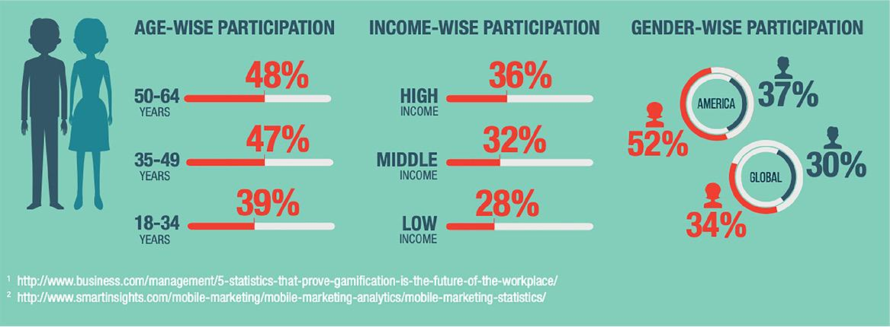
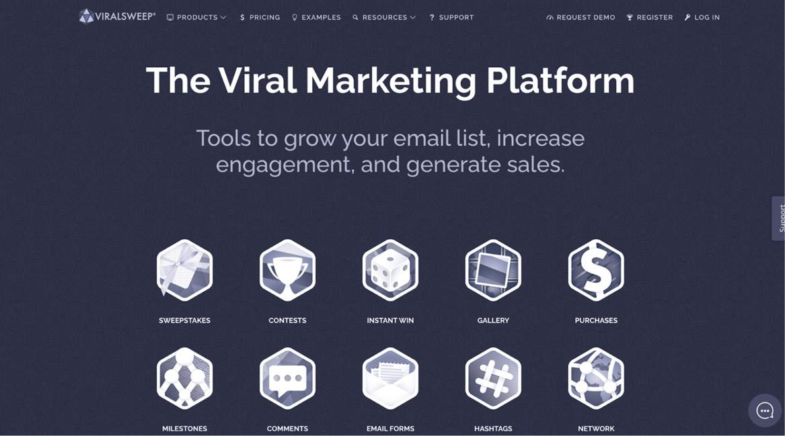
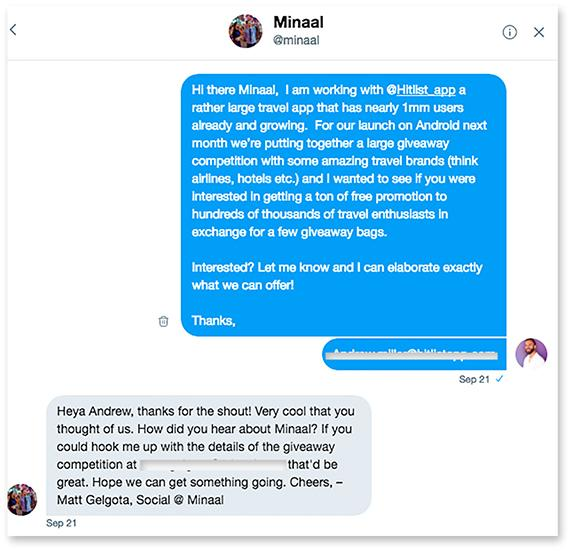
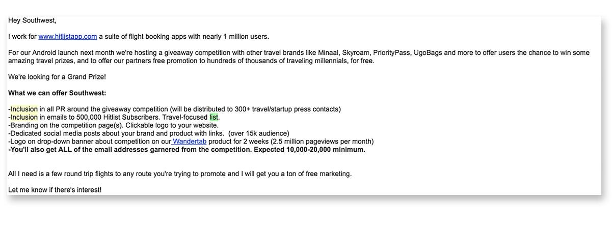
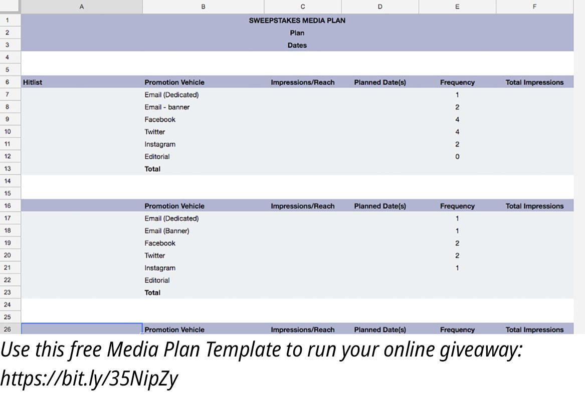
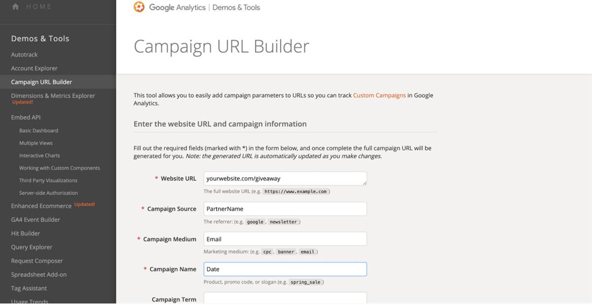
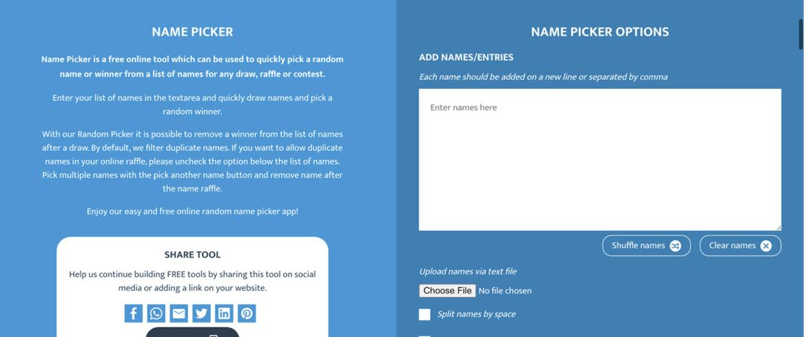

# 通过赠品和抽奖活动增加你的电子邮件捕获
## 第 1 步：构思完美的赠品竞赛

你知道什么可以比其他任何东西更快地扩展你的电子邮件列表吗？不，它不会添加更多弹出窗口；它正在举办在线赠品比赛！那就对了;使用非常简单和便宜的软件，你的公司可以运行可扩展的在线赠品，这不仅使你几乎没有运行成本，而且可以为你提供 5,000 到 50,000 个目标潜在客户的优质电子邮件地址，你可以轻松地将这些地址添加到你的电子邮件水滴营销活动中。更好的是，根据我的方法论，如果你不想，你甚至不需要自己设置奖品。花点时间想想你最后一次看到一个品牌在网上做赠品是什么时候。即使你自己从未参加过赠品活动，和/或你认为它们很荒谬，你也可能已经注意到你所关注的一家公司正在经营该赠品。每年有超过 5500 万美国人参加在线赠品活动，因此不要仅仅因为你认为它们很愚蠢就将其一笔勾销。这是一个常见的营销错误——仅仅因为你不喜欢某件事就认为它可能不可行。请记住，你可能不是目标人群，因此在计划营销时不要认为你的意见和愿望很重要。我总是说什么？测试一切并以数据为导向。这个频道就是一个很好的例子。

认为赠品与你的目标无关？再想一想！他们为所有年龄、性别和收入的人工作。所以测试他们！
如果你曾经参加过在线抽奖活动，你可能已经注意到，在你输入电子邮件地址后，很可能会提示你获得后续免费参赛作品的方法，通常是通过推荐他人、关注合作品牌的社交页面，或其他一些与营销相关的问题。这就是秘诀。这些活动为所涉及的品牌带来了数万美元的价值，我曾与客户合作，这些客户围绕着持续运行这些赠品而建立了整个价值数百万美元的品牌，以增加他们的电子邮件列表和社交粉丝。
这些抽奖/赠品的目的通常是建立一个巨大的电子邮件列表，以便你可以尝试推动这些新订阅者稍后通过可靠的电子邮件营销活动购买你的产品，但请不要误会，这些比赛也可以为你带来很多好处新的社交媒体关注者，在新产品发布之前进行宣传，甚至在竞争结束后的几年内推动可扩展的销售。我将从我的职业生涯中举一个例子，进一步证明这个未开发渠道的力量。
2017 年，我完成了一个非常大的旅行应用赠品竞赛。我们花了一个月的时间努力工作，但我们以大约 400 美元的价格获得了超过 17,000 个电子邮件地址。我们与我接触过的旅游行业合作伙伴交换了所有奖品，反过来，他们必须分享庞大的新电子邮件列表作为他们的付款，因此我们甚至不必投放任何广告。 400 美元用于我即将向你展示的平台上两个月的高级订阅，其余部分完全免费。然后，该公司每周向这些非获奖者发送电子邮件，并最终签署了一个固定百分比（我不再在该公司工作，所以我不知道确切数字）到他们的高级月度订阅中，可能会为他们带来数万美元的收益月。
因此，一旦你决定要为你的业务尝试此渠道，你要做的第一件事就是制定你的营销策略。首先，你应该确定赠品的 KPI 是什么。换句话说，你需要赠品进入者做什么来推动你公司的盈利？大多数情况下，这些活动的目标是获得新的电子邮件订阅者，但其他一些 KPI 可能是你社交媒体关注者的增长，因为也许你知道你的内容和社交非常好，你将能够将用户转化为客户稍后通过社交媒体。也许你只想在新产品页面上获得大量印象和品牌。区分这一点很重要，因为你需要从他们那里获得的任何价值都将成为你进入竞争的障碍。为了获胜，你将让所有进入者都执行你的 KPI。
一旦你弄清楚你想让人们做什么，就可以开始设置比赛了。我推荐你使用的工具称为 ViralSweep (www.viralsweep.com)。

你可能认为你不需要使用工具来运行赠品，但相信我，我不建议你花钱购买任何不能持续推动强大营销投资回报率的东西。你确实可以自己在线运行你的赠品，但如果你这样做，我向你保证，与你可以使用该软件所做的任何事情相比，它都会有所不足，并且相对而言，你可能不会从中获得太多价值。如果你在不使用 ViralSweep 或类似工具的情况下举办和宣传你的比赛，你最终会在付费广告上花费更多来宣传比赛，那么在我看来，该软件会花费自己，但请继续尝试！相反，ViralSweep 托管你的赠品，为所有合作伙伴提供跟踪，为你提供推动人们在社交上推荐和关注你的工具，帮助你随机选择获胜者等等。该工具的起价仅为 50 美元/月，这是本书中推荐的更昂贵的工具之一，但因为无论如何你的竞争对手很可能不到一个月，我建议你挥霍更昂贵的包，因为，在最后，与在其他任何地方花费 200 美元相比，你将获得更多的电子邮件地址。
重申一下——我没有与 ViralSweep 或我在本书中推荐的任何其他工具的所有权、合作伙伴关系、投资或其他激励合作伙伴关系。那里有竞争对手，例如 DojoMojo，我鼓励你研究所有竞争对手，但 ViralSweep 是我在此频道中的首选。
ViralSweep 物有所值，因为它不仅会大量减少你在营销运营上的时间投资，这是我整本书的目标，而且还会最大化你的 KPI 结果。相信我，我曾尝试不使用任何工具来举办赠品活动，但每次的最终结果都是少数进入者和微不足道的回报。 ViralSweep 还使你能够为你的赠品提供高质量的着陆页，而无需编码能力，然后你可以在 www.yourcompany.com/giveaway 上托管，通过该网站，你可以吸引高级奖品和媒体合作伙伴（稍后会详细介绍），否则你将无法仅通过社交媒体托管的赠品获得。他们有很棒的支持（向 Giancarlo 致敬，他是自己负责支持的 CEO！）而且他们的网站上也有很棒的教程视频。
所以你已经决定了你想让人们做什么，你已经决定在哪里举办赠品，现在我想让你为你的赠品想一个主题。 “主题”赠品不仅听起来对参赛者更具吸引力，而且只会吸引属于该类别的合作伙伴，因此只会吸引关心这些产品的参赛者。这大大提高了你即将收到的电子邮件列表的质量。你以后能够将参赛者转变为客户的真正原因是因为你获得了有针对性的新电子邮件列表。如果你只是举办一次赠品活动，提供免费赢取 iPad 的机会，你将获得成千上万的参赛者，他们在赠品结束后再也不会打开关于你的业务的另一封电子邮件。相反，你希望通过选择与你的业务和目标人群相关的赠品主题来确保活动结束后的高投资回报率。如果你是一家旅游公司，这将是一个以旅行为主题的赠品，因此任何参赛者都证明他们已准备好旅行，因为这是他们获胜的全部机会。如果你是 DTC 护肤品牌，那就是#SelfCare 赠品，因为任何参加此类赠品的人都可能是投资护肤品的人。这里的重点是，你要让奖品和主题只对以后可能对你的产品感兴趣的人感兴趣。这将决定你从活动的成功中获得多少投资回报率。
资料来源：
https://cdn2.hubspot.net/hub/53/file-250043455-jpg/Blog-Related_Images/KontestappInfographic.jpg?__hstc=20629287.56129fbc9a502e8cee3d3afe3621f0ae.1566978505862.1567769626482.1568101778911.7&__hssc=20629287.1.1568101778911&__hsfp=1721107091
https://www.snipp.com/hubfs/8441516/Resources/Infographics%20and%20Guides/Sweepstakes-Contests-Infographic.pdf

## 第 2 步：为你的赠品寻找完美的合作伙伴
有两个主要因素是你的赠品比赛取得巨大成果所需要的 - 促销和奖品 - 好消息是你可以轻松找到能够处理这两者的合作伙伴。我喜欢将合作伙伴分解为媒体合作伙伴或奖品合作伙伴，我建议你至少找到两个或三个，以获得最佳的广告系列效果。媒体合作伙伴是一个品牌或公司，它希望在不赞助或提供奖品的情况下加入你的赠品活动，而是提供与观众接触的机会，并帮助你宣传赠品。这些合作伙伴可以是拥有大量社交追随者或大型电子邮件列表、电视节目、广播节目等的品牌。那么，奖品合作伙伴是一家通常没有大量受众但拥有真正有价值的产品的公司，他们可以为你提供作为赠品的奖品，以换取向大量受众进行推广。你明白我在说什么吗？你处于所有这些价值的中间，但它只花费了你执行的时间，你仍然会从双方获得回报。请注意，如果你的企业有产品线，你也可以并且应该将你的产品包括在你的赠品竞赛中，但根据经验，奖品总金额越大，你的竞争对手对潜在参赛者的吸引力就越大。想一想“进入以赢取 5,000 美元的奖品”与“进入以赢取 50 美元的奖品”听起来如何。
为了进一步缩小合作伙伴对赠品的搜索范围，你需要将目光集中在那些受众尽可能多地由目标人群组成的品牌上。这可能意味着与受众年龄、位置和/或性别与你相同的品牌保持一致，即使他们不在完全相同的细分市场中。总体而言，你获得的确切目标人群越接近，你获得的最终电子邮件列表的质量就越好。对于奖品合作伙伴，你需要寻找拥有只有你的目标人群才会关心的产品的品牌。这对于你的广告系列的成功至关重要，并且不需要花钱来推广它。例如，如果你从事旅游业，那么对你的受众而言什么是主题和有价值的？想想酒店住宿、免费航班、旅行包、旅行装备、相机等。 以上所有内容只对旅行的人真正感兴趣，因此为什么电子邮件列表对合作伙伴也具有针对性和价值。
如果你像我建议的那样花钱在 ViralSweep 中使用高级订阅，他们有一个庞大的合作伙伴网络，在那里合作伙伴关系的推广都是自动化的。你可以滚动浏览潜在合作伙伴，查看他们的关注者和列表规模，点击你想要合作的品牌，他们可以在几分钟内批准或拒绝你的竞争。如果你从更便宜的订阅开始，那很好，尤其是在进一步投资更昂贵的订阅之前测试并查看赠品是否真的对你的受众有益。在这种情况下，你要做的是去谷歌、Instagram 和/或 Twitter 寻找合作伙伴。然后，通过与你的主题相关的关键字搜索品牌，并向他们发送有关你的竞争对手的简短而甜蜜的信息，邀请他们给你发送电子邮件以了解有关机会的更多信息。我在下面包含了一个模板外展消息，其中显示了如何进行外展。对于我想得到的一切，我都会发送同样冷酷的信息，只有三个关键要素：我是谁，它们的价值是什么，以及信息末尾的行动号召。

尝试在此处重新构建你的思维过程。 你不是在追求价值； 你为品牌提供了获得这个绝佳机会的机会，而不会花费他们任何现金。 当你与他们联系时，第一条消息要尽量简短，但是当你通过电子邮件向他们发送更多信息时，你可以详细说明你为他们带来的价值，如下例所示。

请注意，我的电子邮件对他们来说几乎是 75% 的价值。媒体合作伙伴与奖品合作伙伴的价值将有所不同，但总体而言，两种类型的合作伙伴都希望获得曝光和免费营销。以下是我对作为赠品活动主办方的潜在合作伙伴的价值的一些想法：

- 他们在比赛页面上的可点击标志。
- 在社交媒体上提及他们的公司。
- 包含在有关比赛的电子邮件爆炸中。
- 包含在你将发送给媒体的新闻稿中（来自你一直在建立的公关清单！）

这是那些营销人员在你伸出手时想要听到的内容。他们希望能够告诉他们的团队：“我刚刚为我们找到了另一个在线赠品，他们会将我们纳入许多营销活动。”他们只需要在老板眼中好看，这就是你为他们创造的真正价值。你是主持人，所以你正在努力工作，我向你保证，如果你坚持这个公式，你将获得比预期更多的免费奖品和媒体合作伙伴。当你开始收到潜在合作伙伴的回复时，你会看到最常见的回复是询问他们需要什么。他们甚至可能会说这听起来好得令人难以置信，那太好了！
就赠品的总奖金价值而言，你希望它至少超过 1,000 美元，因为我希望你的竞争对手说“赢得 1,000 美元的奖金”或至少有一个三位数或四位数的数字，让人们认为值得花时间进入。根据 Outgrow.co 的说法，平均个人赠品奖金为 369 美元，但我要求奖品合作伙伴提供至少价值 500 美元的奖品，以剔除那些不会为我们创造足够价值的公司。我还告诉他们，他们提供的越多，我在赠品中给他们的促销就越多。例如，如果他们给你价值 5,000 美元的奖品，那么除了你作为主持人的名字之外，你可能还会在比赛中包括他们的名字。在写出你必须提供的所有价值后，你可以为合作伙伴设置几个层级。也许你的前两名奖品合作伙伴从你那里得到的比其他任何人都多。至于对媒体合作伙伴的要求，你会希望他们为你提供尽可能多的促销活动。想想向他们的观众发送电子邮件，在他们的 YouTube 频道上提及，或者任何可以让你最接近他们的观众的东西。我们将在下一部分更深入地了解媒体合作伙伴，因为你需要做很多事情才能让他们承担责任，但最重要的是，你不要因为潜在合作伙伴的一个负面回应而放弃。像所有的冷门外展一样，这是一场数字游戏，所以我希望你保持消息传递的潜力，并且知道公司越大，让他们前进的难度就越大。
如果你可以专注于主要是数字奖品合作伙伴或奖品不需要运送的公司，那么在比赛结束时对所有参与者来说就更容易实现；只要确保你的目标人群会对这些赠品感兴趣。我建议你继续下去，直到你获得至少五个媒体合作伙伴；我不会做超过七八个，因为那样价值会被稀释，因为对于任何一家公司来说，有太多的品牌无法取得成功。所以试着找几个小伙伴和一个大伙伴，你会很好。第一个合作伙伴是最难的，但是一旦你抓住了动力，就会有越来越多的人对你的竞争感兴趣。
资料来源：
https://outgrow.co/blog/stats-giveaways-contests

## 第 3 步：创建赠品媒体计划并宣传你的赠品
在你锁定奖品和赠品合作伙伴之后，是时候敲定赠品的促销计划了，因为如果你没有让一群人看到它，那么整个努力就毫无价值，对吧？在活动结束后，你需要数以千计的新社交关注者和数以千计的新电子邮件地址进行营销。正如我提到的，没有理由花任何钱来宣传你的赠品，尤其是如果这是你的第一个测试活动，但你确实需要付出很多努力来有机地宣传它。我希望你将此赠品视为你正在创建的另一项内容，我所说的内容营销中最容易被忽视的部分是什么？没错——内容分发，所以我们将创建一个赠品媒体计划，它的作用很像上一章的内容分发清单，让所有合作伙伴对他们结束促销交易负责。在我参加的所有比赛中，我注意到你让你的合作伙伴承担的责任越多，最终的成功就越好。因此，我为你创建了一个模板媒体计划，你会看到每个合作伙伴及其潜在贡献都有一个部分。我希望你在比赛开始之前让他们填写所有内容，这样你就可以让他们对他们承诺在社交和电子邮件群发上发布的关于比赛的帖子负责。

如果你选择使用 ViralSweep，你还可以为每个合作伙伴提供一个唯一的 URL，这样你就可以按品牌跟踪参与情况并查看谁在跟进。该工具非常棒，因为它会识别每个合作伙伴有多少新进入者，这非常有助于了解每个品牌并推动他们更加努力地推广。如果你最终没有获得该功能，你还可以使用 AppSpot 提供的免费 URL 构建器，至少可以按来源查看赠品页面的总访问量。

使用这个免费的 URL 构建器为每个合作伙伴制作独特的链接以跟踪他们的参与：https://bit.ly/2XJN1H8
你对每个合作伙伴的跟进越多，他们就越会执行他们承诺的赠品促销活动，你的活动就会真正飙升。因此，你将提供给每个合作伙伴的媒体计划和动态 URL 将使你能够了解他们并跟踪他们。不要害怕在整个活动期间每周向他们发送电子邮件，提供有关他们活动的帮助和问题。
好的，就是这样。这就是成功运行在线赠品所需的全部内容。到目前为止，你已经锁定了这些媒体合作伙伴，填写了该媒体计划，并准备启动。来吧，运行你的赠品！成功的另一个关键是学习如何跟进和宣布获胜者，并在你选择他们后最大限度地发挥作用。到目前为止对运行赠品有任何疑问吗？加入我们的在线论坛（如果你还没有加入，可以在本书封面背面找到 URL）与我和其他读者聊天，以了解更多运行赠品的提示和技巧。

## 第 4 步：最大化竞争后的价值
根据我的经验，你的赠品比赛应该持续 14 到 30 天，但根据著名的赠品工具 KontestApp 的说法，“赠品比赛的最佳时间是 25 到 60 天。”无论你选择哪种方式，我建议至少两周的原因是你想让人们有时间发现和传播你的赠品。如果它只是一个星期，它就在它获得任何有机病毒式传播之前就结束了。关于超过两周，我看到一旦超过 30 天，营销往往会变得陈旧，除此之外，你还有其他事情要做。此外，你的媒体合作伙伴不会继续分享赠品那么久，甚至参赛者也会开始怀疑谁赢了，以及你是否认真选择了赢家。除此之外，你不通过电子邮件发送新电子邮件列表的时间越长，一旦你在比赛结束后尝试追加销售该列表，你就会看到更多的流失。所以选择一个结束日期，在你完成赠品之前，还有几件事我想确保你知道该怎么做。首先，你如何选择你的赢家？如果你使用 ViralSweep，你将有一个简单的功能来随机挑选获胜者。如果没有，你可以访问 CommentPicker.com 并单击“Winner Pickers”以使用他们的免费工具，该工具将允许你随机上传你的列表并随机挑选获奖者。我怎么强调随机获胜者的重要性都不为过。请不要随意挑选朋友。如果你被抓住，可能会损害你的品牌，并且一些参赛者对在线赠品非常重视。此外，不要试图挑选社交媒体关注最多的人或品牌上的人。另外，别担心——随机的获胜者不会保留你的名单；这些工具只是随机吐出一个赢家。在我看来，随机获胜者赠品在我看来是最简单的，因为如果你设置了进入或获胜的门槛，你很容易被专业赠品“清扫者”所欺骗（是的，这是一回事，谷歌一下）。把事情简单化;保持随机。

如果你不使用 ViralSweep，请使用 CommentPicker.com 的获胜者选择器立即免费挑选你的获胜者。
现在，一旦你选择了随机获奖者，你将需要通过电子邮件联系这些获奖者，并要求他们领取奖品。他们会为赢得你的竞争而感到兴奋，你可以询问他们是否愿意为你的品牌创建一些内容。你不能强迫他们做任何事情——他们已经赢了——但你会问他们这样的问题：“你能不能在社交媒体上分享你赢了并标记这些品牌 (XYZ)？他们是奖品和媒体赞助商，他们会转发你的帖子！”
也许你想请他们给你发一张他们奖品的照片，这样你就可以把它放在你的社交媒体上，让他们大喊大叫。不是每个人都会同意这一点，但如果他们同意，那将为你的营销提供更多内容！它还向没有获胜的人表明你没有说谎，并且你确实坚持了比赛。这将为你的下一场比赛建立信任。信不信由你，大多数做赠品的公司只是默默地把东西给赢家，没人听说过。这让我很不高兴，我敢肯定，这会让那些花时间分享、宣传和告诉朋友有关赠品比赛的人感到不安。所以告诉获胜者分享它，索取他们的照片，在你公司的社交媒体上自己分享，最后但同样重要的是，你还将向所有新订阅者发送一封电子邮件，告诉他们比赛已经结束，他们没有赢。
你将希望尽快通过电子邮件发送新的订阅者列表，因为每天过去都不给他们发消息，他们中的更多人会忘记你的品牌，这将增加你最终联系时的退订率。
现在，我确定我不需要告诉你如何写一封电子邮件，宣布新名单中的获胜者，但重要的是你至少要为我称之为“亚军”的所有“亚军”提供一些备用价值.如果你可以为他们提供产品或服务的折扣，请尽可能大；这是你将该列表中的大部分转换为客户的机会。知道你的合作伙伴会这样做，尤其是经验丰富的赠品合作伙伴。所以发送这样的话：“嘿，很遗憾你没有中奖，但这里有一个很大的折扣，以 30% 的折扣购买这个 XXXX。”
在与所有合作伙伴共享列表之前，我希望你先给获胜者发送电子邮件。这样你就可以在有任何流失之前先向列表发送消息。访问该电子邮件列表的人越多，这些人收到的电子邮件就越多，列表值就越低，因为他们会对一天内收到两到五封电子邮件的竞争感到不满。因此，尽量不要同意将该电子邮件列表赠送给合作伙伴，除非他们为你提供了价值数千美元的价值。
现在，你已通过电子邮件向非获奖者发送电子邮件，以尝试让他们为你转换，除此之外，我建议你将他们添加到你的常规通讯列表或更长的滴灌系列电子邮件中。完成此操作后，并在社交媒体上发布了有关比赛和获胜者的信息，然后你可以将名单发送给其他合作伙伴，如果你完成了比赛但你的合作伙伴之一没有结束处理他们的交易结束，不要给他们任何东西。不要在电子邮件中提及他们的品牌，而只是伸出手提醒他们他们的不足。大多数情况下，这些合作伙伴会充满热情并希望参与其中，但不幸的是，一些大品牌有时确实会达不到要求，特别是如果他们有多个比赛正在运行或者他们遇到了问题商业。所以不用担心。
就是这样 - 你已准备好举办你的第一场在线赠品比赛！这将为你节省大量资金。我在这方面取得了巨大的成功。我知道这看起来是一项非常艰巨的任务，但与所有事情一样，我希望你跳进论坛，如果你有任何问题，可以直接问我。至少，问问社区；我们的很多其他学生以前都这样做过，并且有其他模板和其他建议可以分享。所以加入我们的社区聊天，让我们一起赢.