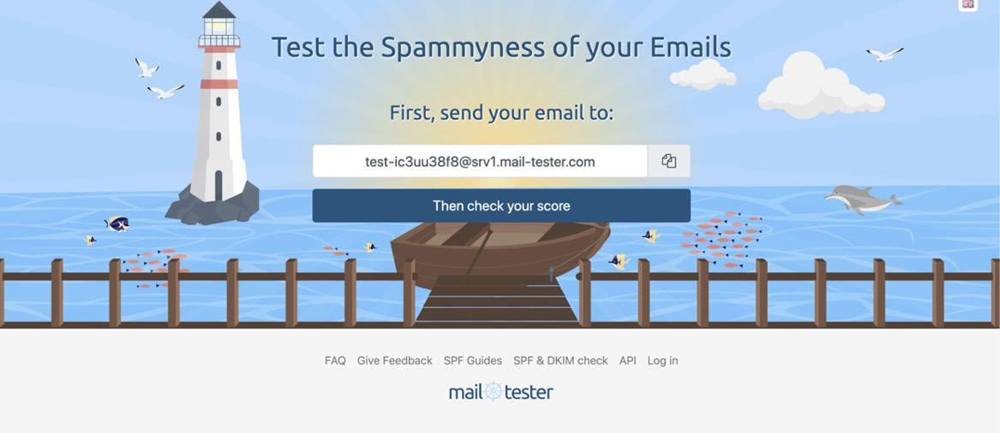
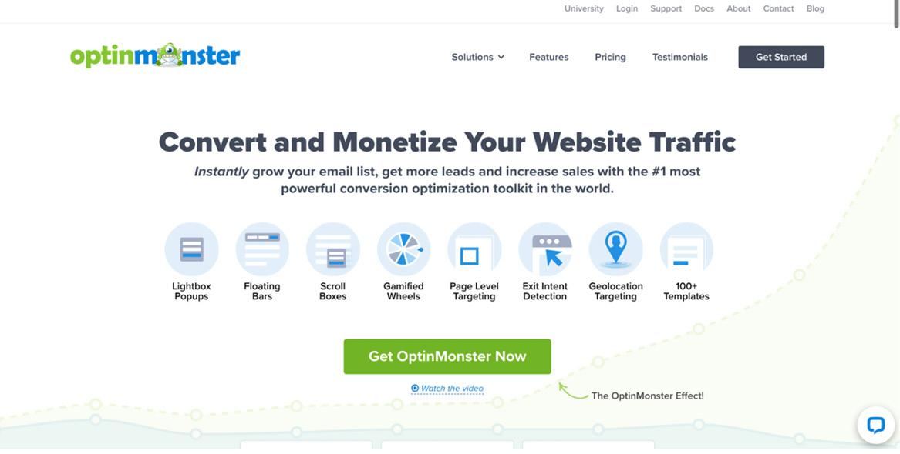
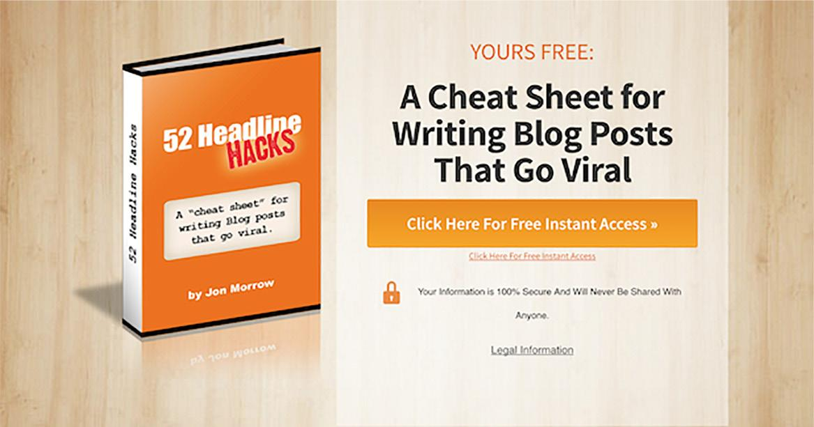
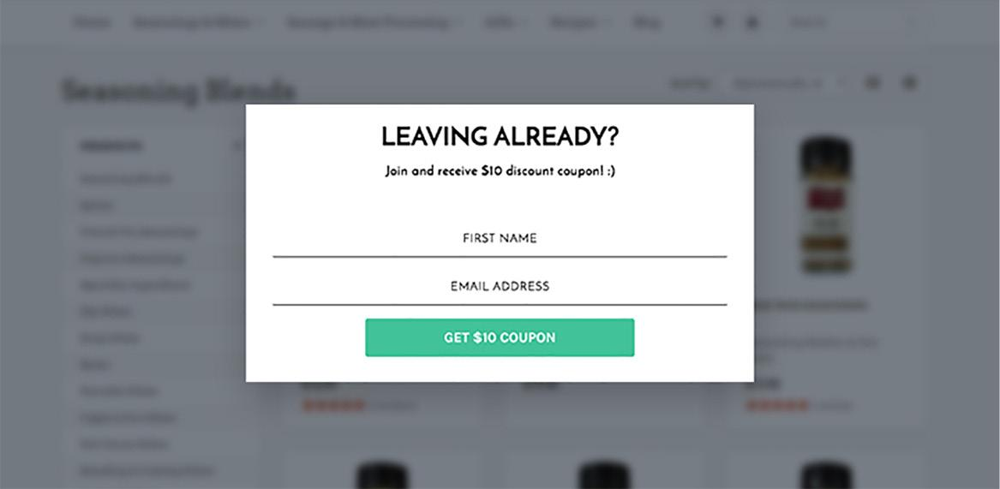
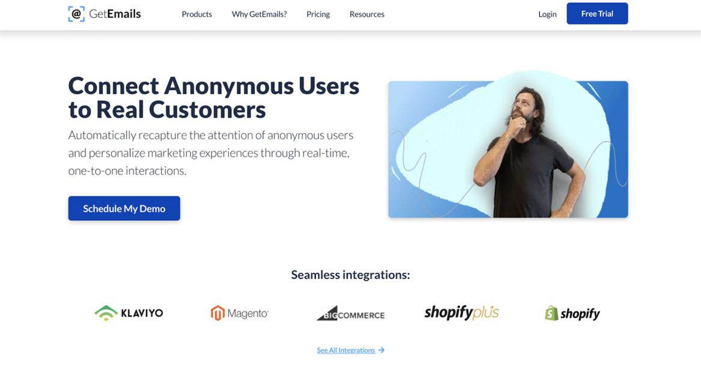
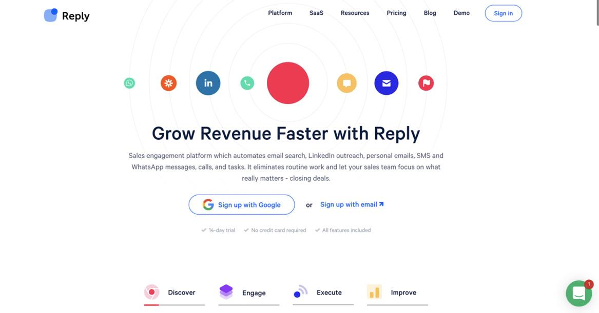
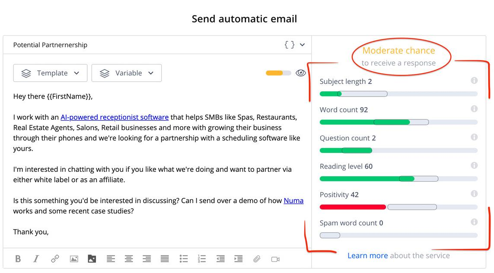
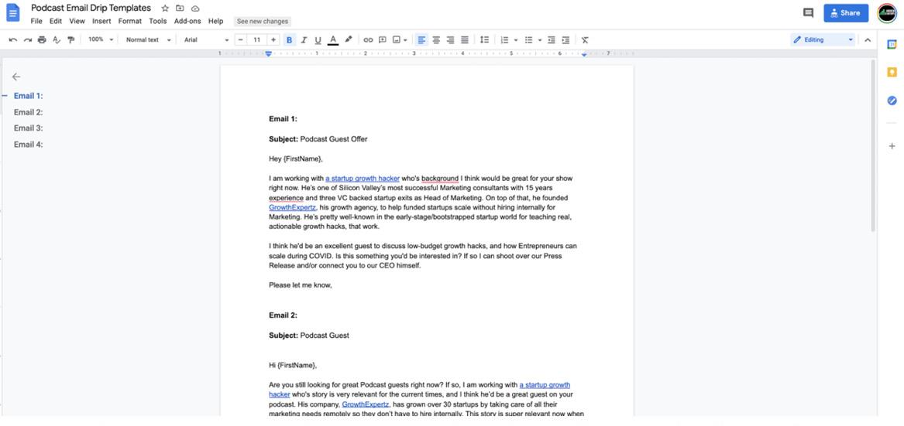
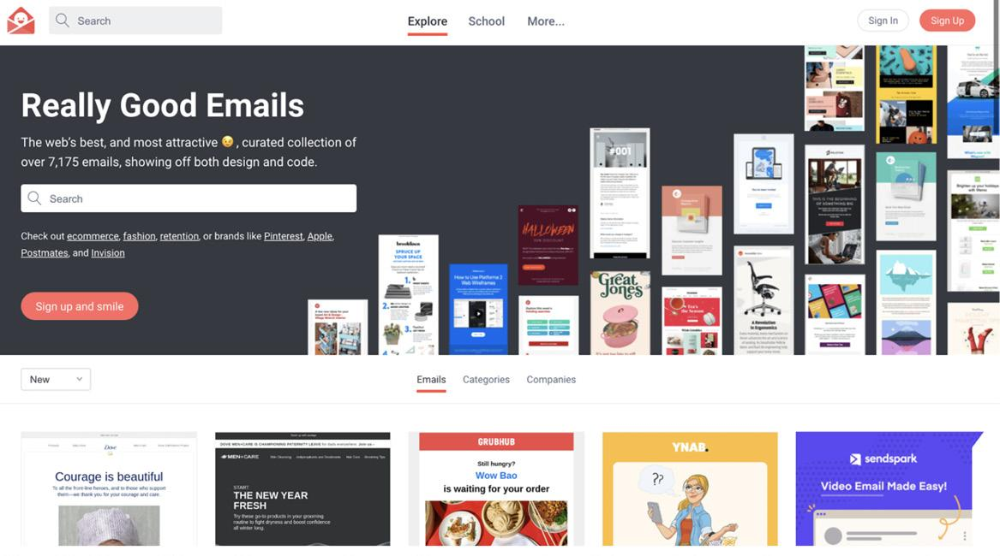
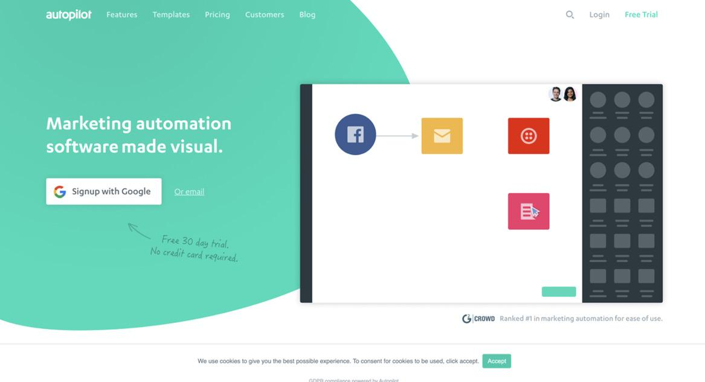

# B2B 和 B2C 的电子邮件营销
## 第 1 步：避免这些电子邮件营销错误

如果你计划在营销中不经常使用电子邮件来发展你的公司，那么你实际上是在尝试仅用一只手就可以赢得一场战斗。电子邮件确实仍然是所有营销的王者。时期。你认为 GDPR 为何被创建？这是因为拥有某人的电子邮件地址的绝对力量。无论你公司的行业、垂直行业、价格点或人口统计是什么，潜在用户或客户在大多数情况下访问你公司的网站时，他们都没有准备好进行交易。如果你从事任何类型的在线商务，那么愿意在第一次访问时购买或放下信用卡的网站流量的平均百分比将徘徊在 2% 左右。这是根据 GrowCode 在 2020 年进行的一项元研究得出的结论，该研究发现其他 12 项电子商务品牌研究的平均转化率为 2.23%。考虑一下;这意味着你带来的所有其他用户获取中超过 97% 将在没有转化的情况下消失。这就是人们在再营销和重新定位上花费数十亿美元的全部原因——以保持对话的进行。正因为如此，对新访问者不要过于咄咄逼人，而只是尝试收集他们的电子邮件地址以缓慢但肯定地带他们踏上旅程，这一点至关重要。收到他们的电子邮件后，你就可以开始帮助他们随着时间的推移发现更多关于你的品牌的信息，然后让他们一遍又一遍地购买。
电子邮件营销是回收内容、推动推荐、免费推广任何东西和向读者追加销售的好方法，但它也是让自己尴尬并因糟糕的用户体验而损害形象的好方法。有了这个，我首先想给你一些关于你永远不应该用电子邮件做的事情的提示。
你永远不应该做的第一件事是购买电子邮件列表。许多处于早期阶段的初创公司，尤其是 B2B 领域的初创公司，都获得了购买电子邮件列表的机会，我想毫不含糊地谴责这是一种立即采取的策略。我知道有人会为你的行业提供一个百万人的目标电子邮件列表，这看起来很棒，但你是一个新品牌，你所做的每件潜在破坏性的事情都会使你的公司面临风险。在我见过的绝大多数情况下，它最终造成的弊大于利。根据你所在的国家/地区，你可能会面临损坏域中电子邮件发件人状态、永远发送垃圾邮件，甚至遇到法律问题的风险。本书的下一部分完全致力于解释如何为你的企业从头开始有效地构建有机列表。
下一封电子邮件禁忌是永远不要从全新的电子邮件地址发送电子邮件。如果你不知道，你必须先“预热”一个新的电子邮件地址，然后才能安全地从该地址开始发送；否则，你将 100% 的时间发送垃圾邮件。
根据 Reply.io（市场上最好的冷邮件工具之一，我们将探索的工具之一），“在最初的 2 到 3 周内，你需要与“热情”的联系人（朋友、同事等）保持通信.)这些人应该打开你的电子邮件，如果电子邮件已发送到他们的垃圾邮件文件夹，则报告为“非垃圾邮件”，回复你，并在可能的情况下转发你的电子邮件。这些是与你的电子邮件进行积极互动的示例。你的热心联系人不应删除你的电子邮件、选择退出或点击“垃圾邮件”，因为这些都是负面互动。积极的互动将帮助你建立良好的发送声誉。此外，尝试发送到各种电子邮件托管服务提供商，例如 Gmail、Outlook、雅虎等。”
在你准备电子邮件时，你可以使用名为 Mail-Tester.com 的免费工具来检查你的电子邮件发件人状态。你会看到你从他们那里得到了一个数字评级，一旦你达到 9 到 10 分，你就可以开始向潜在客户、用户、客户和客户发送电子邮件了。同时，在你努力达到此评级时，Mail Tester 会为你提供有关如何完善电子邮件发件人状态的免费建议。这将是你企业的救星，即使你只是向潜在投资者发送电子邮件，因为现在你将知道你的电子邮件是否会被发送。



使用此免费测试工具查看你的电子邮件是否可以安全发送！争取 9 – 10 的评分：https://bit.ly/3nUJEaT
你永远不应该做的下一件事就是停止发送电子邮件。对于电子邮件营销，重要的是始终如一地发送电子邮件，不仅可以保持你的送达率，而且还可以让接收者始终牢记在心。你的流失率将与你通过电子邮件发送列表的一致性和频率直接相关。当然，你永远不会希望每天给人们发送超过一次电子邮件，但与此同时，你永远不想超过一个月而不用新电子邮件打他们，因为他们可能会忘记你的品牌，这将导致他们退订或将你发送到垃圾邮件，这对你来说是最糟糕的事情。因此，无论你从事什么业务，都尽量坚持使用常规日历向人们发送电子邮件，并且你在列表中的流失率将保持在较低水平。
我经常看到的另一件事是，在可能的情况下不使用个性化，这会破坏电子邮件营销的成功。如果你的企业正在收集电子邮件和名字，但你的电子邮件没有按名字个性化，那么你只是将钱留在桌面上。根据 Campaign Monitor，“与其他非个性化电子邮件相比，个性化电子邮件的打开率高出约 26%，点击率高出 14% 以上。”想象一下，一封电子邮件进来了，叫着你的名字。你更有可能打开它，因为你相信它是给你的。同样的规则也适用于你的订阅者。
我想讨论的最后一个电子邮件营销禁忌是发送很长的电子邮件。无论我们谈论的是 B2B 销售电子邮件还是移动应用程序的用户旅程，你都必须保持电子邮件简短。根据 Adobe 2017 年的电子邮件使用报告，81% 的人使用智能手机定期查看电子邮件，这意味着屏幕非常小，注意力更短。
如果你的电子邮件很大，人们只会浏览它，尤其是当他们在移动设备上阅读时。他们会思考，TLDR，他们永远不会回应或采取你需要他们采取的行动。我见过营销人员花费太多时间编写充满想法、CTA 和内容的电子邮件。你的读者将不得不花费大量时间来阅读这些电子邮件，不幸的是，你对他们的要求太高了。因此，请让你的电子邮件非常简短，并仅突出显示你想要关注的一个号召性用语。如果你有很多要分享的内容，请发送较小的电子邮件并更频繁地发送。那样你会用一块石头杀死两只鸟！
资料来源：
https://support.reply.io/en/articles/1888935-how-to-warm-up-an-email-account-before-sending-cold-emails
https://www.campaignmonitor.com/blog/email-marketing/2019/06/the-5-most-common-email-marketing-mistakes-and-how-to-avoid-them/

## 第 2 步：尽可能快地增加电子邮件列表
大约 10 年前，包括 LivingSocial 和 Groupon 在内的公司以及“每日交易”网站的全面出现，给营销和电子商务带来了巨大的变化。几乎在一夜之间，我们从主要关注仅跟踪销售和转换到跟踪电子邮件订阅者，将其作为业务增长的主要 KPI。这改变了游戏规则，原因与我在上一节中谈到的许多相同，即在第一次访问时销售人员变得多么困难。如果世界上最好的电子商务公司在第一次访问时只能将大约 1% 到 3% 的人转化为随着时间的推移，通过电子邮件继续对话。从那时起，企业意识到你可以通过在第一次访问时优化电子邮件捕获机会来大大增加收入，因此电子邮件列表的构建变得非常重要，以至于许多公司首先按电子邮件订阅者划分年收入。通过这种方式，你不仅最终最终会转化更高比例的总流量，而且你还大大增加了每个客户的平均价值。
让我们做一个基本的数学计算：如果只有 1% 到 3% 的人会在第一次访问你的网站时转换，但是强大的铅磁铁可以吸引高达 25% 的网站流量的电子邮件，那么如果你最终只让这些人中的 20%在向他们发送电子邮件的随后 12 个月内购买，你的转化率将是原始群组的两到五倍。得到它？没有什么比这一策略更能以更少的时间或成本投资来增加你的业务。时期。这些人已经访问过你的网站，因此他们至少有足够的兴趣在某一时刻访问你，那么如果你不需要，为什么要让他们离开呢？有了这个，我想向你展示尽可能快地增加电子邮件列表的所有最佳低成本方法，然后在接下来的部分中，我们将讨论如何处理这些电子邮件地址。
提高列表构建能力的第一个策略是在你的网站上添加和优化弹出窗口。是的，我说的是弹出窗口，复数形式，因为你至少应该测试在你的站点上有多个弹出窗口，并且为此提供了一个了不起的工具 OptinMonster (optinmonster.com)。
OptinMonster 不是免费的，但它非常便宜（每月 9 美元到 30 美元之间）并且具有令人难以置信的弹出选项，可以在几个小时内增加你从网站流量中获取的电子邮件数量。在我看来，每个企业至少应该测试至少两个弹出窗口。我知道你担心用户体验，但最终，如果他们不给你电子邮件，他们将永远离开，除非你有昂贵的重定向广告的预算，否则你将永远不会再看到它们。那为什么不推呢？和往常一样，我建议你只是测试一下，即使你讨厌在其他网站上看到它；你不是这里的目标。如果你的网站流量很大，那么测试可能只需几个小时或几天，以确定它是否适合你的业务。



你可以使用 OptinMonster 创建多种方法来从现有网站流量中收集更多电子邮件地址。
我建议你安装的第一个弹出窗口是在 20 或 30 秒后触发的主页弹出窗口。 你可以提供我们所谓的“铅磁铁”。 根据你的目标和你的行业，铅磁铁会发生巨大变化，但最常见的是折扣或内容，如下图所示：



在集思广益你可以提供什么作为你的业务的主要磁铁时，这里有一些关于从 OptinMonster 非常有价值的博客中寻找什么的快速提示：

1. 解决一个真正的问题——如果你的铅磁铁不能解决你的客户头像所面临的真正问题，或者如果它没有给他们想要的东西，它就根本不起作用。
2. 承诺快速获胜 - 你的主要磁铁应承诺（并交付）你的化身快速获胜。换句话说，它应该帮助他们轻松实现某些目标。
3. 超级具体——不要对一般事物制造铅磁铁。你对铅磁铁的好处越具体，它将更好地转换线索。
4. 快速消化——PDF 清单往往能很好地转换，因为它们非常快速且易于消化。电子书或冗长的报告可能会让你的潜在客户感到不知所措。
5. 高价值——你的铅磁铁应具有高感知价值和高实际价值。
6. 即时可用 - 如果你的铅磁铁可以立即交付，它将发挥最佳作用。人们喜欢即时满足。
7. 展示你的专业知识——当有人使用你的铅磁铁时，它应该展示你的专业知识或你独特的价值主张。这有助于将潜在客户转变为未来的客户。

最后，你需要有提供足够价值的弹出窗口来获取访问者的电子邮件，因此请尝试一些不同的方法，看看哪种效果最好。
我建议每个启动至少测试的第二个弹出电子邮件捕获小部件是我们所说的退出意图弹出窗口。退出意图弹出窗口试图确定某人何时考虑离开你的网站（基于光标移动，而不是看你的脸或任何令人毛骨悚然的东西），然后用他们无法拒绝的要约击中他们。想一想；你还记得有一次你滚动到网站的右上角，可能想点击 X 关闭窗口时，突然出现一个弹出窗口吗？信不信由你，从历史上看，该弹出窗口让大约 10% 到 15% 的人不退出该站点。这里的美妙之处在于你已经从完全失去它们变成了从它们中获得一些价值。成功退出意图弹出窗口的诀窍是提供一些有形的真实和高价值的东西。请参阅下面的示例。



好的，你可能已经了解弹出窗口，这是相对简单的营销技巧，但让我使用你可能从未听说过的技术将你的电子邮件捕获提升一个档次。 GetEmails (getemails.com)。 GetEmails 是一种非常实惠、合法（抱歉，仅适用于美国；GDPR 不适用于此处）并且非常棒的工具，它可以在没有表单或弹出窗口的情况下抓取 10% 到 30% 的网站访问者的电子邮件地址。 让它深入人心。这意味着，如果你有一个 DTC 电子商务品牌，而你的弹出窗口只为你提供了 5% 的流量电子邮件地址，那么你可能会使用此工具捕获 6 倍的电子邮件。 最疯狂的部分？ 打开的邮件还是一样。



完全透明：我在 2019 年帮助推出了 GetEmails，但我不再以任何方式隶属于他们。 然而，我确实帮助他们在第一年的销售额达到了 4 毫米 :)
资料来源：
https://optinmonster.com/9-lead-magnets-to-increase-subscribers/

## 第 3 步：使用电子邮件构建 B2B 潜在客户生成机器
既然你每天都在从网站流量中积极地建立新的电子邮件订阅者，你需要知道如何处理他们，因为就像我讨论的那样，他们没有强烈的意图；因此，你的工作是引导他们通过有效的电子邮件沟通最终在你的公司/品牌/服务上花钱。那么你应该做什么在很大程度上取决于你从事的业务类型。如果你向企业 (B2B) 销售产品，那么你可能需要向他们发送几封电子邮件并进行后续跟进以降低他们的成本漏斗，但好消息是你可以自动化。让潜在客户踏上自动化电子邮件之旅，应该从他们给你电子邮件的那一刻开始（或者，如果你使用 GetEmails，则是他们访问你网站的那一刻）。如果你使用 Mailchimp、Constant Contact、Roby 或任何其他包含自动化功能的电子邮件服务提供商，你可能会设置一个点滴营销活动来自动将这些潜在客户推送到你的渠道中，但如果没有，我有一个很棒的工具给你。我喜欢使用强大的自动化外展工具来进行 B2B 勘探，这是因为它们只做一件事，而且一件事做得非常好：销售跟进。 HubSpot 和其他更复杂的工具对于对所有各种功能有多种要求的大型企业和 CRM 运营来说是惊人的，但对于此活动，你需要做的就是向人们发送电子邮件并经常向他们发送电子邮件，花费最少的时间。因此，我想向你展示的第一个 B2B 公司自动化工具是 Reply.io。



Reply.io 本质上只是 HubSpot 或任何其他复杂的电子邮件服务提供商的精简版，它们只做一件事，只做一件事：电子邮件滴灌活动。简直再简单不过了，你可以将电子邮件列表提供给软件，然后使用他们令人难以置信的指导和模板编写长长的滴灌电子邮件系列，然后该软件将根据时间表为你跟进电子邮件你决定。最酷的部分是，除了名称或公司名称之外，你获得的潜在客户信息越多，你就越能自定义消息，如下所示：

```
Hi {{FirstName}},
I know you’re very busy as {{Insert_Professional_Title}}, but I’ve been wanting to have a quick chat about bringing {{Insert_Product}} to {{Insert_Company}} because I think it could really help you improve {{Insert_Sector,_e.g._email_outreach}} and increase {{Insert_KPI,_e.g._sales}}.
If 15 minutes of your time isn’t too much to ask, then maybe we could jump on a quick Skype call to discuss this?
Best,
{{Your_Name}}
```

这使得 Reply.io 令人难以置信，因为它将取代你业务最初几年对销售人员的需求，而且每月只需 50 到 70 美元。因此，想象一下你正在从你网站的主要磁铁弹出窗口构建一个温暖的电子邮件列表。你每周会收到 250 封电子邮件。现在，你可以自动将这些内容放入 Reply.io 的列表中，开始发送这些模板消息，并以零时间投资开始生成潜在客户。你将有稳定的入站消息和来自潜在客户的回复，而你不必花任何时间在上面。
与你当前使用的任何其他电子邮件工具相比，Reply.io 中另一个非常强大的功能是其强大的垃圾邮件避免建议。该软件将根据通常将冷外展电子邮件发送为垃圾邮件的每个主要因素对你的电子邮件进行评分，从而将你的销售能力提高十倍。因此，使用 Reply.io 不仅会使你的销售流程更加有效，而且还会自然地训练你写出更好的电子邮件，这在你业务的任何阶段都是无价的。



Reply.io 有一个令人难以置信的“反垃圾邮件”意识计，可以训练你进行冷外展加班。
无论你使用什么工具，重要的是要知道在这些电子邮件中要说什么，并且你需要弄清楚在每个阶段可以提供的不同类型的价值。 Reply.io、Close.com 和 PersistIQ 都是为你的冷门外展提供模板的工具，所以即使你还没有准备好每月支付 50 到 70 美元，我建议你去注册免费试用并试用它们。让我们之间保持这一点，但大多数外展工具都可以让你免费工作两周，并且你可以在第一个计费周期之前完成很多工作。 Reply.io 允许你上传你的列表并在收到账单之前发送两周的自动化，你也可以利用这段时间检查他们的模板。滴灌活动如此成功的原因是每条消息都会发生一点变化，而你正在滴落你的内容或价值，因此得名。我建议你测试各种不同的消息——短消息、长消息、视频消息、积极的销售消息、具有大量免费价值的消息，和/或来自 CEO 的消息。当谈到进一步的外展优化时，我还有一些连 Reply.io 都没有想到的技巧。首先，如果你是一个人的团队，我不建议你直接从你的 CEO 那里发送水滴电子邮件。相反，只需在你的团队中创建一个虚构的营销人员（当我进行公开讲座时，我总是建议使用 sean@yourcompany.com），直到你可以雇用一个真正的营销人员。我不建议你使用 sales@ 或 marketing@，因为当人们收到来自该名称的滴灌电子邮件时，他们会意识到自己被出售了，而收到真实姓名的电子邮件听起来更真实。请记住，你希望非常友好，并且看起来尽可能自然，并且你不希望他们知道他们正在进行动态的自动邮件活动。所以，创建一个营销团队成员的名字，并在你的电子邮件中提供“与我们的 CEO 免费聊天”或说“我可以向我的 CEO 询问折扣”作为额外的价值。
关于自动滴漏电子邮件的最后一个提示是，第一条消息应该非常简单，只需说如下内容：“嘿[名字]，[公司名称] 需要[你提供的价值] 方面的帮助吗？下一条消息可以是在更长的消息中包含更多细节的跟进，然后你将安排另一封电子邮件，三到七天后，内容如下：“嘿[名字]，你看到了吗？我的最后一封电子邮件？只是检查。”根据我的经验，让这两封早期的电子邮件保持超级简单的效果远远优于发送冗长的电子邮件，但你需要自己测试一下。如果你发现相同的结果，我很乐意在我们的私人论坛上听到。粘贴屏幕截图以获得额外的巧克力点数！



在此处使用 Andrew 的免费电子邮件滴灌模板：https://bit.ly/3c1bzDP
在你发送了几封简短的电子邮件之后，如果你仍然没有得到回复，我认为将你的下一封电子邮件排在该价值所在的位置是安全的。你应该开始积极进取并牢记价值第四或第五封电子邮件。如果你看到已打开但没有回复，则是时候将其提升一个档次，因此你将获得折扣，例如：“如果你现在预订，我们将为你提供 50% 的折扣，如果你'有兴趣与我们合作。”此时，你还可以尝试所谓的“爆炸性报价”，或者通常会在几天或一周内消失的限时交易。你需要测试你的 B2B 外展，因为紧迫感确实经常在心理上将人们推下漏斗。我总是放在滴灌活动中的最后一封也是最后一封电子邮件往往总是吸引最多的回复，这就是我所说的“最后机会电子邮件”；这是你强烈希望推动他们回复或取消订阅的地方，因为你此时并不关心。到现在为止，如果他们根本不打开这封电子邮件，你可能再也不会给他们发电子邮件了。我建议的主题是“嘿[名字]，最后一次获得这个[交易名称]的机会。”发送这封电子邮件的正文可能有点奇怪，但请相信我。
“嘿[名字]，我不想一直打扰你。我只想知道你是否有兴趣让 [你的公司名称] 帮助你 [你提供的服务]。如果没有，你能不能告诉我，这样我就可以不再花时间跟踪你了，因为我和我的团队很乐意和你一起工作，但我知道这不是你感兴趣的事情吗？”
所以这是你的最后一个，通常，你会感到惊讶；大多数人没有意识到这是一封自动发送的电子邮件，并且觉得有必要做出回应，因为他们对自己一直忽视这个销售人员感到难过。另外，如果他们在七封电子邮件后没有回复，请不要担心，你可以将它们放入你的时事通讯列表中，你可以稍后在适合他们业务的时机转换它们。
此滴灌活动的重点是为 B2B 公司自动化你繁琐的销售推广。它不适用于 B2C 公司，因为你需要创造更多的故事，并且不能像 B2B 那样积极地推销。因此，请查看我随附的模板，查看如何使用 Reply.io、Close.com 甚至 PersistIQ，或者如果你有自己的 ESP，请联系他们的支持人员，看看你是否可以做类似的事情使用他们的工具。请记住，关键是你从第一天开始就在旅途中发送这些 B2B 潜在客户，当他们注册到你的列表时，第一封电子邮件应该是正确的。在私人论坛中，我很乐意看到你发布你正在编写的模板、你正在使用的软件，并在你收到回复但不知道该说什么时获得我们关于 A/B 测试和电子邮件内容的建议.我论坛见！

## 第 4 步：优化你的电子邮件营销之旅 (B2C)
与 B2B 点滴营销活动一样，你的 B2C 电子邮件旅程可以将电子邮件订阅者从几乎不感兴趣到多次购买和推荐，而不会增加你的业务成本。这些旅程非常适合你将从我们在第三章中讨论的赠品比赛中获取的电子邮件，或者你网站上的弹出窗口，甚至是店内运营。最重要的是，你需要快速且有价值地向这些人发送电子邮件。著名的电子邮件营销管理公司 Vertical Response 对营销人员进行了大规模调查，他们的受访者证实，新电子邮件订阅者在注册后 48 小时内参与度最高，因此时间在这里至关重要。你不能让他们在不联系的情况下恶化和坐在那里，因为你不给他们发电子邮件的时间越长，他们就越忘记你，垃圾邮件和退订率就会越高。那是你刚刚留在桌子上的钱。假设你刚刚完成了一个大赠品，为你吸引了 10,000 个几乎不感兴趣的新电子邮件订阅者。你做什么工作？你需要通过至少某种形式的号召性用语向他们发送很棒的内容，以从你那里购买东西！你的电子邮件旅程应该旨在让这些订阅者获得有趣的发现体验，希望能够给他们留下深刻印象，转化他们，并将他们带回来进行推荐并随着时间的推移向他们追加销售。你这样做的唯一方法是使用有趣的内容，但很酷的部分是你可以从现有的营销活动中回收大部分内容。
我告诉早期的初创公司专注于回收已经证明具有吸引力并推动参与的内容。想想你的热门社交媒体帖子、你的热门博客帖子以及你获得参与度的顶级产品。所有这些东西都可以放入电子邮件中，并且可以毫不费力地进行测试。 B2C 和 B2B 活动之间的最大区别在于，与 B2B 相比，通过这些 B2C 活动，你可以更有效地细分他们的旅程，而在 B2B 中，我们通常只是不断地尝试向他们推销一件事。对于电子商务企业等 B2C 公司，你可以根据他们在你网站上采取的行动、居住地、年龄人口统计等来细分他们的旅程，但使用我讨论的 B2B 工具，你通常根据其他功能动态填充电子邮件。一旦你更高级，你将能够跟踪用户是否浏览了你网站上的特定产品，并且他们将获得围绕该产品的不同电子邮件旅程。如果他们多次回到你的网站，他们会收到与不回来时不同的电子邮件。你可以向订阅者发送的电子邮件有无数种选择，我知道这可能会让人不知所措，所以我想告诉你的第一个工具是 100% 免费，并且是世界上最大的宝藏 - trove 其他公司强大的 B2C 旅程的示例和模板数据库。它被称为ReallyGoodEmails.com。



RealGoodEmails.com 拥有数以千计的鼓舞人心的免费电子邮件旅程示例，这些示例来自你欣赏的真实公司！
我怎么强调这个免费资源是多么的不可思议，因为你可以浏览大量来自你认识和尊重的品牌的示例电子邮件，然后你可以轻松地定制这个想法并添加到你的旅程中来测试它。仅通过浏览该免费网站，你就会很快找到 5 到 10 个新的电子邮件创意，但我想写出我最终应该构建的 15 个最强大的旅程示例：
来自ReallyGoodEmails的15个B2C营销之旅示例

1. 欢迎活动
2. 入职活动
3. 重复购买活动（客户保留）
4. 重新参与/重新激活活动
5. 多渠道活动
6. 行为运动
7. 交叉销售活动
8. 信息/更新活动
9. 广告系列的 A/B 测试
10. 反馈活动
11. 追加销售活动
12. 里程碑活动
13. 推荐活动
14. 基于位置的广告系列
15. 限时活动

查看上面的示例，以对我建议始终使用自动化进行的操作有一个非常可靠的了解。如果你甚至实施了其中的一半，你将看到令人难以置信的结果，每月 50 美元。
现在，我不建议复制其他品牌的任何文本或图像。相反，我建议仅将其用于有关创建自己的电子邮件类型的想法。你可以自定义和重新创建你自己的想法，并在论坛中告诉我们哪些电子邮件让你大吃一惊，或惨遭失败。如果你认为这很难设置，我在下面提供了一个非常简单的工具推荐，但让我用这个统计数据来确定预期的投资回报率：根据 Campaign Monitor，“使用分段营销活动的营销人员注意到收入增加了 760%。”你还需要听什么？
使用ReallyGoodEmails，我希望你首先确定至少五封可以很好地测试你的业务的电子邮件，将它们安排到你的客户旅程中，在两周后在日历上增加时间以分析哪些电子邮件表现最好，然后添加/减去你认为合适的交互。几乎没有什么比这更能增加你的底线了。你很快就会发现，在自动化到位后，你从赠品和其他促销活动中获得的电子邮件中有很大一部分将转化为销售，而无需付出任何努力。
嗯，想法很棒，但你还需要一个工具来细分这些用户，自动发送电子邮件，并节省你创建旅程的时间。有了这个，我想向你展示的下一个令人难以置信的电子邮件旅程工具称为 AutoPilot (AutoPilotHQ.com)。我们当中没有多少人是电子邮件营销专家，即使使用了 RealGoodEmails，你也必须学习如何创建、何时触发以及如何优化发出的电子邮件。事实是，大多数电子邮件自动化工具的学习曲线都非常陡峭，而且你经常会在非常公开的、面向客户的互动中咬牙切齿，这意味着错误可能会令人尴尬。嗯，有了 AutoPilot，你就可以得到一个非常简单的视觉旅程创建器，五年级的孩子也可以轻松使用，在我看来，这是值得的，因为你犯错的可能性要小得多。如果你的公司已经有一个工具来进行电子邮件旅程，那么你可能可以跳过此建议，但如果没有，这是一个非常实惠的工具，可让你将电子邮件营销时间减少到几个小时每月。一旦你从 RealGoodEmails 中获得灵感，你就可以使用他们的视觉旅程创建器轻松地将示例进行测试，该创建器具有强大的拖放功能，该功能可以包括更多的交互，而不仅仅是电子邮件。我强烈建议使用这个工具，因为它允许组织将他们的电子邮件自动化扩展到新的高度，而无需在他们的团队中引入专家。在ReallyGoodEmails 的内容推荐和使用AutoPilot 构建最佳旅程的软件之间，你的电子邮件营销将是自动驾驶的！



除了这两个惊人的工具之外，还有一些其他规则值得讨论，以帮助你在电子邮件旅程中朝着正确的方向前进。我在虚张声势……我要说的第一件事是没有规则。另一家公司针对电子邮件营销制定的任何规则可能适用于你的业务，也可能不适用于你的业务。一切都值得测试，尤其是你走得越远。
你应该在旅程中进一步进行更疯狂的电子邮件测试，因为你在没有购买或参与的情况下发送给订阅者的电子邮件越多，用户的价值就越低。想一想；如果他们没有回复几封电子邮件，你可以在将它们从列表中完全清除之前尝试一些左派的东西。如果他们浏览了 10 封电子邮件但仍未转换，请尝试向他们发送一封非常私人的电子邮件。
在我参与的一个特定项目中，我们通过一封主题为“你为什么恨我们？”的电子邮件完善了这一点。这只是创始人的一段视频，请求订阅者回复他们感兴趣的内容。在视频中，创始人只是简单地说：“嘿，我注意到你还没有打开我们的一堆电子邮件，而且我只是想知道我们能做些什么来赢回你？我们不做什么？请让我知道，因为我们是一家处于早期阶段的初创公司，我们需要这些反馈。如果你能发表评论或回复此电子邮件，那么你将对我们有很大帮助。谢谢！”你不会相信他们在寻找产品市场契合度的过程中得到了多少带有关键反馈的回复。
B2C 电子邮件往往会在你的旅程中变得更加激进，因为聪明的公司通常会在 30 到 60 天不活动后清理订阅者以降低成本。大多数电子邮件服务提供商（例如 MailChimp、Constant Contact 和其他服务提供商）将根据你的总订阅人数收费，因此你希望将该数字保持在尽可能低的水平。我称之为去除脂肪。你想让你的清单保持精简，并且只有参与的人，所以在 60 天没有价值后清理它们，你的成本会保持在较低的水平。同样，正如我在每个营销渠道中所谈到的，你需要想象人们是最懒惰的人，因此你需要让他们尽可能容易地行动。因此，通过这些客户旅程，你希望让他们更轻松地决定转换。所以你在敲定那个价值，你在测试一堆不同的想法，你提供不同的价值和内容，折扣，优惠，评论，电话，无论你认为会转化它们，你再去看看什么最有效。
资料来源：
https://v12data.com/blog/email-marketing-trends-stats-to-know-for-2021/
https://www.campaignmonitor.com/resources/infographics/how-effective-are-welcome-emails/

## 第 5 步：破解通讯
如果我至少不接触电子邮件通讯，那我就是失职了。就像常识一样，由于创建内容所需的感知时间投资，电子邮件简报经常被忽视，但与其他所有渠道一样，我对简报有一些技巧，可以将你的时间投资减少到每个小时月。如果你不确定你的企业是否需要时事通讯，请让我说清楚。无论你是 B2B、B2C 还是 B2G（企业对政府），也无论你的目标是谁，每家公司都需要发送不属于销售或滴灌活动的常规电子邮件，这就是为什么没有理由你不应该定期发送电子邮件通讯。时事通讯可以是关于行业新闻、公司新闻、产品更新或你通常认为目标人群可能感兴趣的任何其他内容。根据行业基准，大多数时事通讯的打开率约为 22%，这意味着超过 20%每次你发送时事通讯时，以下都会收到你的来信。将其与每次发布新帖子时从 Facebook 和 Instagram 粉丝那里获得的平均受众百分比（1% 到 5%）进行比较，你很快就会明白为什么电子邮件是王道。如果你积极在社交媒体上发帖但不定期发送时事通讯，那么你又将钱留在了桌面上。
时事通讯不一定很难组合在一起，我想教你我如何破解它们。第一步是安排一个固定的时间间隔来发送时事通讯。返回到你的 Google 日历，然后为“时事通讯创建”设置一个循环时间块。大多数公司从每月发布一份时事通讯开始，然后随着数据证明它的价值而扩大规模，例如每两周发布一次。在你将日历上的时间设置为与时事通讯保持一致并至少每月向所有订阅者发送一个后，下一个任务是在你选择的电子邮件工具中选择一个模板，以便你将来使用。每个时事通讯绝对可以保持相同的布局和格式，这样你只需在每个月之间更新各个内容片段。保持模板一致将是一个节省大量时间的方面，这将使你更容易完成每月通讯。随着读者对相同的布局变得更加熟悉，你还会看到参与度也会随着时间的推移而上升。
如果你像大多数初创公司一样使用 MailChimp，那么开始和选择时事通讯模板非常简单。一旦你选择了一个模板并留出时间来创建时事通讯，你需要做的就是每个月都想出所有的内容，但有什么技巧呢？我的诀窍是依靠我所有的分析。我喜欢查看过去一个月中哪些内容在不同渠道中最吸引人，然后将这些热门内容重新用于新闻通讯，供那些错过它的人使用。由于在社交媒体上看到我们的内容或观看我们在 YouTube 上发布的视频的人只有低个位数百分比，因此我们希望将上个月的最佳内容重新用于简报，以向更多人展示.除了你的 Google Analytics，你还应该拥有来自 Buffer、Quuu 或我们在社交媒体营销章节中讨论的任何其他社交媒体工具的社交分析。这些工具具有分析功能，可让你查看过去一个月中哪个社交媒体渠道和哪个内容最具吸引力。因此，找出哪些内容、哪篇博文、社交媒体上的哪些帖子以及 YouTube 上的哪个视频参与度最高，然后通过只需几分钟的简单拖放操作将它们放入你的时事通讯中。我建议你尝试将过去时间范围内其他营销活动中的三到五个非常好的内容放入你的时事通讯中。
为了让它更像是一个测试，假设你通过本月最热门的 Instagram 帖子、最热门的推文、最热门的视频和最热门的博客文章来改变它。就在那里，你已经用重新调整用途的内容填满了整个时事通讯。这里的秘诀是你无需重新发明轮子并仅为时事通讯创建全新的内容。如果你的时事通讯起飞并获得大量参与，推动了大量收入增长并产生了重大影响，那么你可以投资于稍后为其创建更多独特的内容，但首先要对其进行修改。除了你每个月添加的内容之外，你只需要添加一个有机的文本段落，永远不会超过 20 分钟。该段落应该是你读者的相关更新。想想告诉他们公司有什么新鲜事，世界上正在发生什么疯狂的事情，以及它与你的产品有什么关系。不过，总的来说，你只需要与他们联系即可。每个月不要花一个多小时来制作时事通讯；把它安排好。四到五天后，我回去查看该时事通讯中的分析，并在私人小组中发布结果。你看到 20% 的打开率吗？如果没有，请发布你的电子邮件主题，因为这通常是最大的罪魁祸首。我会在论坛上见到你，并期待听到你的结果。
资料来源：
https://uplandsoftware.com/postup/resources/blog/email-newsletter-statistics/