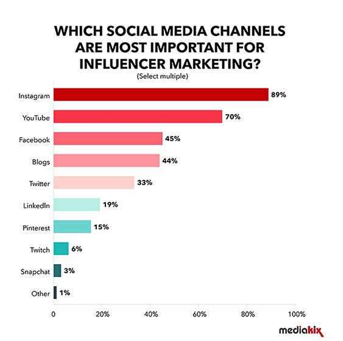
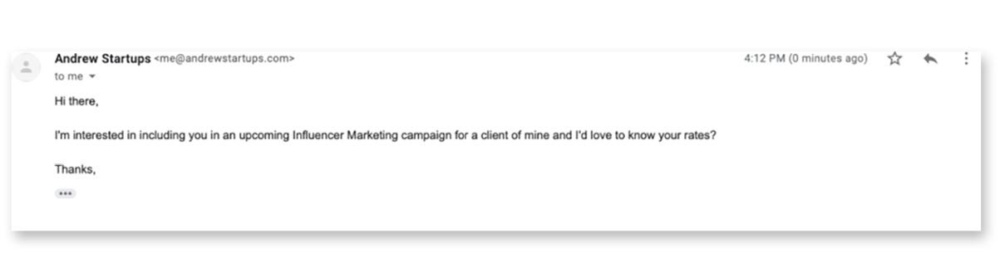
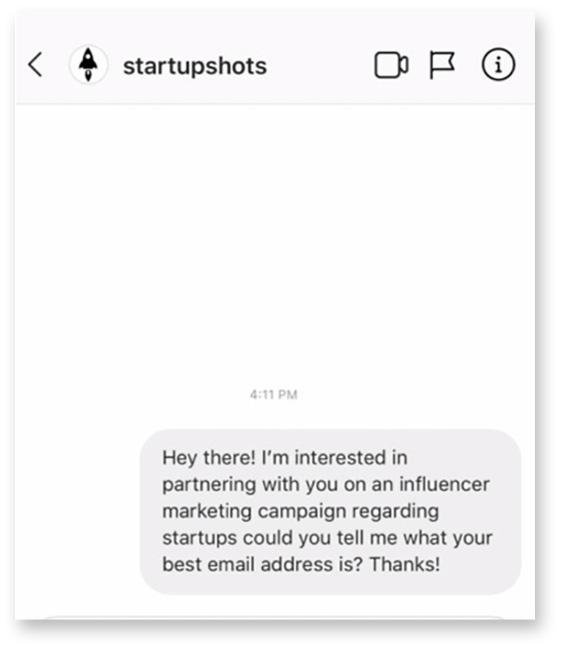
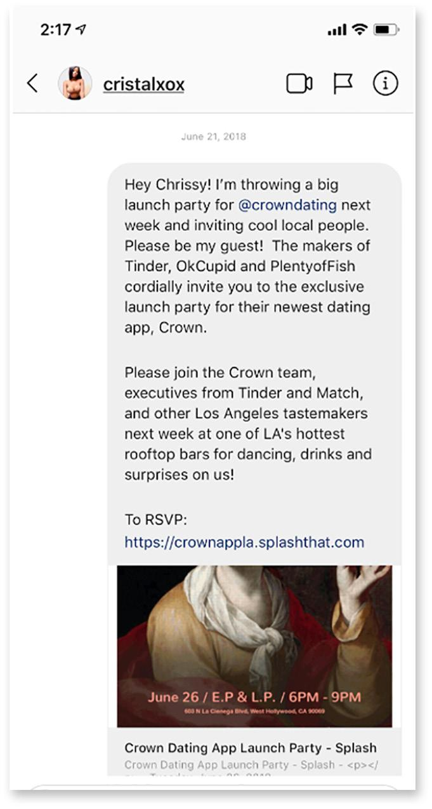
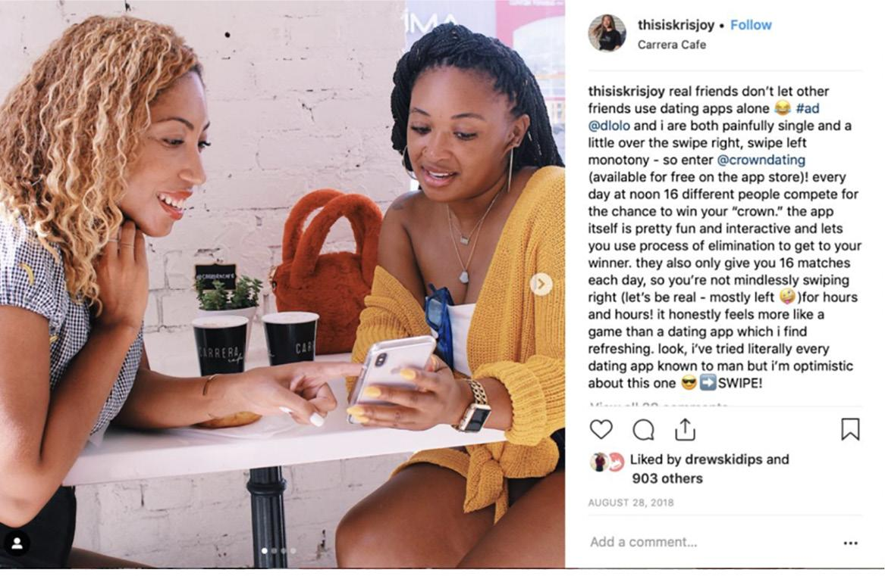
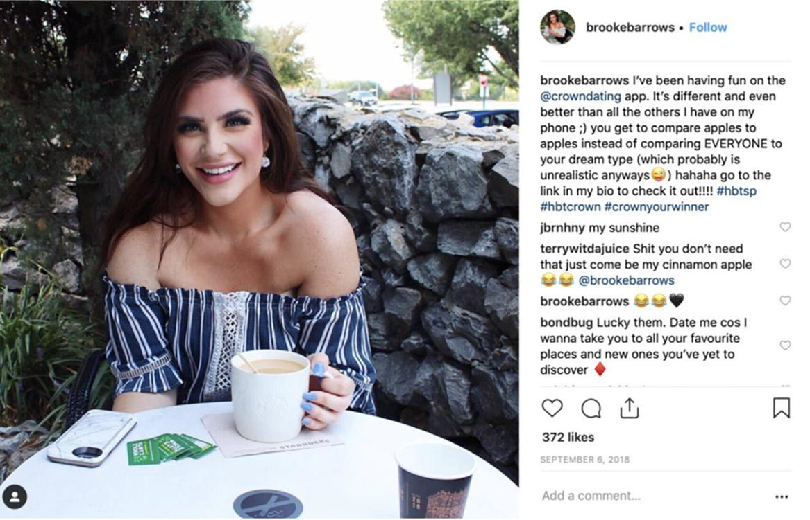

# 预算上的影响者营销
## 第 1 步：确定你想要使用的渠道和影响者

你想知道目前增长最快的营销渠道是什么吗？传递其影响者营销。在过去的几年里，在我参与的绝大多数项目中，几乎没有什么比影响者营销的 CPM（有时是 CPA）更便宜的了，但我花了将近 500 次参与才弄清楚这一切，而且要做好并不容易。
影响力营销不仅改变了游戏规则；它现在也获得了非常健康的广告预算部分。据 BigCommerce 称，超过 18% 的公司计划每年在影响者活动上花费至少 100,000 美元。根据 Twitter 几年前进行的一项调查，超过 49% 的成年人声称，他们在购买和购物创意方面的建议几乎与他们从朋友那里获得的一样多。我个人亲眼目睹了影响者营销从“狂野西部”演变而来，品牌以荒谬的价格向衣着暴露的女性支付了可笑的费用，这些女性主要用机器人和短靴来建立自己的追随者，以一种极其可扩展和真实的方式来真正影响人们使用/尝试/买你的东西。无论你在哪个市场，你都需要让有影响力的人宣传你的业务。
你可以通过三种主要方式进行影响者营销：

1. 从头开始 DIY 网红营销活动。
2. 通过有影响力的营销机构。
3. 使用网红营销平台。

最有可能的是，自从你投资这本书以来，你并不适合使用代理机构或昂贵的平台，但是当你获得更大的预算时，值得一提！每种策略之间的主要区别在于，你和你的团队需要投入更多资金，而不是投入更多时间。例如，如果你通过一家机构，他们会从头到尾为你做繁重的工作，但你需要支付总预算的相当一部分才能获得帮助。如果你刚开始，代理商也很棒，因为你可以从自广告渠道成立以来一直在战壕中进行数千次参与的人员中受益。不利的一面是，如果你尝试去有影响力的营销机构，除非你有 10,000 到 50,000 美元的支出，否则他们不会与你交谈，而且你只会与非常大的有影响力的人合作，这不是不总是最好的。
你可以尝试网红营销的第二种方法是利用网红营销平台和网络。你无需进行过多研究即可接触到数十名中型影响者，并且通常使用众多影响者营销平台之一进行全套分析。似乎每个月都有新的平台用于发现和吸引影响者，所以我不会一概而论，但总的来说你仍然需要数千美元来使用这些平台，这不值得为你的早期项目进行测试.
如果你是一家自力更生、自筹资金的公司，你将需要使用 DIY 方法进行网红营销，并且你不会与非常大的网红合作，但根据我的经验，这通常被证明更成功。通过我们称为“微影响者”活动的策略，与较小的影响者合作可以推动更多参与。微型影响者是指拥有 1,000 到 50,000 名追随者，因此整体影响力较小的人，但由于“微型影响者”通常专注于特定的细分市场或领域，因此他们通常被认为比典型的影响者拥有更牢固的关系。吸引这些微型影响者的最佳部分是什么？他们通常对现金以外的其他事情感兴趣！那么困难的部分是你需要与许多这些所谓的微观影响者合作才能对你的项目产生影响。但这并不意味着不可能！我已经看过很多次了，我将向你展示如何使用除了现金之外的任何价值来进行影响者营销活动，以吸引大量微型影响者的兴趣。
首先要做的是确定你所在市场的影响者。所以，选择一个频道。现在很多人都依赖 Instagram，所以我们将主要关注它，但它可能是 YouTube 用户、TikTokkers、播客或博主。 Instagram 是影响者营销的总体赢家，毫无疑问，但对于我曾经合作过的几乎每个品牌/目标来说，最强大的影响者都是不同的，所以一定要在其他渠道上进行测试。

看看不同的影响者营销在渠道方面的表现如何。记得测试一切！
下一个任务是开发一个关键字列表，你将使用它来发现你选择测试的频道上的影响者。假设我是一家专注于 25 至 45 岁富裕人群的健康食品配送初创公司。我会对我认为对我的目标人群很重要的关键字进行深入研究。
健康食品配送初创公司的影响者关键词列表示例：

- “Healthy”
- “Medicine”
- “Wellness”
- “Fitness”
- “Organic”

为了这个练习，让我们假设这五个术语是基于重要研究的超级针对你的用户。你可以围绕竞争力、活动和参与度进行研究，为影响者找到合适的关键字。然后，我将为每个术语寻找和开发影响者列表，以测试参与度并确定哪个“社区”或关键字焦点最适合我们扩展此策略。
然后我将直接转到我选择的影响者频道来测试和搜索这些术语，以找到有趣的影响者简介。因此，如果你在 Twitter 上，你会在右侧的“关注谁”下看到。只需输入一个关键字，然后单击“查看全部”，你就会看到出现这些关键字的所有顶级影响者。如果你是特定地点的企业，城市将成为你要搜索的关键字，因为你只需要位于你所在城市的影响者；否则，对你的成长的影响将是微乎其微的。这里简单的部分是算法会在这里为你做一些工作，因为它们会显示这些关键字的热门帐户，这意味着这些人是这些关键字周围的自然影响者，也就是那些谁现在流行和流行。
你希望测试各种规模的影响者，但每个人都应该充分结合这三个指标：

- Audience - 总共有多少粉丝？
- 参与度——他们的追随者有多活跃？
- Activations — 他们推广了多少其他品牌？

出于显而易见的原因，观众很重要；你需要确认他们拥有贵公司希望定位的正确受众。这可以通过查看他们的个人资料、最近的帖子及其内容的关键字相关性来确定。如果你的业务专注于特定位置，它们的位置也很重要。参与度对于评估他们的追随者是否真实、参与以及是否完全受创作者发布内容的影响很重要。你可以使用一个简单的公式来评估参与度：帖子的总参与度（喜欢和评论）/总关注者 = 参与度。因此，如果一个帖子有 100 条评论和 100 个赞以及 10,000 名粉丝……帖子的参与度将为 2%。理想情况下，你希望大型影响者的参与度至少为 1%，而优秀的微型影响者的参与度平均为 3 – 5%。
最近的品牌活动很重要，因为他们推广的品牌越多，你的信息就越淡化，而且很可能会被置若罔闻。你会想要看到一些品牌激活，显示内容类型和平均参与度，但你不想看到太多。我喜欢每月至少寻找一个带有品牌标签的#ad 帖子，但每周不超过一个类似的帖子。
当你在频道本身中搜索并找到你认为合适的影响者时，你将开始另一个新的 Google 表格，就像我们为新闻和电子邮件营销所做的那样，然后你将添加一些诸如影响者姓名、电子邮件、个人资料 URL 以及关于影响者的注释等列。我希望你开始时每天将你喜欢的所有影响者的个人资料 URL 放入表格中，直到你找到大约 100 个潜在影响者，然后你将大规模联系他们以获取他们的电子邮件地址和协商。
资料来源：
https://www.bigcommerce.com/blog/influencer-marketing-statistics/#10-most-important-influencer-marketing-statistics-for-2020
https://www.ion.co/twitter-has-released-a-report-showing-consumers-seek-product-recommendations-from-influencers-almost-as-much-as-they-do-from-friends

## 第 2 步：与有影响力的人进行大规模接触和谈判
一旦你的谷歌表有 100 个潜在的影响者，我希望你一个一个点击个人资料 URL，然后向影响者发送一个非常简单的冷外展消息，充满价值。我建议你为影响者创建一个模板冷直接消息，你可以复制/粘贴该模板以每天发送多条消息，如下所示：
嘿 NAME，我是你的名字，我的职位名称是公司名称。我们很乐意与你合作开展我们的影响者活动。我可以提供你最好的电子邮件地址以向你发送详细信息吗？
信息越短，他们就越快意识到你有价值，因为他们筛选的文本越少。如果他们的个人资料中有他们的电子邮件，你可以通过电子邮件向他们发送一些超级简短的内容，如下所示：

或者通过 DM 联系以获取他们的电子邮件并将他们添加到你的影响者列表中：

或者更好的是邀请他们参加发布会并首先与他们面对面会面：

尝试每天发送大约 20 到 30 条消息来构建这个影响者列表，特别是如果它们都在一个频道中。你不想在一天之内向 100 位尚未在 Instagram 上关注你的人发送消息；你可能会因此遇到麻烦。开始分批发送 10 条或 20 条消息，如果该消息有价值，你会对积极响应感到非常惊讶。他们可能会用他们的电子邮件地址快速回复。然后，你将获取这些电子邮件地址并将它们放入该工作表中。因此，当你进行产品开发时，在构建新闻列表和构建我们讨论过的其他营销渠道的同时，你也在构建一个准备谈论你的影响者的列表产品，以便当你准备发布时，你现在已经建立了另一个强大的营销列表。
比方说，收到 100 封有影响力的电子邮件后，下一步是为他们提供有价值的报价。大多数品牌认为他们需要大量预算才能与有影响力的人合作，但如果你像我之前提到的那样专注于微型影响者，你会发现许多愿意以物易物以换取其他价值的人。花点时间集思广益，看看除了现金之外，你是否还有一些有价值的东西可以提供给有影响力的人。除了经济奖励之外，他们中的许多人确实会拒绝任何事情，但即使预算很低，也会有足够的人同意使你的活动取得成功。下面是提供其他东西的一些想法。
影响者喜欢的其他有价值的东西：

- 免费商品 给他们你的产品！
- 赠品 在他们的页面上举办赠品
- 内容创意与他们一起创造内容！
- 独家/抢先体验产品！

然后，宣传将更加专注于合作，并高度强调对他们的价值。我所有网红宣传的底线是：与接触他们的其他品牌相比，我如何才能让我的品牌参与对他们的受众更有价值？我们希望他们觉得这不仅仅是出于经济原因而有价值……因此，向他们提出创意和有趣的想法，让他们的追随者感到高兴和印象深刻，这将有助于说服他们与你合作，而无需获得高额薪水。对于 10 万以下的影响者来说尤其如此。
此外，如果你有即将举行的活动，可以邀请他们参加，那就更好了。有影响力的人喜欢免费的东西，这意味着也有赃物和派对/活动邀请。因此，如果你正在举办活动或发布会，请邀请所有媒体和所有潜在影响者。
如果你有预算，我会给你一个关于付费参与的一般经验法则（尽管我认为你应该专注于以物易物的方式为你提供第一个 10 多个影响者营销活动，这样你就可以在投资之前证明什么最有效）：

- 低于 10,000：以物易物。
- 低于 50,000：为他们的观众提供赠品 + 免费产品。
- 100,000 美元以下：100 美元 – 200 美元以上
- 500,000 美元以下：500 美元 – 1000 美元以上
- 1,000,000 美元以下：2,000 美元 – 5,000 美元
- 更大？你不想知道。

如果你看到潜在影响者的愤怒回应并带有荒谬的价目表，请不要气馁。低下头，向更多微影响者发送更多信息，最终你会看到 10 到 20 位愿意与你合作开发某些产品、很酷的内容合作，甚至可能为他们的观众提供赠品。这里的整个想法是，你以很少甚至没有支出的方式进行前 10 到 20 次互动，然后将该渠道视为值得投资。如果你从这些早期参与中看到令人难以置信的回报，那么你可以回到负面回应并与稍后需要金钱补偿的影响者接触。

## 第 3 步：掌握影响者内容创建
成功进行影响者营销活动的秘诀是控制影响者创建的内容。你在这些活动中投入的努力越多，你给影响者的指导越多，结果就越好。相反，如果你没有给出任何指导方针，而只是让创作者“全权委托”做他们想做的任何事情，那么十有八九你最终会得到一些并没有真正优化潜在参与度的东西。这不是对有影响力的人的挖掘，而是承认你需要付出努力才能使这种营销策略取得成功。与所有其他营销一样，你确实需要确保有可靠的 ROTI（时间投资回报），但这里的美妙之处在于，一旦你为第一个创建了详细的指南和内容推荐，你就可以在后续的每个营销中重复使用它们订婚你做下来。毕竟，业务就是构建系统，对吗？
接下来，让我们看几个比其他内容效果更好的内容示例。首先，与图像相比，视频内容更具吸引力。据 LinkedIn 称，视频的分享频率是其他任何内容格式的 20 倍，并且 80% 的营销人员证实视频有助于增加销售额（来自 Wyzowl）。
在我的职业生涯中，通过 10 多年在线投放广告的累积数据（并且花费超过 10,000,000 美元），我可以告诉你，视频内容几乎总是优于图像和文本。然而，视频内容的问题是制作难度大且成本高昂。没有理由不鼓励影响者创建视频内容，但请务必询问他们的录制设置是什么，并且只有在创作者拥有创建品牌内容的工具时才继续进行。如果你最终创建了图像内容，我相信像下面这样的内容效果最好。首先，网红内容专为宣传你的产品而创建，而不是从以前的活动中反刍出来，并附有你公司的一些展示，或你在帖子中的产品展示位置。理想情况下，你希望使用你的任何产品或服务向影响者展示，并且视频应该是可信的。这一点至关重要，因为要让影响者影响人们，你需要让人们相信他们会使用你公司的产品或服务。

请注意，上面的女士们正直视产品，使我们的品牌成为帖子的明星。这对我们来说是一个巨大的胜利，而且超级实惠，与我在本章前面提到的影响者率相当。
另一方面，差劲的网红帖子通常只是网红的随机照片，重点是他或她的性取向，更糟糕的是，帖子中甚至可能包含其他产品。

请注意，我们没有关注我们付钱给她推广的产品（一个移动应用程序）（无可否认是我们的错）。在第一张照片中，这个影响者的影响力是创作者的五倍，但促成了三分之一的参与。这就是为什么提前奠定基础是值得的。
除了图像和视频内容之外，你还应该让网红撰写哪些文字内容来让你的活动更具吸引力？理想情况下，你希望有影响力的人将帖子与他们自己的生活联系起来，更加坚定他们追随者的信念。所以想想在那里写什么是可信的。你希望那个有影响力的人写下已经喜欢你的产品。你希望他们推荐它。在理想的帖子中，网红似乎在有机地推广他们喜欢的公司，并且不会被视为广告。不要在这里感到不知所措，因为很容易从一到三个参与开始，看看你的策略是否值得继续。有了这个，我希望你直接去接触一些有影响力的人，给他们一个易货交易，看看他们会带什么样的东西回来。看看会发生什么，并在我们的论坛中告诉我。我想听听什么对你有用。