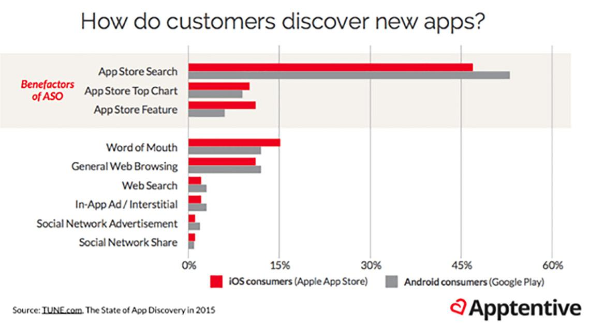
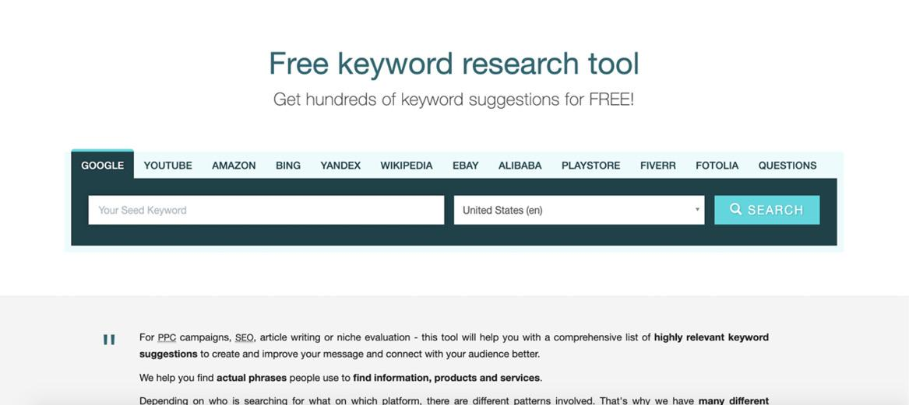
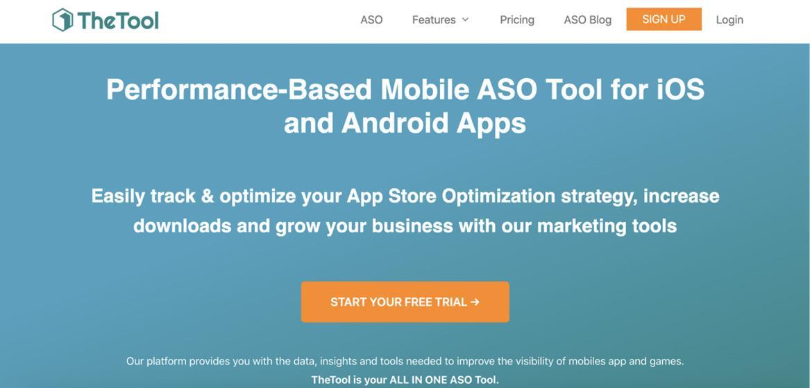
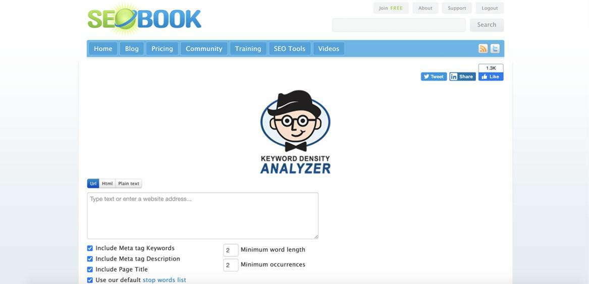
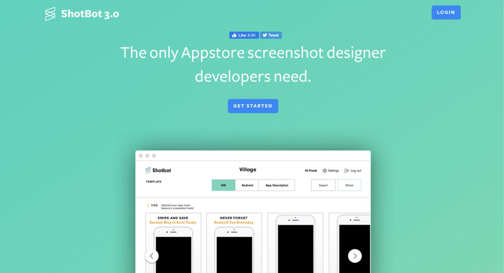
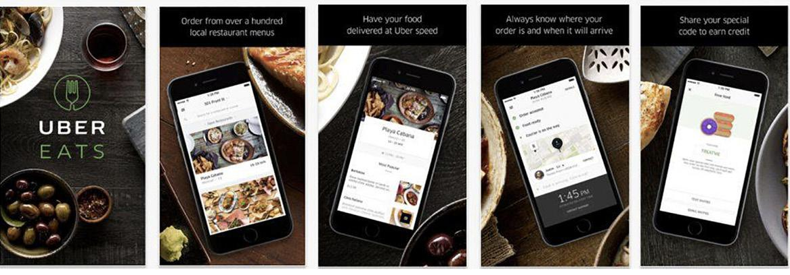
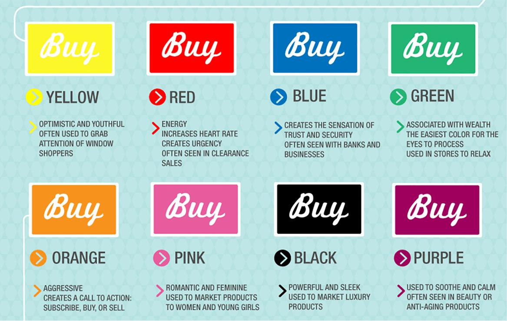

# 有应用程序吗？让我们为两个 App Store 优化它！
## 第 1 步：发现优化应用的最佳关键字

如果你是一家以移动为先的企业，这对你来说可能是整本书中最重要的一章。如果你的公司还没有并且从未计划过应用程序，我建议你暂时跳过本章。应用商店优化（大多数营销人员称之为 ASO）是一种有机的血液、汗水和泪水工作，你可以投入这些工作，使你的应用在客户使用的应用商店中进行相关搜索时更容易被发现、点击和下载。
目前人们使用的主要应用程序商店只有两个：用于 iOS 应用程序的 Apple App Store 和用于所有 Android 应用程序的 Google Play Store。老实说，两者在营销方面没有太大区别。有几个细微的差别，例如描述的不同字符限制和你可以在列表页面上发布的内容的不同内容限制，但整体设置是相同的。最重要的是应用页面内容的关键字相关性，这就是我们要开始的内容！

你可能已经看过这样的图表。 ASO 是有机移动增长所需的一切。
这里的想法很简单。我们希望你的应用能够进行潜在用户将执行的相关搜索，并从搜索营销人员最喜欢的消遣开始寻找所有最强大的关键字进行排名：关键字研究！你可能认为自己确切地知道要关注哪些关键字，但至少要进行几个小时的研究，以确定要优化的最佳关键字。这意味着你不仅仅是一时兴起，随机选择关键字并随心所欲。还记得我宣扬的数据驱动吗？这是利用该策略的好地方。如果你能够在竞争对手发现之前对鲜为人知的热门关键词进行排名，那么你将在其他人赶上之前获得数千美元的免费安装。
有了这个，我想让你做的第一件事就是为你的应用程序可能相关的关键字写出大量潜在的想法。稍后我们将比较他们的在线流量、趋势能力和竞争。令人难以置信的 ASO 资源 TheTool.io 建议将你的关键字分成几组。他们建议你“为关键字创建至少四到六个类别。根据你的应用程序，有意义的类别可能会有所不同。但总的来说，这些关键字类别是一个很好的起点：
问题关键词：描述用户搜索应用的原因。他们缩小了你的应用程序可以解决的问题或问题的范围，或者你的应用程序可以满足的需求或愿望。
用户关键字：描述你的目标受众，包括他们的人口统计、职业、兴趣以及他们在使用你的应用程序时所扮演的角色。例如，角色可能是学生（教育应用）、旅行者（旅行应用）、玩家（游戏）或运动员（健身应用）。
操作关键字：指定用户对你的应用程序进行的操作以及使用后的操作。使用健身应用程序的人会跑步、锻炼、锻炼或健身。
功能关键字：命名你的应用程序的基本功能，尤其是将其与竞争对手区分开来的 USP。
位置关键字：描述人们在哪里使用你的应用程序。它们可以包括特定国家和城市的名称，也可以包括描述工作场所、健身房、海滩或山脉等情况的通用术语。”
当然，你会立即知道最常见的关键字，但请与你的团队集思广益，确定你希望对哪些行业、市场和竞争对手的关键字进行排名。然后，稍后，你将使用我最喜欢的几个免费工具去“事实检查”它们。除了使用你的头脑之外，查看用户如何谈论你的应用并研究他们在你的应用中使用的关键字也是一个很好的主意。如果你已经收到评论，请仔细阅读这些评论，看看你是否能发现经常提到的任何关键字。最后，要找到新的关键字提示，你可以在应用商店中对已确定的关键字之一进行简单搜索，以找到其他新的关键字建议和变体以进行研究。当你在任一应用商店中搜索时，你不仅会看到哪些竞争对手出现了哪些搜索，而且你还会从应用商店本身获得“自动填充”建议，这对于解锁新关键字至关重要。大多数营销人员都同意这些自动填充建议是基于最近的热门搜索，这意味着 Apple 和/或 Google 会通过这些自动填充条款为你提供免费数据。
有几种令人惊叹的 ASO 工具，但大多数对于早期初创公司来说都太昂贵了。如果你负担得起，我推荐 Moz、AppAnnie、AppFollow 等，但现在，让我们从免费工具开始。
我想让你检查的第一个工具是 Keyword.io。使用 Keyword.io，你需要创建一个免费帐户，然后你就可以输入你头脑风暴的关键字，并提出所有其他可能对你的应用程序很重要的潜在关键字。

这个惊人的免费工具将帮助你发现需要为应用商店列表页面测试的关键字。
一旦你编译了几个你知道要研究的关键字，你将转到我的下一个工具推荐，它的字面意思是 TheTool (TheTool.io)。 TheTool 不是免费的，但它们为你提供了非常慷慨的两周试用期，你可以将其用于 ASO 工作。 在这个神奇的工具中，你可以输入你之前研究过的关键字，并可以将它们全部进行比较，以找出哪些具有最佳指标组合。

你应该能够获得有关每月搜索量和竞争的数据，这正是你可以确定要优化哪些关键字的方法。现在，你在这些指标中寻找什么？根据我的经验，要关注的理想关键字是搜索流量高、竞争低且与你的业务相关性高的关键字。你也可以使用 Google Keyword Planner 或你遇到的任何其他工具，但目标是了解有多少其他人将与你竞争这些关键字。进入应用程序商店并搜索这些关键字以查看你在野外看到的竞争类型也是一个明智的策略。这些企业有多活跃？他们的应用商店列表的关键字密度如何？如果你能够注意到它不是非常密集的关键字，那么很可能他们已经在很长一段时间内轻松获得免费排名空间。你可以从他们那里偷走它！
在你完成尽职调查并获得已确认与你的业务高度相关的关键字列表之后，它们很好地融合了有限的竞争和足够的搜索流量，使它们变得有价值，下一步是缩小范围。我只希望你最多关注 5 到 10 个关键术语，以便在不涉及黑帽“关键字填充”的情况下尽可能多地有效处理你的应用商店列表的文本内容。
资料来源：
https://thetool.io/2019/how-to-do-aso-keyword-research

## 第 2 步：关注关键字密度
在为你的应用商店列表页面确定明确的关键字焦点后，你将专注于重写列表的内容以获得最大的关键字密度（同时确保它保持可读性和价值）。对于不熟悉的人来说，术语“关键字密度”是一个术语，表示你的核心关键字出现在你的列表描述、标题、应用程序名称等中的次数。我们希望尽可能地将这些重要的关键词注入到应用商店允许我们自定义的每一段文本内容中，因为“关键词相关性”是应用有机排名的主要决定因素之一。为了更容易理解，Apple 和 Google 使用软件来搜索你的应用商店列表页面，并确定你的应用将与哪些搜索（如果有）相关。因此，你在增加关键术语在列表页面中出现的最大次数方面投入的工作越多，你将永远免费获得的展示次数和安装次数越多。
为关键字密度重写你的列表页面文本非常耗时，并且需要进行多次编辑，但这是值得的，而且你自己做这件事而不是付钱给代理机构将为你节省数千美元。
首先，我希望你先在网络上拉出你的列表页面。复制所有列表页面文本，然后将其粘贴到 Google 文档中，你将其命名为“当前 App Store 列表内容”。你将在文档中一遍又一遍地重写文本，直到写满为止。我所说的最大化是指你不可能在文本中添加更多关键术语，而不会冒着听起来可疑、疯狂或不专业的风险。然后是时候停下来分析了。接下来，我希望你去打印出来，或者在你的手机上打开你想出的关键术语列表，这样你就可以把它放在你面前，然后你再重新编写内容以增加关键字注入。有时你需要走开或专注于其他事情，然后重新打开它并重新开始。这可能需要一周的时间，所以不要着急。目标应该是在不破坏可读性的情况下获得最大数量的关键字密度。
ASO 关键字密度基准没有固定标准，我从我参加的各种营销人员和活动中听到了很多不同的数字，但我建议你将前三个关键字的密度设置为 5%，次要关键字设置为 1%。 ASOprofesional.com 有点同意并表示你应该“对主要关键字使用 2 – 3% 的密度，对相关和支持关键字使用 1% – 2%。”最重要的是，如果你尝试几次，并且从重新编辑文本之前的位置获得至少 3% 的密度，我认为随着时间的推移，你会看到自然安装的巨大改进，几乎没有别的。

一旦你完成了一些重写并准备好评估关键字密度，你就无需为昂贵的 ASO 工具付费。我使用 SeoBook.com，你可以在其中免费注册一个免费帐户以免费访问他们的关键字密度检查器。

创建帐户后（物有所值且免费），找到他们的密度检查器工具，你可以再次将你正在处理的 Google 文档中的文本复制/粘贴到检查器中，以分析文本的密度。然后你将能够看到关键字云，这本质上是你企业当前的关键字策略。我建议你在对文本进行一些编辑之前和之后进行密度测试，以查看你所做的改进。如果可以的话，然后向人们大声朗读。如果它听起来太俗气，那么作为应用商店列表听起来也很糟糕。目标是继续这样做，直到找到可读性和关键字密度的平衡，并且通常需要至少三到四次修改才能找到最佳平衡。你不能只关注关键字密度，因为当人们阅读它时，这听起来很愚蠢，而你需要关键字密度，否则没人会找到它。所以我希望你继续写那个描述。
除了工作簿中的这一部分，我还包含了一张表格，其中包含你可以使用的所有最大字符限制，以及应用商店的每个元素。它们经常随应用商店的一时兴起而更改，因此如果某些内容不再准确，请在组中发表评论。两个商店之间的字符限制差异很大，但是，例如，在 iOS App Store 中，关键字限制为 100 个字符，描述限制为 4,000 个，应用程序名称限制为 30 个字符。在这里，没有什么“黑帽子”对你来说是有效的，并且试图通过关键字填充或故意重复内容来玩弄系统可能会导致你的应用程序被永久下架。所以，不要一遍又一遍地说，只是为了提高关键字密度。专注于你的应用程序提供的所有惊人价值，同时有意整合关键字。同样，如果你有任何问题，请在论坛上发帖。我会跳进去给你反馈！

## 第 3 步：在视觉上优化你的 App Store 列表页面

好的，现在你有了想要关注的关键字。你已经重写了应用商店列表以获得最佳关键字密度，并且你知道最终会出现这些搜索。这是 ASO 的第一步——出现在相关搜索中——但现在，下一步是让人们相信你的应用值得点击下载按钮。我们怎么做？通过视觉应用商店列表内容。在你的应用商店列表中优化你的图像/视频是我们让人们信任你并转换为安装的方式。
根据 SplitMetrics 博客的说法，“事实证明，只有不到 2% 的用户点击了‘阅读更多’按钮，有些人完全忽略了应用程序说明。这并不奇怪，因为视觉交流比书面交流对人们的影响更大。因此，应用程序截图负责吸引潜在用户的注意力并说服他们安装应用程序。”
在这两个应用程序商店中，你都可以添加图像，还可以添加始终显示在屏幕截图之前的短视频。在 iOS App Store 中，开发者最多可以上传十张截图，而在 Google Play 商店中，你可以为任何设备添加最多八张。你可以通过无数种方式在此处测试你的图像——背景颜色，包括措辞与无文本、近距离展示产品屏幕截图或展示设备本身等等。每年测试一些新策略是完全安全的，但请注意，开发所有这些图像需要时间，所以我想告诉你一个工具，它使它变得如此简单，你甚至不需要使用设计师创建它们。
查看 ShotBot (Shotbot.io)。 ShotBot 是一款令人难以置信的免费工具，可为两个应用商店制作图像。这个工具可以轻松地将你的图像创建时间缩短到几分钟，这样你就可以创建一堆不同的图像，然后对你的团队、朋友、家人和顾问进行投票，以最好地了解使用哪些图像。

决定要创建什么内容的最简单方法是将应用商店列表页面视为向潜在用户进行闪电般快速的宣传，其中潜在用户是你见过的任何人中注意力持续时间最短的。有了这个，你只有三到五个可以快速了解的项目，以向用户敲定房屋价值。那么你的应用程序中的哪些主要体验会让人们认为他们需要它？你正在解决什么问题？什么是不可思议的“啊哈！”在你的应用程序中的时刻？这就是你想在这里展示的内容。如果你遇到困难，请尝试思考你的业务的主要价值主张，并在这些第一张图片中包含最重要的价值主张。这是他们会看到并认为足够重要以下载你的应用程序的内容。如果你决定，你还可以测试在图像中添加一些文本，例如以下来自 Uber Eats 的示例，通常每张图像也有大约 5 到 8 个单词。

最近，许多企业都在其产品照片中添加了文字简介，如上述。
一旦你决定了图像的内容，你就需要为它们辨别最佳配色方案。信不信由你，这是一个非常重要的方面，正如你从下面令人难以置信的图片中看到的，每种颜色都可以在心理上对用户表示某种意义。正因为如此，我并不总是建议你只是默认你的品牌颜色。相反，请考虑你希望通过你的应用程序传达什么，并基于此选择一种配色方案。

感谢 Buffer 提供了这个令人难以置信的图像/颜色分解。访问 Buffer.com/blog 找到它。
优化应用商店列表页面（我称之为 ASLP）的视觉方面的最后一部分是包含视频。这不是强制性的，但有数据证明视频确实提高了应用商店中应用的转化率。据 StoreMaven 称，“应用程序下载量的增长百分比约为 35%，观看视频的用户安装该应用程序的可能性高达 3 倍。”视频是应用程序商店也有很大差异的其他领域之一。例如，在 Apple App Store 中，应用预览视频会自动播放，因此大多数应用列表页面访问者都会看到应用视频的开头。根据我的研究，IOS 上的平均视频观看时间是 4 到 6.5 秒，这不是很长。
与 Apple 不同的是，Google Play 视频不会自动播放，因此小得多的片段甚至会看到你的视频。这里有更多关于为你的应用商店列表页面创建最佳视频的提示。
保持应用视频简短，不要过度宣传。
如果你无法创建任何其他内容，请从你的应用程序内体验的屏幕录制开始。
声音并不重要，所以添加字幕、标注和其他元素。
这些视频应显示应用程序的设计和功能。
再说一次，我不想忽视这样一个事实，即有整本书籍都写在 ASO 上，还有一些很棒的博客，如 TheTool、SplitMetrics、AppAnnie 等等，其中详细介绍了如何在应用程序中测试和优化新策略商店列表，它们都值得研究。我的目标是至少从这些课程中完成一些基本的 ASO，获取一些数据表明值得在这个渠道上投入更多的时间和精力，然后你可以加倍努力。
资料来源：
https://splitmetrics.com/blog/app-store-screenshots-aso-guide/
www.itunes.apple.com/us/app/ubereats-uber-for-food-delivery/id1058959277?mt=8
https://thetool.io/2019/app-store-google-play-screenshot-sizes-guidelines

## 第 4 步：排列大量早期评论
你可能从未想过评论是营销应用程序的一种功能，但最重要的是，你不希望在启动新的应用商店列表页面之前没有排列大量新评论。评论很重要的原因是，与任何其他搜索算法一样，用户和下载的活动和积极互动越多，搜索引擎收到的数据就越多，表明你是有价值的，你的排名就会提高。归根结底，任何搜索引擎的目标都是向搜索者提供最准确、最可靠的搜索结果。这就是 Google 的工作，这也是 iOS App Store 和 Google Play 商店的工作。因此，你获得的好评越多，应用商店就越有信心更频繁、更突出地展示你的应用。我主要通过三种方式来获得可扩展的应用程序评论，而且这些方式都不涉及任何类型的付费服务。我完全赞成假装直到你成功，但我不希望你只为评论付费，因为垃圾邮件不起作用，我相信它会被注意到，所以它无济于事。当你重新启动应用程序的列表页面时，获得可扩展评论的第一种方法是通过朋友和家人，这不是火箭科学。为了使其具有可扩展性，我希望你制作一个 Google 表格，并写下你可以想到的所有朋友和家人，你可以在重新启动应用程序的那天诚实地联系并要求对其进行评论。我建议你从朋友那里获得至少 50 条可靠的评论保证，因此不要将你的联系限制在电子邮件上。将这几乎视为众筹活动，并通过文本、Facebook、Instagram 甚至 Twitter 向人们发送消息，因为最重要的是这些是你认识的 50 个人，你甚至可以指导他们提及你想要提及的应用程序的关键信息被突出显示。此外，显然，我并不是建议你撰写评论，而是考虑通过为朋友和家人提供一些关于撰写内容的指示和指南来让他们更轻松一些。
我增加评论潜力的第二个策略有点困难，但可能会导致评论数量增加数百倍，这就是将评论请求直接构建到你的产品中。这里的想法是确定当你的用户对你的产品非常满意时，我称之为应用程序中的“AHA 时刻”；那是你想要提示他们进行评论的时候，因为他们觉得他们刚刚从你那里获得了价值，并且他们已经准备好传播口耳相传。想想在你的应用程序中发生的第一次很棒的体验——如果你是电子商务应用程序，那可能是他们第一次结账，或者他们第一次在游戏中达到里程碑。制作一个弹出窗口并说出以下内容：“嘿，你喜欢[APP NAME]吗？单击此处查看。如果不是，请单击此处向客户支持发送电子邮件。”你想给他们第二个选项，因为如果你的应用是 1 星评价，你不希望他们评价你的应用。他们的反馈对于改善你的用户体验至关重要。
与流行的看法相反，你也不需要任何开发时间，因为现在有几个插件，你可以在某些时间和触发器中弹出审查请求。你可以通过一些你可能已经在使用的工具来做到这一点，例如 MixPanel 和 Braze。
获得评论的第三种方式是通过你的在线社区，可能是通过竞赛。正如我之前提到的，不要仅仅依靠一个平台上的社交媒体关注者；你还可以进入初创公司群组、与初创公司相关的子版块、与你所在行业相关的论坛等，并在这些地方寻求评论。此外，如果你通过赠品竞赛来激励评论，你可以轻松地在社交媒体上推广并推动大量入站评论。这里的最终目标是在你重新启动完全优化的新应用程序的那一天推动大量自然入站流量和新评论。这会告诉谷歌或苹果他们应该给你更高的排名，你会看到更多的自然流量。
你现在的功课是找到完美的应用商店页面，排列一堆评论，并为你的应用获取自然流量。