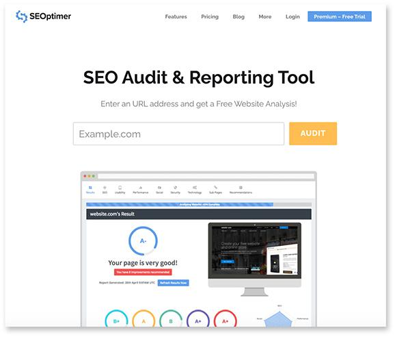
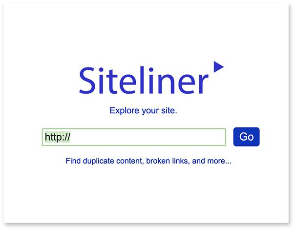
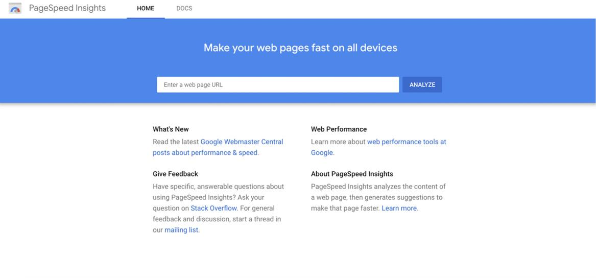

# 无需代理即可掌握你的 SEO！
## 第 1 步：审核你的 SEO 以制定行动方案

让自己站在你企业的潜在客户的立场上。当他们为你解决的问题寻找服务、产品或解决方案时，你认为他们会做的第一件事是什么？去谷歌搜索一下，对吧？那么，按照这种逻辑，你的企业获得知名度的最重要位置之一就是 Google 搜索排名，对吗？这就是搜索引擎优化 (SEO) 的全部意义所在。你的企业网站有两个主要网站访问者，人类和搜索引擎蜘蛛，而且大多数时候，你的 Web 开发人员只会为人眼开发你的网站。搜索引擎优化是关于修复你的网站以及你作为一项业务在你的网站上做什么，以便那些搜索引擎蜘蛛在你的网站上也有很好的体验。你想创造一个世界，在这个世界中，在线搜索你的确切解决方案/产品的人可以在他们需要你的时候，在竞争对手之前找到你。
好消息是像谷歌这样的搜索引擎也想要同样的东西。他们的工作是尽可能快地为网络搜索者提供最佳的网站体验。那么，搜索引擎优化是一门让 Google 的工作对他们来说更轻松的艺术，它通过准确地告诉他们你的全部内容以及你应该排名的内容，而不是让他们碰巧。根据 BrightEdge 的研究，SEO 带来的流量比有机社交媒体多 1000% 以上，Sparktoro 表示全球 90% 以上的流量来自谷歌搜索、谷歌图片和谷歌地图。这就是为什么我说搜索引擎优化是你在营销的第一个月可以为你的业务做的最重要的事情。随着对 SEO 的关注，随着时间的推移，你网站的关键术语排名可以继续提高，并在不增加任何时间投入的情况下推动越来越多的免费业务。此外，由于搜索者的意图水平如此之高，来自 Google 的自然流量是你可以获得的一些最高质量的网站流量。例如，如果我正在搜索“旧金山的牙科清洁”，而你是旧金山的牙医，你可以打赌，一旦我登陆你的网站，我就准备好转换，因为我搜索的内容，而不是某人只是在 Facebook 上观看有关牙齿清洁的视频，而不是超级感兴趣。
由于这种能力，SEO 机构通常可以为长期公司关系收取 200,000 美元以上的费用，甚至更便宜的 SEO 机构每月可以从 5,000 美元到 10,000 美元不等，因为投资回报率就在那里。疯狂的部分？ SEO 只需要时间、基本的 Web 开发专业知识和大量研究来执行。只要你不松懈研究，我将教你如何处理你的网站只会在接下来的几周内执行，但会在 5 到 10 年内支付红利，即使你不这样做还要别的吗。在我们开始之前，让我分解任何可靠的搜索引擎优化活动的两个主要组成部分：页内 SEO 和页外 SEO。
页内 SEO 是指涉及改进你的网页的优化策略，页外 SEO 是你在网站外进行的所有 SEO 策略，例如我们在本章末尾讨论的链接构建。我建议你首先优化你的网站（页面 SEO），然后专注于页外 SEO 以继续扩展你的自然排名。谷歌说反向链接是他们排名前三的因素之一，但在此之前，你必须有一个快速、干净、关键字密集的网站，该网站还拥有大量的社会证明来说服谷歌和其他搜索引擎（谷歌有超过所有搜索引擎使用的最大份额，因此最好专注于优化它们）来对你进行排名。如果这听起来很多，那么我只想说这是最难开发、最耗时的渠道之一，本章的每一部分都可以轻松地花费一周的时间来正确执行。搜索引擎优化机构不仅因为他们带来的结果而昂贵，而且因为他们为你节省的时间。与每个渠道一样，你应该通过你有多少时间/金钱来分析投资于 SEO 帮助与 DIY 是否更好。如果你的钱比时间多，你应该投资于 SEO 帮助；如果相反，请继续阅读，我们将一起为你做 SEO。
一旦你决定开始自己的 SEO 工作，第一个任务就是对你的企业网站进行全面的 SEO 审核，以准确了解你当前所处的位置，然后制定必要的列表优化。网站的 SEO 审核通常包含三个主要部分：1) 网站当前的关键字密度和关键字焦点； 2) 网站的技术不足和必要的优化，如速度提升； 3）你网站的内容数量和内容结构。几乎所有网站都可以改进这三个方面，但好消息是，一旦你解决了所有未解决的问题，你就会看到你的网站的排名随着时间的推移而不断上升，即使你没有花太多钱之后在页外 SEO 上的时间。有许多昂贵的 SEO 审计工具可以帮助你确定需要在网站上修复的项目的完整列表，但在本章中，我将推荐免费工具，以节省你的资金。你还可以使用 Moz、SEMRush 等付费服务，但我喜欢那里的免费 SEO 工具，而且有很多。我推荐的第一个工具叫做 SEOptimer (seoptimer.com)。

访问该网站后，你可以输入你网站的 URL，几秒钟内，你将收到一份精美的免费 30 分网站审核，其中包含你可以交给开发人员的一系列内容使固定。并非每条建议都是可行的，请记住，这是一份基本报告，因此不会让你达到 100%，但这是朝着正确方向迈出的一大步。
当我在 SEO 方面与客户合作时，我们花了一周时间使用十几种不同的工具来编译完整的页面优化列表，但这将使你完成 25% 到 50% 的工作，无论你身在何处目前在。 SEO 审计的重点是在你扩展其他营销活动之前有效地确定你网站上需要修复的内容，并且开发人员可以快速修复大多数这些建议。如果你正在阅读本文并且没有任何联系或首选开发人员，那么你只需在 LinkedIn 上发帖即可轻松找到。如果那不成功，那么我建议 Fiverr (fiverr.com) 雇用便宜而有效的人。你所要做的就是给开发人员一个很好的项目要点清单，他们将能够让你摆脱困境。这些页面优化值得投资，因此如果与自由开发人员合作要花费你几百美元，我建议你这样做，尤其是当你在 SEOptimer 上的评分低于 C 时。你会看到审核不仅会显示你当前的主要技术问题，还会显示你的关键字相关性以及你的企业目前告诉 Google 为你排名的关键字。十分之九，这是进行这些审计中最令人震惊的发现。人们没有意识到，仅仅为人类读者自然地编写文本，他们可能会向谷歌发送错误的信号，导致他们被完全错误地排名。 SEO 审计将有助于描绘出更清晰的图景，因此你将确切知道需要解决哪些问题才能获得正确关键字的最高排名。
来源：
https://videos.brightedge.com/research-report/BrightEdge_ChannelReport2019_FINAL.pdf
https://ahrefs.com/blog/seo-statistics/

## 第 2 步：制定关键字策略并重写你的网站文本
在你对站点进行审核并创建与其结构、速度和设计相关的优化列表后，我建议你放下本书并立即与你的开发人员进行对话。没有理由在没有首先完成你的页面的情况下开始任何类型的页外搜索引擎优化，因为谷歌回来检查你的网站的次数越多（因为这是发生的事情，你在内容营销、SMM 等方面越活跃）你的排名会做出更多反应，因此最好让它为 Google 蜘蛛的非常高且相关的排名做好准备！说得通？
如果你有幸成为自己企业的开发人员，我希望你已经实施并实施了一些快速修复，例如缩小页面大小或加强文件的技术方面并使你的在移动设备上的网站体验更好。无论哪种方式，一旦你实施了尽可能多的更改，并且你已经多次重新运行该 SEOptimer 测试以确保你的操作尽可能接近 A+，那么下一步就是获取你网站的书面文本内容要与你认为会为你带来来自 Google 的高质量流量的关键术语相关。这就是我们所说的“关键字策略”，大多数公司在开发网站时都没有考虑太多，所以我想从这里开始。你必须研究并找到你网站每个页面的关键术语的最佳组合，因为我们将一遍又一遍地重写你的网站文本，以增加这些关键术语被提及的次数，以在每个页面上创建最佳的“关键字密度”，这样 Google 就不会在你的相关性上犯错误并对你进行排名。这就是我认为 SEO 最重要的方面：关键字相关性和密度。想一想；如果你在凤凰城销售烘焙食品，并且你的网站上的关键词“凤凰城的烘焙食品”非常密集，那么 Google 自然会为搜索“凤凰城的烘焙食品”的人提供服务（假设你的 On-Page 的其余部分搜索引擎优化完成）。现在谷歌从不公开承认或澄清其搜索算法中变量的权重，但整体关键字相关性和密度被认为是让你的网站排名的最重要方面。
因此，正如我们讨论的应用商店优化一样，我希望你首先为你的网站创建一个包含 5 到 10 个术语的关键字云。你可以将其写在纸上、手机上或 Google 文档中。你不会只是凭空挑选这些关键术语，即使你已经知道一些关于你认为应该排名的内容的想法；在这些决策中，你必须进行研究并以数据为依据。想一想你会想象某人在需要你的业务时在 Google 上搜索的关键术语，然后使用以下工具比较、研究和制定基于我在 ASO 章节中提到的相同组合的关键字策略：低搜索竞争/高搜索流量。理想情况下，你想尝试达到“关键字的圣杯”，这是一个没有人想到要投放广告但每个人都已经在搜索的关键字。你不太可能找到这样的关键字，但高搜索流量和低广告竞争的安全组合是你的理想组合。获得关键术语的入门列表后，就该比较和研究它们了。首先，我希望你从 ASO 章节返回 Keyword.io 网站，在那里你将搜索一些你已经集思广益的术语。结果应该分解竞争、搜索流量和你需要知道的其他关键指标，以确定网站每个页面的最佳焦点关键词。如果由于某种原因Keyword.io网站不再有此功能，只需在Google上搜索“关键字流量比较工具”即可找到另一个免费工具。
现在，这对我来说是棘手的地方，因为我不能在这里做出非常大的概括，否则它们对你的业务不准确。每个企业都确实不同，但总体而言，你的主页通常应包含最通用的搜索词，例如“刹车维修公司”，然后你的内页（例如服务页面或产品页面）都会有不同的，更具体的关键字策略，以便它们可以单独排名。这就是你如何通过 SEO 全面获胜。你可以尝试为你提供的每种产品和/或服务获得单独的排名，而不仅仅是在整个网站上使用一个重点关键词。如果你是一家拥有多种产品和服务的企业，你将希望为每个独特的产品制作单独的页面，然后转到该关键字工具并找到最佳关键字来优化每个页面。
一旦你获得了关键字焦点，你将完全按照 ASO 章节中所做的工作并重写每个页面的所有内容，尝试在不破坏人类可读性的情况下尽可能使其关键字密集。因此，打开另一个 Google 文档并粘贴你主页中的所有文本，然后粘贴其下方其他页面中的所有文本。该文本是搜索引擎蜘蛛在访问你的网站以对其进行排名时会看到的内容，因此你希望在不破坏网站访问者的用户体验的情况下使其关键字尽可能密集。你不能在这里过火并使它变得不再可读，但是在这之前尝试将密度推到极限。重写文本后，将其粘贴到我们在应用商店优化章节中介绍的 SEObook (seobook.com) Keyword Density Checker 中，你将逐页查看你当前的关键字焦点和密度是什么样的.你当前的关键字焦点可能会让你感到震惊和不安，特别是如果你还没有做过任何 SEO 工作。这基本上是你从第一次设计网站以来一直向 Google 发送的信号。既然你已经为你的内容和 SEO 开发了一种有预谋的方法，你将继续使用新的关键字焦点重写网站每个页面的文本，直到达到至少 2% 到 5% 的密度为止页面的焦点关键字。这就是全部！因此，继续重写该文本，将其转回 SEObook，按 Enter，然后查看是否可以达到我推荐的 5% 的密度。一定要注意与目标人群相关的单字短语、两字短语和三字短语以及你想搜索的内容。不要气馁，因为这个过程需要大量的工作才能正确。然而，一旦你得到它，你就会离开它几个月，免费的潜在客户和转化将在很长一段时间内进入你的业务，因为你将始终专注于我们的下一个策略，页外SEO，然后。

## 第 3 步：页外 SEO 和长期链接建设
我们刚刚讨论的页面 SEO 策略将为你带来大量的自然搜索引擎增长，而你无需花费一美元，但事实是，即使页面 SEO 占了战斗的 75%，你仍然需要继续进行页外练习以保持该排名。
虽然页内 SEO 活动可能需要一到四个星期的时间来研究、执行和优化，但页外 SEO 是持续进行的，永远不会真正停止。然而，好消息是页外搜索引擎优化本质上是我们在本书中讨论过的所有其他营销策略，只是继续。使用页外搜索引擎优化，它不是关于你在一两个星期的研究中对你的网站做了什么，而是一个持续的策略，你不断地向谷歌确认你在你正在尝试的关键字领域中很活跃排名。我们怎么做？通过与其他排名良好的老牌企业建立联系，你实际上是在建立社交影响力，并告诉谷歌你是一家合法的企业，随着时间的推移，它的排名应该越来越高。这意味着通过活跃在社交媒体上、通过内容营销创建内容、通过博客建立链接以及获得一致的公关曝光，你将参与页外搜索引擎优化。在社交媒体上分享你的内容的人越多，Google 的算法就越能识别你是合法的，但有一些方法可以扩展这一点。
我希望你做的第一件事是了解你在当前反向链接方面的立场，尤其是与已经对你想要提出的关键术语进行排名的竞争对手相比。网上有很多免费的反向链接检查器，但我使用 SpyFU (spyfu.com) 工具，因为它不仅免费，而且你可以在同一个地方比较你的竞争对手（这是你寻找和窃取的史诗般的方式）还有建立链接的机会！）。
使用此工具，你可以比较你拥有的几个，也许是两个或三个不同的竞争对手，看看到目前为止谁拥有更强大的反向链接计划。如果你有时间，去访问你的竞争对手建立链接的每个站点，看看你是否也有机会在那里建立链接。访问并确保你在目标人群花费时间的所有网站和在线社区上都有存在并没有错。也许它是一个论坛、一个流行的博客、一个问答网站、一个社交媒体组，或者是一篇你可以评论的文章。竞争对手不在的任何地方都是开始建立高质量链接的好地方。模仿竞争对手的链接建设方法是一个很好的入门策略，但如果你只做这些，你可能永远不会超过他们的排名，所以下一个链接建设策略就是利用社交媒体的力量。还记得在社交媒体营销一章中，我教过你如何进行社交媒体监控并以合乎道德的方式将你的链接传播给已经在谈论你的业务的所有内容的人吗？好吧，事实证明，这对于构建 SEO 链接也非常强大。
同样，谷歌从未完全承认社交媒体对 SEO 的重要性和重要性，但 CognitiveSEO 的研究分析了选定平台上的 2300 万社交媒体分享，他们发现社交分享和 SEO 之间存在不可否认的联系，证明分享、喜欢和评论你收到的帖子是 Google 和其他搜索引擎用来对你的网站进行排名的重要信号。在社交媒体上喜欢、分享或转发内容的人越多，你的企业就越能在 Google 中建立信誉。
通过继续从事社交媒体、公关、内容营销等工作，你正在建立来自不同站点的链接并有效提高你在 Google 中的声誉，但你是否知道某些站点的链接比其他站点的链接更有价值？例如，如果你可以从 .edu 或 .org 网站获得链接，那么在 Google 眼中，它比另一个 .com 更有价值。这是因为谷歌认为 .edu 和 .org 网站不仅仅是为了盈利，因此更值得信赖，所以如果你能够从这样的组织获得链接，你的 SEO 就会受益。关于如何从大学网站获取链接的一个简单、可破解的示例是创建职位发布并将其发布在多个大学招聘公告板上。砰，一个链接被创建。
许多营销人员认为维基百科是一个非常宝贵的建立链接的机会。如果你可以合法地将你的企业置于 Wiki 页面或你所在城市、行业或主要投资者的 Wiki 页面上，这是一个很好的链接。这些链接将有助于与 Google 建立你的 SEO 论据，而且它永远不会结束。与你每年只需要进行几次审核和编辑网站的页面 SEO 不同，页面外 SEO 开发永无止境，但它应该与你正在进行的营销工作相吻合。我必须评论的 SEO 的另一个重要方面是看到效果所需的时间。通过你执行的初始页内任务，你可能会在 30 到 60 天内看到你的排名重新排序，但使用页外 SEO，它需要更长的时间，因此你不能放弃。让我们想象一下，从今天开始，你所有的页面 SEO 都已完成。仍然需要几个月的页外搜索引擎优化才能开始看到真正的增长并接近第一页排名。只需确保你继续建立与其他网站的链接，并不断寻找与你合作的其他企业建立链接的机会，包括公关提及、社交媒体和其他形式我们讨论过的营销。
资料来源：
https://www.semrush.com/blog/social-media-seo/#:~:text=Social%20media%20does%20not%20directly,Longer%20lifespan%20of%20your%20posts

## 第 4 步：避免常见的 SEO 错误
老实说，这就是你了解 SEO 基础知识并至少让你的企业与 Google 正确沟通所需的全部知识。不过，在这个时刻，我想花点时间谈谈我见过的一些与初创公司和公司合作进行 SEO 的非常常见的模式，这些模式与初创公司创始人所犯的 SEO 错误有关。第一个是称为“重复内容”的问题，即当你网站上的多个页面在内容上如此相似以至于谷歌完全忽略这两个页面时。 90% 的情况下，这种情况完全是错误的，但如果你有一个包含多个页面的相当大的网站，则可能会有 60% 或更多类似文本的页面，因此在 Google 上竞争相同的排名。
网上有很多免费的重复内容检查工具，但我使用的是 Siteliner (siteliner.com)。

在 Siteliner 上，你只需输入你网站的 URL，你就可以立即了解是否存在重复内容问题。在我看来，你需要确保你的网站在任何页面之间的重复内容不超过 30%。如果这样做，你需要进入这些页面并创建独特的文本内容以将它们分开，以便 Google 可以更轻松地对两个页面进行排名。这需要一点时间，但最终，Google 将能够识别哪个页面更重要，哪个页面的关键字密度更高，并开始对你进行排名。
我希望你考虑的第二件事是你网站上的断开链接。你还可以通过 Siteliner 免费查看损坏的链接。在同一份报告中，你应该会看到网站上所有损坏链接的列表。这对 SEO 不利，但对网站访问者的用户体验也非常不利，因此你需要立即摆脱所有这些损坏的链接。它可能是一个不再有效的旧博客 URL，或者来自“联系我们”页面的 404 错误；无论是什么，你都需要立即修复这些问题，因为在大多数情况下，一个人点击断开的链接，他们会从你的网站反弹，而我们不希望那样。
我看到公司犯的第三个主要 SEO 错误是关于网站速度。如果你的网站加载缓慢，谷歌将永远不会对你进行排名。除了永远不会被谷歌排名之外，一个缓慢的网站还会产生糟糕的用户体验，这会损害你的品牌，并让你付出无休止的转化和潜在客户的代价，否则会关闭。 WebsiteBuilderExpert 对这个主题有一个很好的引用：“你可以将网站速度视为一个滑动比例，速度越快的网站获得的收益最大，每一秒都会产生影响。例如，两秒内加载的页面平均跳出率为 9%，而五秒内加载的页面跳出率飙升至 38%”
我们之前在运行你的诊断 SEO 审计并找出你需要解决的问题时谈到了这一点。站点速度通常是该报告中的主要发现之一，但它经常被忽视，因为它通常难以修复，但站点速度非常重要，值得进行多次检查和测试，以确保你运行得很快。如果当你通过 SEOptimer 并在底部运行该测试时，它表明你的网站速度非常慢，我希望你转到 Google Page Speed Insights (developers.google.com/speed/pagespeed/insights) 并运行测试你的 URL 以准确找出你可以修复哪些内容以使你的网站更快。

Google Page Speeds Insight 的结果对于创始人或 CEO 来说通常过于技术性，需要外部开发人员的帮助，但这是值得的。
我想给你的最后一条 SEO 建议是关于你的 URL 结构。 URL 结构可能不是你的首要考虑因素，但它对 SEO 和用户体验都非常重要。理想情况下，你需要一个从头到尾对用户都有意义的 URL 结构，而 Google 希望看到关键字密集的 URL，其中没有大量数字或随机词。我所说的常识性的、关键字密集的 URL 是指用户可以正确猜测你网站任何页面的 URL。
这是一个著名的鞋履零售商的例子，该零售商将保持匿名。
主页是 BrandName.com
类别页面（鞋子）则是 BrandName.com/shoes
子类别页面（男鞋）则是 BrandName.com/shoes/mens
产品页面（男士耐克鞋）然后是 BrandName.com/shoes/mens/nikeairforceone
有了这个，我希望你检查你的 URL，看看是否有方法可以将每个页面的关键字焦点注入 URL，但如果可以的话，还可以删除任何无用的字符。如果可能的话，你希望避免在 URL 结构中使用一堆数字、破折号和符号来损害你的 SEO 关键字密度。如果可以，我建议你从 SEO 活动的一开始就修复你的 URL 结构，这将大大有助于你的排名和网站访问者体验。总的来说，SEO 是一个极其容易被忽视的营销渠道，因为它被认为很难正确执行。话虽如此，我希望本章能清楚地表明 SEO 在内部是可能的，至少可以达到中等水平，这对大多数行业都适用。希望你也对最难掌握的概念有所了解，并掌握了如何在有机搜索营销中立足的基本知识。与所有这些渠道一样，如果你执行在这里学到的知识，你将能够证明该渠道是否值得进行更大的投资，如果是，希望我们可以与你的公司合作扩大规模它到月球。正如你刚刚了解到的那样，SEO 是很多策略，而这些策略最好由研究和讨论来推动。通过在我们的私人在线小组中向我和其他读者询问有关你的 SEO 策略的问题，加入并开始你自己的 SEO 讨论。搜索引擎优化是最具争议和争论的营销渠道之一，因为像谷歌这样的搜索引擎实际上并没有发布最重要的排名因素，从技术上讲，这都是传闻。我很乐意就本书中的任何章节、策略或课程与你联系！

## 下一步, 怎么办？...

很棒的工作，但现在呢？首先，我希望你不要急于写这本书，正如我所建议的，你花了一周（至少）时间来专注于测试每一章的业务策略。许多渠道确实需要数月的努力才能取得成果，因此无论你花了多少时间阅读本书，请回到你认为与受众或行业最一致的章节，并尽最大努力测试它们，因为执行确实就是一切。将日历上的某些月份屏蔽起来以专注于不同的渠道可能会有所帮助。在那个月，你的小团队专注于启动和扩展一个单独的新营销渠道。这通常会在年底产生相当大的滚雪球效应。所以这是你的下一步，执行你所学到的。我为本书提供的 10 多个在线课程非常棒，但更多创始人告诉我，他们加入 AndrewStartups 辅导计划只是为了获得执行营销方面的帮助。活动和组织聘请我教如何更快、更快、更便宜地执行营销。参加我的研讨会和活动的人总是说，学习他们可以立即执行的可操作的事情是多么令人耳目一新。制定一个计划，然后开始执行，如果我听起来像一张破唱片，就知道这是有意为之。
一旦你可以花时间执行每个策略并正确跟踪它们，那么你将能够返回并通过你的分析从你测试的所有渠道中获取有关哪些渠道真正有机地工作的定量数据。这样，你就可以轻松确定哪些渠道应该首先投入更多时间进行扩展，然后再在表现最佳的渠道上添加资源。你需要的资源可以是人力资源、资本或更多时间投资。
如果你真的匆匆忙忙看完这本书，我不能责怪你，而是回去看看书的大纲/目录，然后决定你认为哪些章节或渠道对你的业务最重要，然后开始攻击唾手可得的果实。营销优先级可以基于一些事情，包括你的数据、竞争、预算以及你手头的其他资源数量。当你开始获得新的流量、客户、购买或任何你的主要转化时，你还可以开始询问转化他们如何找到你，以定性地确定哪些渠道值得为你的业务投资。我们优先考虑营销渠道的另一种方式是我们可以用我们当前的资源完成什么，宜早不宜迟。知道所有营销渠道对于测试都很重要，你可以从测试需要你已有资源的营销渠道开始。例如，如果你有现成的图形设计资源，但没有在职的 Web 开发人员，那么在深入研究 SEO 工作之前，你可能想启动一些社交媒体或内容营销。
无论你从哪里开始，毫无疑问，这些章节中的课程将帮助你从现在的任何地方增长到通过多个渠道有效扩展，而无需任何广告支出。第一次快速增长对于长期生存至关重要，因为有机增长通常是吸引投资者、合作伙伴和早期员工的原因，因此请为它腾出时间。我尽我最大的努力去消除任何笼统的概括，同时仍然使每节课适用于更广泛的受众，但请不要犹豫，在社交媒体或我们的私人团体中提出任何你想质疑、争论或反驳的事情。 .在我们的私人论坛中，我们有一个完整的社区，等待着在此过程中为你提供帮助。我们希望听到你的问题，看到你的反馈，并且很想知道你同意或不同意本书的哪些部分。如果你运行的测试获得了你认为可能对社区有价值的有趣结果，请加入并分享你的发现。你还可以在 andrewstartups.com 上轻松找到我在线，或在你最喜欢的社交媒体渠道上@andrewstartups，你甚至可以通过 hello@andrewstartups.com 给我和我的团队发送电子邮件。最后，如果你准备好成长，并希望在你的项目上得到我的帮助，以下是我现在可以帮助你的业务的四种主要方式：

1) 如果你想与我预约私人咨询，我可以参加每小时一次的营销策略会议，这些会议以高清格式录制以备将来使用。你可以与我一起预订一个小时或几个小时的时间，以获得帮助制定你的定制营销策略、优化你的付费广告、扩展你的社交媒体、启动你的公关、发展你的内容营销，或者甚至只是学习建立你的营销团队。在 www.andrewstartups.com 上了解更多信息
2) 如果你是一个喜欢视频/音频课程的视觉学习者，你可以购买我与本书一致的全套 10 门高清在线增长黑客课程。在视频中，我详细介绍了本书中的许多策略，包括社交、电子邮件、影响者营销、公关等。我还在视频课程中加入了我 15 年职业生涯中的更多个人参考资料。以 99 美元的价格捆绑购买这些课程，仅在 startupgrowthbook.com 上为读者提供独家优惠
3) 如果你需要我的帮助来领导你的企业营销，但你仍然自力更生，而且还没有能力聘请代理机构或全职营销人员。我有一个成功的辅导计划，让每家公司都有一名全职营销实习生，由我采购、雇用和培训，以及我的兼职指导和战略协助。在这个计划中，我每天都会为你提供帮助，指导你的营销策略、我的整套增长视频课程，以及我设法帮助执行你的营销手册中的策略的全职本地初级营销人员。你还将参加每周一次的私人营销会议。在 andrewstartups.com 上了解更多信息
4) 最后，如果相反，你想要为你完成的增长咨询并有预算投资于顶级执行，我的机构 GrowthExpertz 提供从公关到付费广告管理的全栈营销服务。我们专注于中期和部分增长解决方案，并与从 B2B SaaS 到消费者社交媒体应用程序的各种早期初创公司合作。在 growthexpertz.com 上了解更多信息
我也可以通过私人研讨会和培训直接与你的团队合作。我曾与世界各地的公司合作，我很高兴有机会与你合作。只需通过 hello@andrewstartups.com 给我的团队发送电子邮件以了解更多信息。
再次感谢你优先考虑营销和投资本书。我希望我们的道路交叉！
-安德鲁