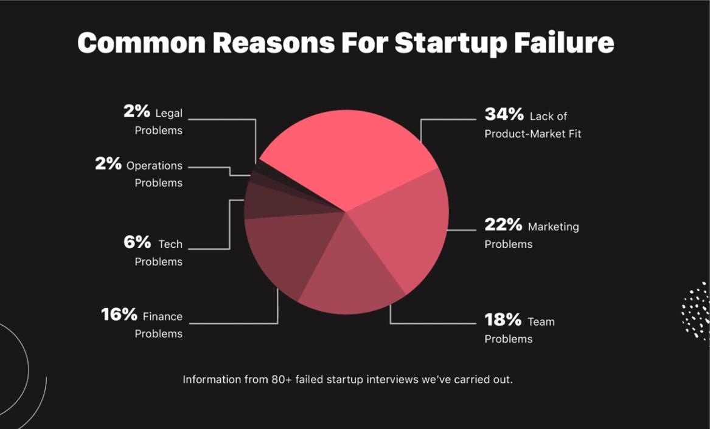
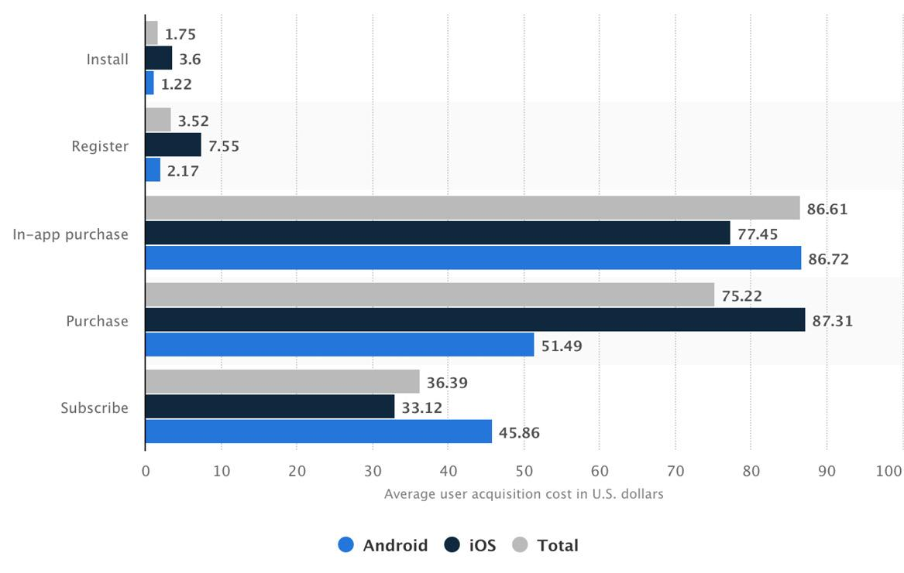

# 为什么早期营销很重要以及你需要的心态
无论你是创业公司创始人、营销人员还是未来的企业家，我都想祝贺你，因为你做出了迄今为止营销生涯中最好的决定。我这么说并不是因为我认为这是有史以来最好的商业书籍（虽然它在那里，但你以后会成为评判者），而是因为事实是，通过购买这本书，你已经证明了你重新准备好优先考虑营销，这是 90% 的初创公司和年轻企业根本没有尽快做的事情。现在，我从哪里想出这个统计数据？这不仅仅是我编造的东西。我将在本书中谈论很多关于在我们作为营销人员所做的“行动”中以数据为导向的内容，所以要知道，无论何时我抛出一个数字，它都是经过研究支持的，就像你应该进行营销一样。由数据驱动——而不是我们的直觉或假设或我们以前的项目/职业——减少了我们失败的机会。所以，一些数据来支持我所说的：2019 年，初创企业的失败率约为 90%，这是根据美国小企业协会的数据。繁荣。麦克风掉落。最重要的是，进一步的研究得出的结论是，仅在第一年就有 21.5% 的初创公司失败，第二年失败了 30%，第五年失败了 50%，这个名单还在继续！
你可能会问：“为什么大多数初创公司都失败了？”好吧，我很高兴你问了，你这个认真的学生读者，你！诚实的事实是，绝大多数“公司”并不是以真正专注于解决实际问题的意图开始的。许多人创办公司时怀揣着赚数十亿美元的愿望，当他们意识到这不会很快发生时，他们就放弃了。找到合适的产品-市场契合点通常需要几个支点和几年的时间，如果你不愿意迭代以达到目标，你就会屈服。如果你正在阅读本文并且正在开发一个新的 MVP（最小可行产品，谷歌它），你不应该期望第一次迭代是用户喜欢的梦想产品，而是应该准备好花费数年的时间迭代，直到你找到一个你的市场真正需要、喜欢和愿意的产品相互参考足以维持你的业务。这是大多数人在第一次将领英头衔更改为“首席执行官兼创始人”时没有意识到他们正在注册的现实。当然，一旦现实让他们眼前一亮，真正准备好多年努力寻找产品与市场契合点的人并不多。我在 Dubizzle.com 担任营销主管的第一家初创公司在我只花了一年时间将它们扩展到整个中东地区后就以超过 4 亿美元的价格售出，但在我加入之前，创始人们独自度过了四年残酷的岁月。一直以来，他们的家人一直在告诉他们放弃。这需要大量的时间和毅力！是的，真正的产品市场契合是最难实现的，但除此之外，这一切都与营销有关。如果你有一个好的产品，并且早期数据显示人们喜欢它，那么剩下的战斗就是寻找更多这样的人。
根据 Failory.com 最近的一项研究，营销问题是创业失败的第二大原因，仅次于发现难以捉摸的产品市场契合度。看看下图，就会意识到这意味着营销失败的可能性是运营失败的 15 倍！让它沉入其中。

数据不会说谎（当它是正确的数据时）。糟糕的营销杀死了超过 20% 的初创公司。来源 – Failory.com
这就是为什么我要向你表示祝贺。你已经在采取必要措施来减轻这些潜在的担忧。但如果它如此重要，那么为什么这么多创始人，尤其是那些有技术背景的创始人，往往会在创业初期忽视营销呢？嗯，15 年后，我注意到一些模式可以描绘出更清晰的画面，因为知识就是力量，你对这些我见过很多次的常见错误了解得越多，你就越不可能屈服给他们。以我的拙见，从我多年来所见，营销和产品开发往往处于大脑的对立面，如果你正在阅读本文，那么你很可能在产品开发方面很熟练。你已经花了大量时间开发产品，现在你需要我的“商品”，这样你就可以开始为它带来流量，这就是为什么你花大力气深入研究有效的早期营销策略.
你很可能是这个“规则”的例外，但一般来说，人类会凭直觉避开我们不擅长的事情，所以如果你是一位出色的开发人员或工程师，很可能即使谈论营销也会让你蠕动一下。我经常看到创始人和企业主在精神上不重视营销的第一个原因是他们觉得他们不会在营销上表现得很好，因此不会产生足够大的影响，所以他们不做。我什至听说创始人说营销对他们之前失败的初创公司不起作用，所以这不是下一个的重点（显然，他们没有看到上面的图表，对吧？）。如果你的公司不是这种情况，那太好了，但我经常看到另一种模式，我想解决，不要觉得我在攻击你。从 2006 年以来我在一百多个创业项目中看到的情况来看，自力更生的公司往往忽视早期营销，因为他们只是认为他们还没有足够的钱来做这件事。时期。营销被认为是昂贵的，因此被搁置，直到众所周知的“战争基金”组装完成。我开始意识到许多创始人认为营销和广告是一回事，而且由于“广告”显然是要花钱的，因此在获得足够的投资、资金或收入后，他们通过广告将营销和广告放在一起进行预期扩展。重新投资业务。
这在几个层面上是错误的，我的核心是一次又一次地看到这一点，与全球各地的团队一起。首先，营销不同于广告。广告本质上是付费用户获取和付费品牌推广活动，或者更一般地说，是用金钱换取可促进你的业务的广告。
事实上，付费广告的成本相当高，而且毫无疑问，每年的成本都越来越高。根据 Statista.com 在其关于 2018 年 9 月至 2019 年 8 月全球移动应用程序用户平均获取成本的报告中，如今推动应用程序内购买的成本高达 90 美元。

有更多关于移动用户获取的集体数据可用，但如果你不关心应用程序并认为你的业务是免疫的，这里有一些针对各种行业和多种设备的平均客户获取成本。 （来源：PropellerCRM。）

- 旅行：7美元
- 零售：10 美元
- 消费品：22美元
- 制造：83美元
- 交通：$98
    营销机构：$141
- 财务：175 美元
- 技术/硬件：182 美元
- 房地产：213 美元
- 银行/保险：$303
- 电信：315 美元
- 技术/软件：395 美元（哎哟！）

以下是用户获取 KPI（关键绩效指标）的一般经验法则：你的客户对你来说越有利可图，通过广告找到他们的成本就越高。考虑一下房地产，这是广告空间中最具竞争力的行业之一，你就会明白我的意思。如果他们能够销售一个客户，他们就会获得巨额利润，因此有很多人尝试这样做，因此，这种竞争程度会推动昂贵的 CPC（每次点击成本）的市场反应。
现在，如果你有大型付费广告活动的预算，那一切都很好，但营销远不止于此。营销也是你通过有机渠道（如内容、社交、搜索、公共关系等）为促进业务所做的任何努力，我可能会补充说，我们在本书中对所有这些都进行了深入研究。对我而言，增长黑客是一门在你可支配的营销资源确实有限的情况下建立持续、可扩展增长的艺术。这是关于用你所拥有的来创造奇迹，而不是等待更多。事实上，初创公司需要在早期获得某种吸引力，不仅要给投资者留下深刻印象，还要给早期的支持者、第一批员工、有利可图的潜在合作伙伴等留下深刻印象。不知道如何执行那些通常令人讨厌但总是必要的营销策略，例如你自己的 SEO、内容营销或公关，从历史上看，这意味着你只有少数几个选择来发展你的业务，是的，它们都需要花钱。

**选项 1)** 你可以聘请昂贵的营销机构为你进行营销。我知道这是许多创始人采用的常见策略，因为我拥有并经营着一个这样的机构 (www.GrowthExpertz.com)，多年来，大量以技术为中心或以产品为中心的团队都依赖我们一次扩展他们的业务他们筹集了资金。
自 2016 年以来，我们已经为数十家获得资助的初创公司提供了全栈营销和广告服务，因为聪明的超增长公司知道在内部掌握这些工具的学习曲线可能需要数年时间，因此与“以前看过这部电影很多次”（引用我们以前的客户的话）。
**选项 2)** 是直接建立内部营销团队，通常在招聘上花费数月和数千美元，却找不到合适的文化契合点。一些公司真的相信一切都应该在内部进行，这是完全公平的。我想将我自己和我的 GrowthExpertz 团队视为与我们合作的公司的延伸，而不是外包咨询公司，但事实仍然是，大多数公司确实会推迟营销，直到他们拥有专注于营销的人力资源。根据美国人口普查局的数据，2015 年，初创公司仅在美国就创造了超过 200 万个工作岗位。这意味着他们仍然喜欢雇用员工。
现在你可能会问：“那么，第三个选项是什么？”
**选项 3)** 什么都不做。严重地。由于这两种选择的成本都很高，许多早期公司只是完全忽视营销，直到他们有资金来做我上面提到的两种选择中的一种，而仅此一项，就会导致许多公司失败，因为当最终需要扩大规模时，他们已经一个巨大的劣势，而且要成功完成任何一项工作要做的事情太多了。想想当你把你的衣服放在一边时会发生什么，它总是堆积如山？这里的理论相同。早点开始，这样你就知道以后需要关注什么。
最重要的是，许多以产品为中心的团队忽视了营销，因为他们真的相信他们的产品会自我推销。硅谷的几家确实由专注于技术的创始人创立的横幅公司在不使用传统营销的情况下进行了扩张，例如 RobinHoods、ClubHouses 等，并且由于这些“海报男孩”，许多创始人认为他们可以复制他们在没有真正关注营销的情况下取得了成功。事实是，这是一个登月计划，这些公司在早期获得了大量免费公关，这是我们绝对要深入研究的（实际上是在第一章）。
现在，自 2010 年以来，甚至在“增长黑客”这个词出现之前，我就一直在告诉初创公司创始人，事实上，还有另一种选择。你确实可以学习如何在你的正常时间表内自己完成几个关键的营销功能，如果你有纪律，你可以花比你在业务开始阶段想象的少得多的时间，建立“营销基础” ”通过近十几个不同的渠道实现可扩展的增长。多年来，我了解了所有这些，我周游世界，在十多个不同的国家教授研讨会、讲习班，并在活动中发言。我创建了十多门在线课程，专门用于逐步教授创始人，如何避免需要向代理商付款，何时专注于某些渠道，以及在启动前准备时该怎么做，我誓言有一天要花足够的时间来记录和说明这些策略，这样全世界的任何人都能够以低廉的价格启动一个项目，推动一些牵引力，获取数据，根据该数据进行迭代，并继续再次推广。
这本书是对导致超过 20% 的初创公司失败并导致近 100% 的初创公司在早期出现问题的疾病的解毒剂。在这本书中，我不仅会在营销活动上为你节省数万美元，而且还会为你节省一些同样宝贵的东西：你的时间。我与世界各地的早期初创公司合作超过 15 年，在那段时间里，我完善了低成本增长黑客方法来扩展每一个有机渠道。我曾在大学任教，并在世界各地的会议上演讲。拍摄，我什至推出了一套“你能学”的在线课程套件，售价 2,500 美元，但教授的策略与你将要学习的完全相同，每个购买它的人都对我的巨大价值赞不绝口。我在整个职业生涯中学到的一切，与世界各地的初创公司合作，我都打包在这本书里，只为你。我一生中的大部分时间都在测试、扩展、证明和构建这些课程，现在，我在这里带你踏上这段改变人生的旅程，将你转变为成熟的增长黑客，并使你的公司失败-证明（至少从营销的角度来看）。你即将成为从每个主要营销渠道“入侵”增长的专家，而无需任何付费广告预算。有些人“浪费”（因为他们可以自己做）仅在我们将在本书中介绍的一章中就“浪费”了数万美元。严重地！你有没有见过现在一个好的公关公司收取多少费用？
如果你实施我即将与你分享的技术，我可以保证你的业务将会增长。时期。它将获得追随者，建立思想领导力，建立强大的电子邮件列表，与越来越多的客户建立关系，而且无需在广告上花费任何真钱。最后，我只想回顾一下你可以期待的几个场景和解释。我想确保你从这本书中获得最大的价值，但我也想确保你在每一章都有足够的时间来实际执行你所学的内容。以下是你需要了解的一些事项：

## 如何使用本书
这些课程都是经过实战考验的。本书中没有任何内容不是我自己开发、测试、分析和扩展的，除了这些课程之外，在每一章中，我还为购买它们的人开发了练习册练习。如果你在阅读本书时完成工作，这些强大而简单的练习将使你能够在短短几周内学习其他人需要花费数年时间的策略。我不建议一口气读完这本书，甚至不建议在短短几天内读完。相反，每周读一章，然后放下书并实际测试一周或一个月的课程，或者无论你或你的团队需要多长时间。阅读本书并立即实施所有概念根本不可行。当我要求反馈时，我从研讨会和公开演讲中得到的第一条评论是，一次性完成太多，所以请给自己时间单独学习、测试和完善每个策略，或者如果你有团队致力于营销，一次专注于几个渠道，最多。如果你觉得在阅读整本书后可以使用额外的指导和帮助，请联系我和我的团队，让我们预约一个快速咨询，深入你的业务，找出你下一步的最佳选择。我希望我能和你们中的许多人一起工作，所以如果你想了解更多关于我如何帮助你的项目的信息，给我发电子邮件@andrewstartups.com
因此，在阅读时，请使用工作簿并做笔记。此外，如果你想与同行讨论本书中的课程，我们为读者提供了一个仅限邀请的私人 Facebook 群组（有关如何获得邀请的详细信息，请参见第 320 页）。不要错过这个机会，因为在这里你会遇到其他创业公司的创始人和营销人员。与试图实现与你相同目标的同行联系将帮助你避免代价高昂的错误。我也将直接在论坛上回答问题，所以这是你在阅读时从我那里获得额外课程的机会！
在我们进入第一章之前，我想谈论的最后一件事是我所说的“创业营销心态”。现在，我们不会在本书中深入探讨心态的主题，因为我只想为你提供可用于发展业务的可行策略，但无论你是否（或计划）初创公司创始人、企业营销人员或小型企业企业家不会改变这样一个事实，即有几个核心思维原则可以帮助你在此类营销中取得更大成功。首先，在早期创业公司，每个人都身兼数职，所以你没有时间浪费在做错事上，因为要做的事情太多了。有了这个，成功的初创公司希望像他们花费的时间一样优化时间投资。所以你会听到我在整本书中谈论最大化你的时间投资回报。希望因此，我可以说服你像花现金一样分析你的时间投资。关注你如何度过你的时间，以及你在营销上花费的每一小时所获得的回报，会让你获得更大的成功。其次，我需要你沉迷于根据数据而不是假设做出决策。例如，如果你一天在 Twitter 上花两个小时，另一天在 SEO 上花一个小时，但你看到你的 SEO 带来了更多流量，那么你需要以数据为导向并减少花在 Twitter 上的时间以增加流量将时间投入到真正推动你成长的事物上。
我还希望你习惯于测试一切（在合理范围内）。在营销方面，真的没有愚蠢的想法。测试它，证明它，扩展它。在我的成长生涯中，一些最好的成功来自于周五晚上与开发团队的头脑风暴会议，在那里我毫不犹豫地抛出随机增长黑客的想法并问：“我们能做到吗？” “不，那是愚蠢的。” “嗯，这个呢？” “哦，那是天才！”我希望你有这样的想法。无论营销理念在何处触动你，无论它们多么狂野，请将它们写下来，并将它们带到你的团队或我们的私人论坛，进一步讨论它们，因为它们可能是你整个公司的重大胜利。
我想谈的另一个重要的营销思维原则是“假装成真”的想法。你也会在这本书中经常听到我这样说，我需要你明白这样做没有任何非法或错误。我不希望你对你的业务撒谎，因为这会给你带来弊大于利，但你确实需要在你目前的业务提前六个月保持精神上的持续运作。从本质上讲，在你的头脑中，我需要你相信作为一家公司，你比实际情况更进一步，因为这将决定谁会相信你的产品并遵循你的愿景。当我们深入到真正的课程中时，你会更多地了解我的意思，但是当我教你如何破解合作伙伴关系、赠品、新闻等等时，那些具有前瞻性思维并拥有更大愿景的创始人将获得最佳成功。只是他们的小公司。毕竟，如果你不相信，谁会相信呢？所以，你可能刚刚开始，你可能还没有太多的吸引力，但你仍然会和其他人交谈，就像你已经在那个六个月的地方，或者在那个百万美元的估值中，因为你知道你要做什么。我们不会低估我们在业务中所处的位置。我们伪造它，直到我们真正做到。知道了？
我希望你在整本书中思考的最后一个心态原则是垃圾邮件与有针对性的冷消息。你会听到我一遍又一遍地说“没有针对性的垃圾邮件”，我这么说是因为如果你的邮件有正确的目标和正确的价值，它就不是垃圾邮件。因此，作为一个激进的营销人员，不要觉得垃圾邮件。我每年会发送数千封未经请求的电子邮件，但如果我知道那个人正在寻找我所提供的东西，而且我不会过度推销，那么我知道我会被认为是有价值的，而不是垃圾邮件。在你执行本书中的课程时，不要担心会收到垃圾邮件，我希望你思考如何通过你尝试的每个营销活动创造最大的价值。如果你专注于这一点，你就会赢。
不懈地为他人创造价值是营销成功的真正秘诀。我希望你对自己的解决方案改善人们生活的能力充满信心，以至于你不必担心向潜在投资者、媒体或梦想合作伙伴发送随机信息。我希望你将一切都视为通过你公司的产品或服务帮助改善人们生活的另一个机会。当你这样构建它时，你会以不同的方式思考如何营销你的业务。如果你的企业没有创造价值，也没有帮助改善人们的生活，那么你可能完全做错了生意。因此，请考虑你的目标人群，考虑如何为该目标创造比其他任何人都多的价值，然后像成功的增长黑客一样对如何找到更多这些人充满信心。在本书的所有课程中，你将学习如何赢得营销，但实际上，我将教你如何找到更多的人来提供帮助。当你拥有这种心态时，所有使这些营销策略奏效的深夜、热血、汗水和眼泪都变得非常容易投入。你准备好开始了吗？

---------------------------------------------
资料来源：
www.failory.com
https://www.statista.com/statistics/185736/mobile-app-average-user-acquisition-cost/
https://www.demandjump.com/blog/customer-acquisition-cost-by-industry
https://www.propellercrm.com/blog/customer-acquisition-cost
https://smallbiztrends.com/2019/03/startup-statistics-small-business.html
https://www.smallbizgenius.net/by-the-numbers/entrepreneur-statistics/#gref
https://psychcentral.com/blog/how-to-stop-avoiding-what-scares-or-overwhelms-you#1